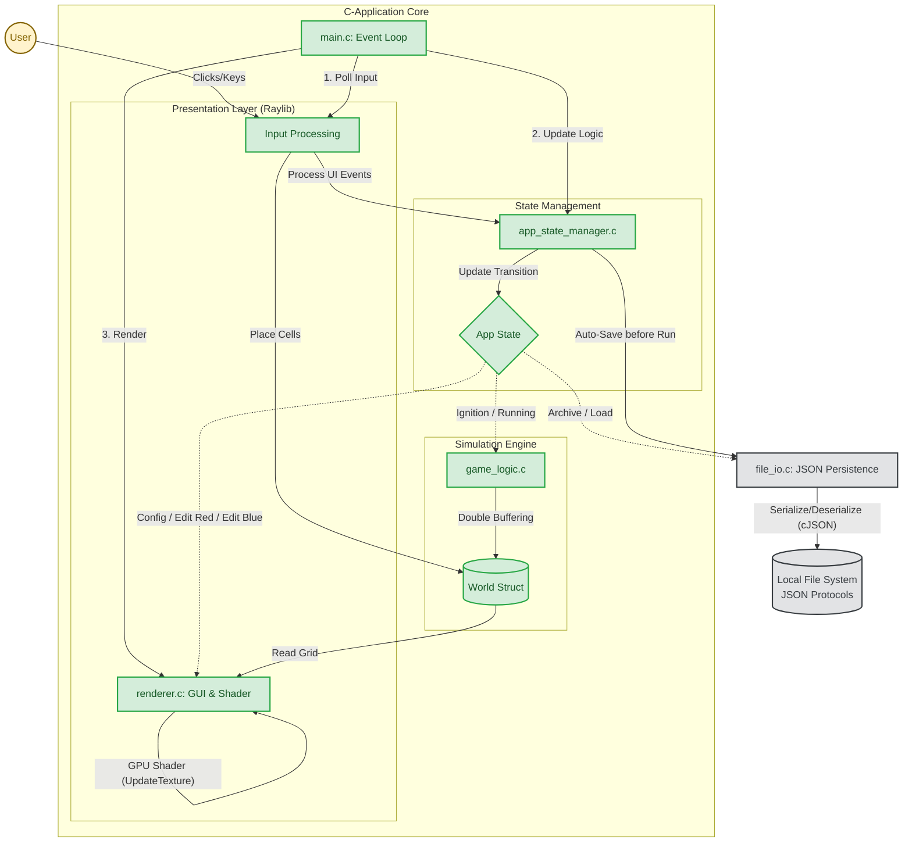
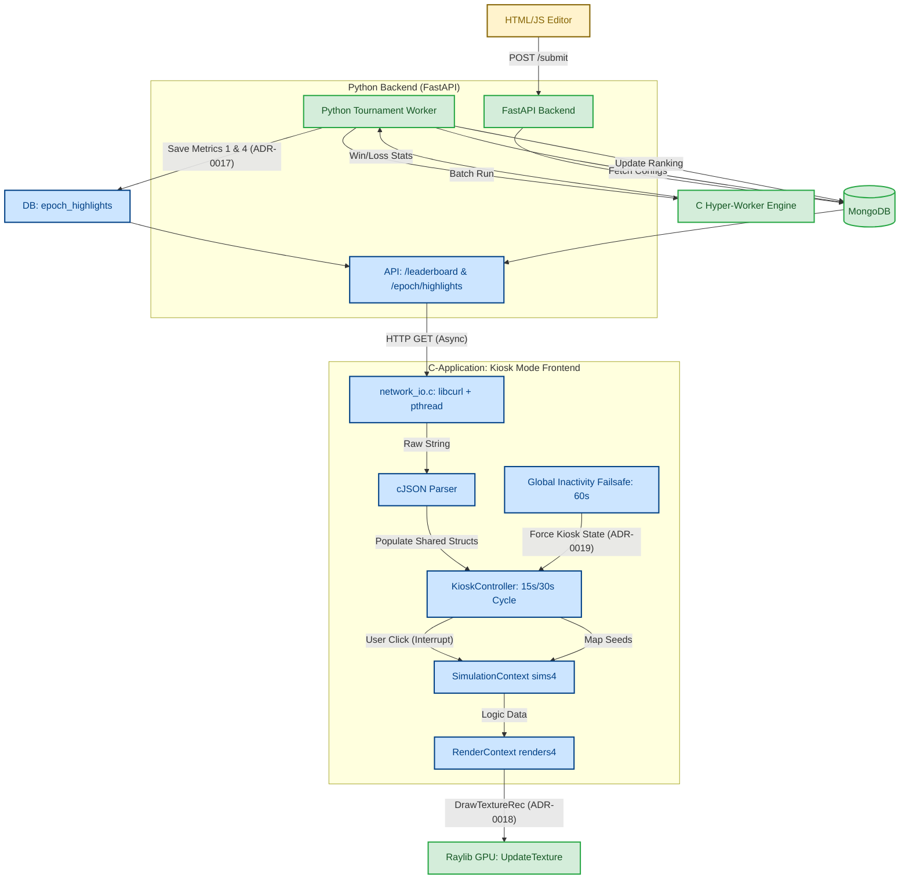

# Architecture Diagrams (Uni-Messe)

> **Historical snapshot — as of 27 May 2026.**
> The components marked as "Planned" (blue) — `network_io.c`, `KioskController`, `SimulationContext ×4`, `RenderContext ×4`, API endpoints — are now fully implemented. Current diagram: [260530_ARCHITECTURE_DIAGRAM.md](260530_ARCHITECTURE_DIAGRAM.md).

This document visualizes the system architecture for the "Game of Life - Biotope" project. It covers both the local Singleplayer experience and the distributed Multiplayer Tournament mode.

## 1. Singleplayer Architecture

This diagram visualizes the internal architecture of the standalone C-Application, detailing how user input drives the state machine, simulation, and local persistence.

### Key:
*   **Green:** Core C-Application components (Simulation, UI, Logic).
*   **Grey:** Local File I/O and JSON storage components.
*   **Yellow:** User interaction.

---

## 2. Multiplayer Tournament Architecture (Uni-Messe Kiosk)

 This diagram visualizes the system architecture for the Multiplayer Tournament Mode, specifically highlighting the transition from the existing backend/simulation core to the new **Uni-Messe Kiosk Mode**.

### Key:
 *   **Green:** Existing components and data paths.
 *   **Blue:** Planned components specified in ADR-0017, ADR-0018, and ADR-0019.
 *   **Yellow:** External interfaces (Web Editor).