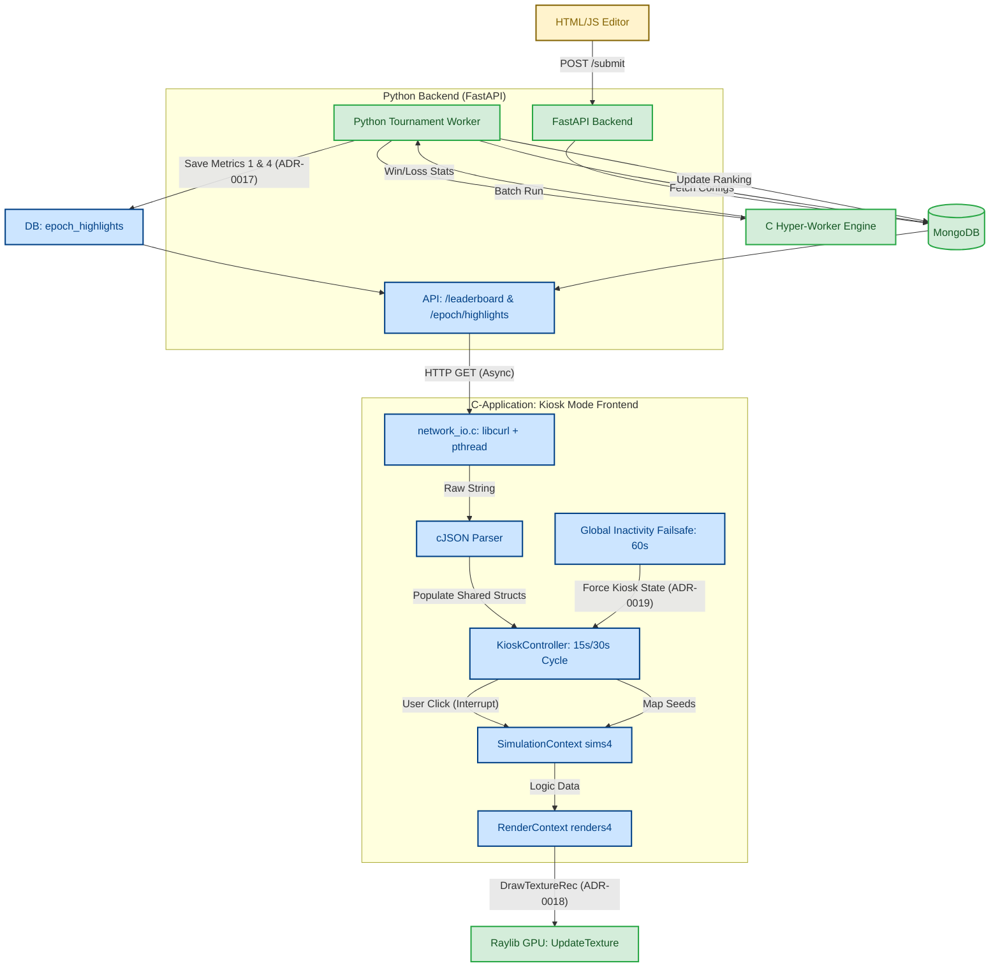

# Multiplayer Tournament Architecture (Uni-Messe)

 This diagram visualizes the system architecture for the Multiplayer Tournament Mode, specifically highlighting the transition from the existing backend/simulation core to the new **Uni-Messe Kiosk Mode**.

### Key:
 *   **Green:** Existing components and data paths.
 *   **Blue:** Planned components specified in ADR-0017, ADR-0018, and ADR-0019.
 *   **Yellow:** External interfaces (Web Editor).