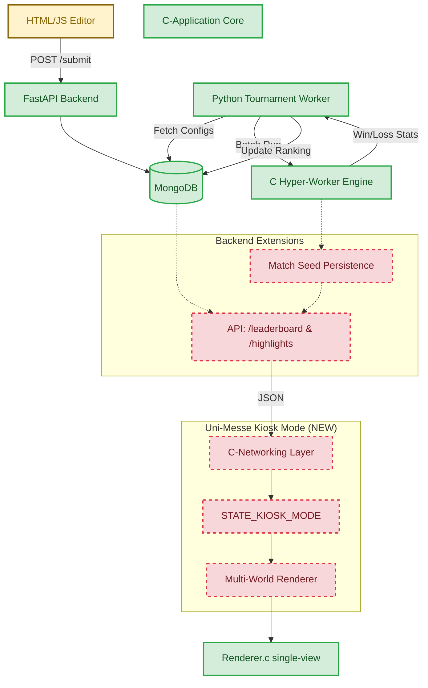

# Multiplayer Tournament Architecture (Uni-Messe)

 This diagram visualizes the system architecture for the Multiplayer Tournament Mode, specifically highlighting the transition from the existing backend/simulation core to the new **Uni-Messe Kiosk Mode**.

### Key:
 *   **Green (Solid):** Existing components and data paths.
 *   **Red (Dashed):** Components and paths to be implemented for the Uni-Messe Kiosk Mode.
 *   **Yellow:** External interfaces (Web Editor).