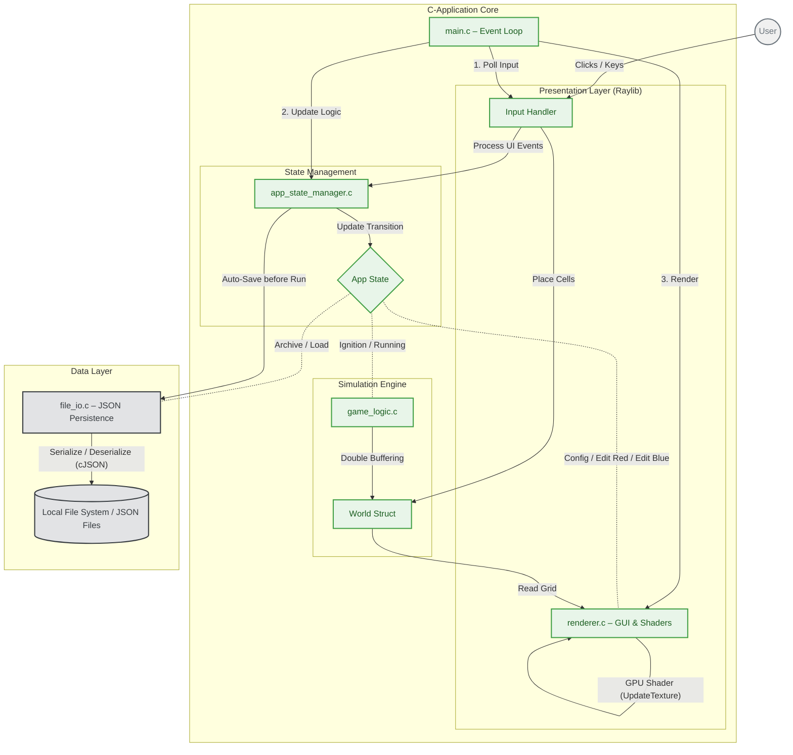
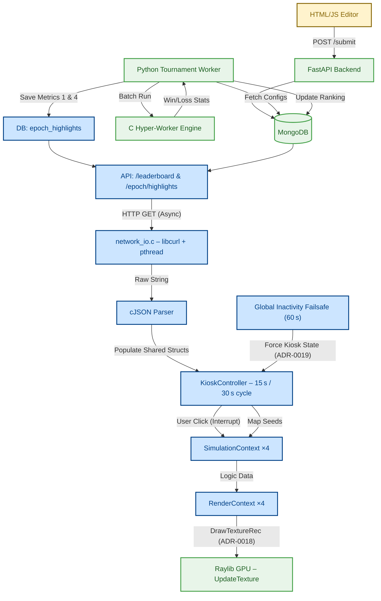

# Architecture Diagrams – Uni‑Messe (Updated 30 May 2026)

> **Purpose** – This document gives a concise, production‑ready visual overview of the full system – both the standalone single‑player client and the distributed multiplayer‑tournament (Uni‑Messe) solution. The diagrams are written in **Mermaid** and can be rendered directly in VS Code, GitHub, or any Markdown viewer that supports Mermaid.

---

## 1️⃣ Single‑player Architecture (C‑Application)

**Legend**
- **Core** – Core C‑application components (logic, UI, state management).
- **Data** – Local persistence (JSON + file system).
- **External** – Human user.

---

## 2️⃣ Multiplayer Tournament Architecture (Uni‑Messe Kiosk Mode)

**Legend**
- **Core** – Already‑implemented backend & C‑application components.
- **Planned** – New functionality introduced for the Uni‑Messe kiosk (all already in code as of 27 May 2026).
- **External** – Web‑based editor used by participants.

---

*Document generated on **2026‑05‑30** – updated from the initial draft (27 May 2026) with refined styling, explicit legends, and clearer flow descriptions.*
