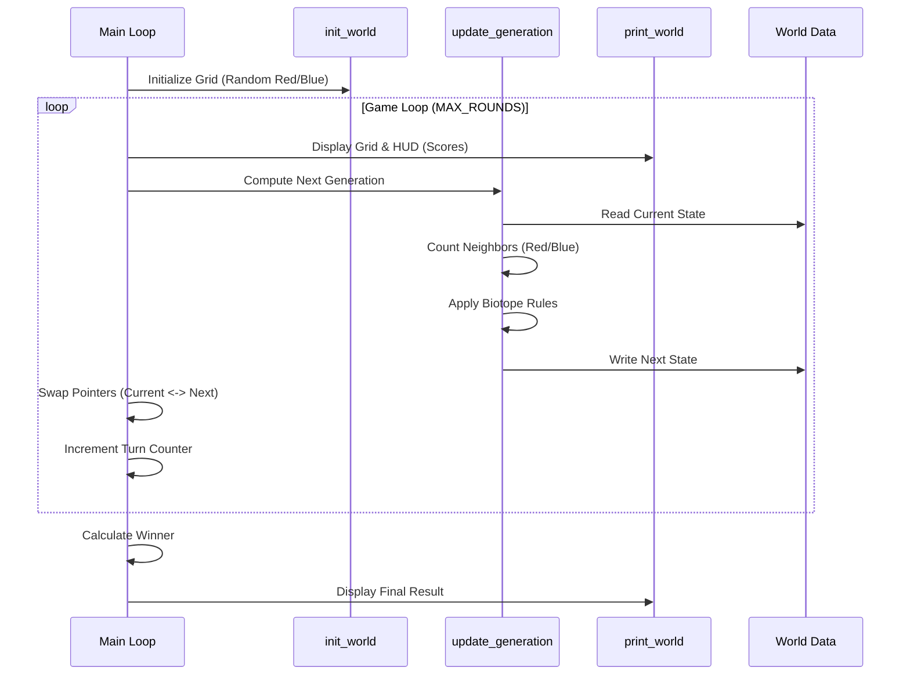

# Technical Design: Competitive Biotope Mode (Red vs Blue)

**Version:** 1.0
**Date:** 2026-01-08
**Author:** Gemini
**Related Documents:** [ADR-0001](docs/ADR-0001-competitive-biotope-mode.md), [DEV_SPEC-0001](docs/DEV_SPEC-0001-competitive-biotope-mode.md)

---

### 1. Introduction

This document provides a detailed technical design for the "Competitive Biotope Mode" feature in Conway's Game of Life. It translates the requirements defined in DEV_SPEC-0001 into a concrete implementation plan, specifying the architecture, components, data models, and logic updates. The goal is to extend the existing C-based simulation to support two competing teams (Red and Blue) with specific inheritance rules, while maintaining the project's minimalist and high-performance philosophy.

---

### 2. System Architecture and Components

The architecture remains a monolithic C application, following a procedural design pattern. The core components are logically separated into Data Structures (World/Grid), Logic (Evolution), and Presentation (CLI Output).

#### 2.1. Component Overview

*   **Core Engine (`main.c`):**
    *   **Data Structures:** The `World` struct will be reused but semantically extended. The `int *grid` array will now hold state identifiers (`0`, `1`, `2`) instead of just binary values.
    *   **Evolution Logic:** The `update_generation` function is the critical component requiring modification. It will now perform two passes or a more complex single pass: counting neighbors *per team* and applying the "Biotope" birth/survival rules.
    *   **Initialization:** `init_world` will be updated to distribute `TEAM_RED` and `TEAM_BLUE` values.

*   **Visualization (CLI):**
    *   **Output:** `print_world` will map integer states to visual characters ('X' for Red, 'O' for Blue, ' ' for Dead) and potentially apply ANSI color codes for better visibility.
    *   **HUD:** A new reporting mechanism (within the main loop) will calculate and print the score (population counts) and current turn number.

#### 2.2. Component Interaction Diagram

This diagram illustrates the flow of the game loop.



---

### 3. Data Model Specification

The data model is minimalist, relying on primitive types for performance.

*   **Constants:**
    ```c
    #define DEAD 0
    #define TEAM_RED 1
    #define TEAM_BLUE 2
    ```

*   **World Structure:**
    (Unchanged structure, but semantic change in `grid` content)
    ```c
    typedef struct {
        int *grid; // Pointer to flat array. Values: 0, 1, 2
        int r;     // Rows
        int c;     // Columns
    } World;
    ```

---

### 4. Logic Specification (Backend)

#### 4.1. Neighbor Counting Logic
The current implementation hardcodes neighbor access. This needs to be slightly abstracted or expanded to return *counts* per team.

*   **New Helper (Conceptual - inline optimization preferred):**
    `void count_neighbors(World *w, int index, int *red_count, int *blue_count)`
    
    *   Iterates the 8 neighbors (using toroidal wrapping logic).
    *   If neighbor value == `TEAM_RED`, increment `red_count`.
    *   If neighbor value == `TEAM_BLUE`, increment `blue_count`.

#### 4.2. Evolution Rules Implementation (`update_generation`)

The logic inside the loop over all cells `i`:

```c
int red_neighbors = 0;
int blue_neighbors = 0;
// ... (neighbor counting logic) ...
int total_neighbors = red_neighbors + blue_neighbors;

int current_state = current_gen->grid[i];
int next_state = DEAD;

if (current_state != DEAD) {
    // SURVIVAL RULE
    if (total_neighbors == 2 || total_neighbors == 3) {
        next_state = current_state; // Retain color
    } else {
        next_state = DEAD; // Die by under/over-population
    }
} else {
    // BIRTH RULE
    if (total_neighbors == 3) {
        // BIOTOPE INHERITANCE
        if (red_neighbors > blue_neighbors) {
            next_state = TEAM_RED;
        } else {
            next_state = TEAM_BLUE;
        }
    }
}
next_gen->grid[i] = next_state;
```

#### 4.3. Initialization Strategy
To ensure a fair start, `init_world` should probabalistically assign cells:
- ~80% Dead
- ~10% Red
- ~10% Blue
Alternatively, a split-screen approach could be used (Left half Red, Right half Blue), but random distribution is closer to the current codebase style.

---

### 5. Visualization Specification (Frontend/CLI)

#### 5.1. Output Mapping
The `print_world` function will iterate the grid and print characters based on the value.

*   **ANSI Colors (Optional but recommended):**
    *   Red: `\033[1;31mX\033[0m`
    *   Blue: `\033[1;34mO\033[0m`
    *   Dead: `.` or ` `

#### 5.2. HUD (Heads-Up Display)
Before or after printing the grid, a status line will be printed:
`"Turn: 15 | Red Population: 45 | Blue Population: 42"`

This requires a quick traversal of the grid to count `1`s and `2`s before printing, or counting them during the printing loop.

---

### 6. Security Considerations

*   **Input Validation:** The program accepts command line arguments for rows/cols. Large values could cause stack overflow or excessive memory allocation (`malloc`).
    *   *Mitigation:* Add strict bounds checking for `rows` and `cols` (e.g., max 2000x2000).
*   **Memory Safety:** Standard C manual memory management risks apply.
    *   *Mitigation:* Ensure `free()` is called at the end. Verify `malloc` success before use.

---

### 7. Performance Considerations

*   **Cache Locality:** The 1D array representation is cache-friendly. The logic changes involve only local variables and should not significantly impact cache performance.
*   **Branch Prediction:** The new `if/else` logic for teams adds branching. However, compared to memory access latency, this is negligible for the target grid sizes.
*   **Optimization:** Avoid function calls inside the inner loop (e.g., inlining neighbor calculation or using macros) to maintain the "high performance" requirement.
