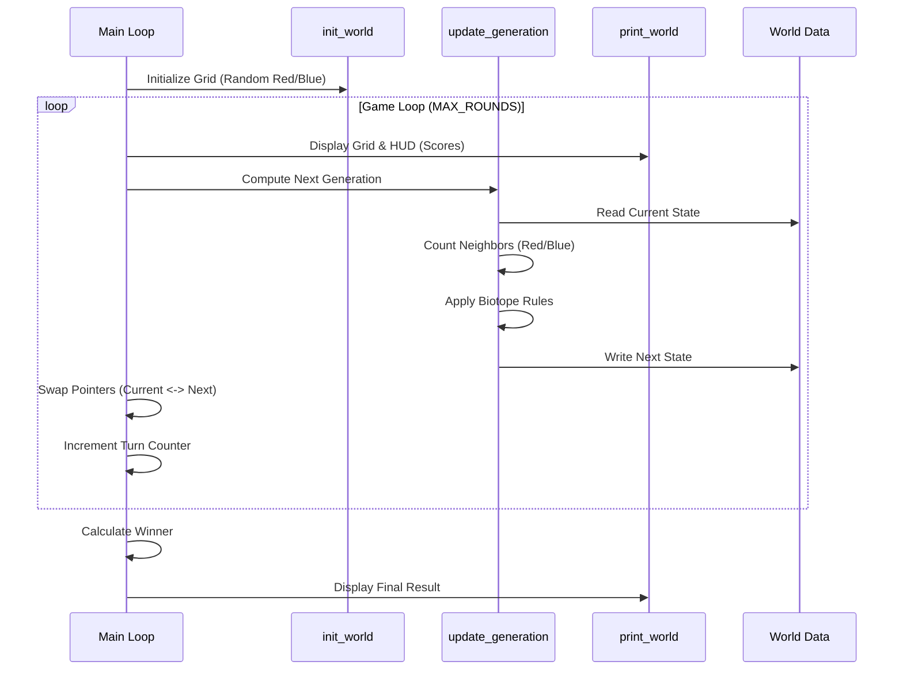

## USER 🧑‍💻

This is the Gemini CLI. We are setting up the context for our chat.
Today's date is Donnerstag, 8. Januar 2026 (formatted according to the user's locale).
My operating system is: win32
The project's temporary directory is: C:\Users\Fried\.gemini\tmp\4c2a4e80f055037652e8d65c1f730c648ab41f2e3a6ad1ed685a3dd841f63761
I'm currently working in the directory: C:\Users\Fried\onedrive\studium\inf\inf-einf-b\gameoflife
Here is the folder structure of the current working directories:

Showing up to 200 items (files + folders). Folders or files indicated with ... contain more items not shown, were ignored, or the display limit (200 items) was reached.

C:\Users\Fried\onedrive\studium\inf\inf-einf-b\gameoflife\
├───docker-compose.yml
├───Dockerfile
├───main
├───main.c
├───project-logfile.md
├───README.md
└───.git\...

Reminder: Do not return an empty response when a tool call is required.

My setup is complete. I will provide my first command in the next turn.

---

## USER 🧑‍💻

Du bist ein erfahrener Spiele-Entwickler. Deine Spezialität ist, hoch perfomante Spiele in minimalistischem Design zu entwickeln. Bei Performance und Qualität des Programm-Codes bist du kompromisslos. Deine Aufgabe ist, die in @main.c skizzierte Idee gemäß @README.md "Biotop" zu entwickeln und zu vervollkommnen. Sei kreativ.

Erstelle ein Architecture Decision Record (ADR), das die grundlegende Architekturentscheidung für ein neues Feature dokumentiert. Dieses Dokument wird die Basis für alle weiteren Entwicklungsschritte bilden.

**Briefing Dokument:** Feature-Beschreibung in @README.md 

**Zu erstellende Berichte:**
1. Architecture Decision Record (ADR) für das beschriebene Feature

**Deine Aufgabe:**
1. Analysiere das beschriebene Feature und seinen Kontext sorgfältig
2. Dokumentiere den Kontext und die Problemstellung klar und ausführlich
3. Beschreibe die getroffene Architekturentscheidung mit fundierter Begründung
4. Analysiere die positiven und negativen Konsequenzen dieser Entscheidung
5. Dokumentiere alternative Lösungsansätze, die in Betracht gezogen wurden

**Lieferumfang:**
- Ein vollständiges Architecture Decision Record (ADR) gemäß @docs/ADR-0000-template.md 
- Status des ADR (in der Regel "proposed" für neue Features)
- Aktuelles Datum

Antworte in Englisch. Speichere das Dokument unter @docs/ADR-xxxx-title-of-feature.md, wobei xxxx eine fortlaufende Nummer ist und "title-of-feature" den Namen des Features widerspiegelt.
--- Content from referenced files ---
Content from @README.md:
# Conway's Game of Life in einer C-Umgebung - Bonus: Interaktiver Wettbewerb um das nachhaltigste Zell-Biotop
#### Author1: Friedemann Decker / 2203777
#### Video: <URL> oder "VC"
#### Description:

##### Spielregeln
 aus Gewinnen: Strategien für math. Spiele Bd. 4, Elwyn R. Berlekamp, John H. Conway, Richard K. Guy, Vieweg, 1985, Seite 123

"LIFE" wird auf einem unendlichen Schachbrett gespielt. Ein Spiel-Zustand ist dadurch gegeben, dass man sagt, welche Quadrate oder Zellen **leben** und welche **tod** sind. Den Anfangszustand zur Zeit 0 können Sie sich aussuchen. Danach haben Sie sich freundlichst zurückzulehnen und nichts mehr zu tun, denn was dann kommt, ergibt sich in strenger Zwangsläufigkeit aus den Spielregeln:
**Geburt**: Eine zur Zeit t tote Zelle wird zum Zeitpunkt *t+1* genau dann lebendig, wenn zur Zeit *t* genau 3 von ihren  Nachbarn lebendig waren.
**Tod durch Überbevölkerung**: Eine Zelle, die zur Zeit *t* lebt, aber zugleich noch 4 oder mehr lebende Nachbarn hat, ist zur Zeit *t+1* tot.
**Tod durch Einsamkeit**: Eine Zelle, die zur Zeit *t* lebt, aber nur einen oder keinen lebendigen Nachbarn hat, ist zur Zeit *t+1* tot.

Damit haben wir alle Todesursachen abgehandelt, also lassen wir das traurige Thema und reden wir von der Regel für das
**Überleben**: Eine Zelle, die zur Zeit *t* lebt, ist auch zur Zeit *t+1* am Leben, wenn sie 2 oder 3 zur Zeit *t* lebende Nachbarn hat.
ZITAT Ende


Umsetzung der Spielidee in ein C-Programm

##### Unendliches Spielfeld
Das unendliche Spielfeld wird dadurch realisiert, dass die gegüberliegenden Ränder als Nachbarfelder modelliert werden. Dadurch entsteht quasi ein unendliches Spielfeld in Form der Oberfläche eines Torus.

##### Programmier-Konzept
Die Kern-Algorithmen (Erstellung des Spielfelds, Berechnung der Zustände, Speicherverwaltung) werden eigenständig programmiert. Die periphere Komponenten (Eingabe Startkonfiguration, Ausgabe auf Bildschirm, ...) werden mittels eines selbst entwickelten Vibe-Coding Prompts erstellt.

##### Prseudocode Kern-Algorithmen
// Einbindung benötigter Header
#include <stdio.h>
#include <stdlib.h>

// 1. Konstanten festlegen
// Eine geeignete Anzahl Zeilen/Spalten für den Betrieb wird später festgelegt.
// Für die Entwicklung wird 20/20 gewählt
#define ROWS 20  
#define COLS 20

// 2. Struktur definieren
typedef struct {
    int *grid; // Pointer auf Array
    int r;
    int c;
} World;

int main(void) {
    // 3. Dynamische Speicherverwaltung für zwei Gitter
    // Zwei Gitter, um neuen zustand berechnen zu können, ohne den aktuellen Zustand zu beeinflussen, analog zu "Bildbearbeituns-Übung"
    World *current_gen = malloc(sizeof(World));
    World *next_gen = malloc(sizeof(World));

    // Speicher für die Zellen (Arrays) reservieren
    current_gen->grid = malloc(ROWS * COLS * sizeof(int));
    next_gen->grid = malloc(ROWS * COLS * sizeof(int));

    // 4. Initialisierung
    // Zufälliges Muster lebender Zellen
    init_world(current_gen);

    // 5. Spiel-Schleife (Loop)
    while (true) {
        print_world(current_gen);
        update_generation(current_gen, next_gen);

        // Tausche die Gitter (Pointer-Zuweisung)
        World *temp = current_gen;
        current_gen = next_gen;
        next_gen = temp;

        // Abbruchbedingung oder Pause noch einfügen
    }

    // 6. Speicher freigeben (Vermeidung von Memory Leaks)
    free(current_gen->grid);
    free(next_gen->grid);
    free(current_gen);
    free(next_gen);

    return 0;
}


## Ab hier Programmierung mit VIBE-CODING
Mittlerweile existieren von verschiedenen Anbietern sog. KI-Agenten, die behaupten, auf professionellem Niveau Software-Code schreiben zu können. 
Ziel dieses Projektes ist, eine funktionierende (von Hand in C geschriebene) Simulation von Conway's Game of Life mittels der Nutzung von einem KI-Agenten zu der im Folgenden beschriebenen Anwendung zu entwickeln.

### Vorgehensweise
Im ersten Schritt wird ein sog. **Architecture Decision Record (ADR)** erstellt, der die Anforderungen an das Projekt und die Grundlagen für die Entscheidung für das Programmkonzept enthält. In einem weiteren Schritt soll der KI-Agent eine **Anforderungsanalyse und Spezifikation** erstellen, in der auf Basis des ADR die Anforderungsspezifikation, User Stories, das Product Backlog und die Definition of Done formuliert werden. Im nächsten Schritt soll der KI-Agent dann das **technische Design und eine umsetzbare technische Architektur** entwickeln und formulieren. Basierend auf diesen Dokumenten wird der KI-Agent anschließend beauftragt, eine detaillierte **Aufgabenliste** zu erstellen, die dann verwendet wird, um den KI-Agenten präzise durch die Umsetzung und Entwicklung des Programmcodes zu führen. Dem KI-Agenten werden für die vorstehend genannten Dokumente **Templates** zur Verfügung gestellt, die eine Form und inhaltliche Struktur vorgeben.

Die zur Verfügung gestellten Templates und die von dem KI-Agenten erstellten Dokumente werden in einem separaten Verzeichnis docs/ innerhalb der Codebase abgelegt.


Für die Umsetzung wird der KI-Agent von Google Gemini-CLI verwendet. Ausschlaggebend für die Wahl dieses Anbieters war ausschließlich das große kostenfreie Token-Volumen für Studierende.


##### Pseudocode Biotop
LIFE bleibt immer noch ein 0-Personen-Spiel, jedoch wird der Zustand des initialen Spielfelds von zwei unterschiedlichen Personen (Teams "rot" vs "blau") festgelegt. Dann wird das Spiel gestartet. Nach einer festgelegten Anzahl Zyklen wird gezählt, von welcher Farbe mehr Zellen existieren. Gewonnen hat der Spieler mit den meisten lebenden Zellen. 
Man kann sich das das Spielfeld wie ein **Biotop** vorstellen: Die Regeln von Conway bestimmen, wo neues Leben entstehen kann, aber die Teamfarben der Nachbarn entscheiden, welche  "Lebensform" das neue Leben annimmt. So entsteht ein rundenbasierter Wettstreit auf einem mathematischen Raster.

Um die interaktive Spielidee „Rote Zellen vs Blaue Zellen“ auf Basis des vorhandenen Entwurfs für Conway's Game of Life umzusetzen, muss der Pseudocode in der **Zustandsverwaltung** und der **Geburtslogiklogik** erweitert werden. Während das klassische Modell nur „lebendig“ oder „tot“ kennt, wird hier eine Differenzierung nach Zellfarben eingeführt.

Entwurf für die Erweiterung des Pseudocodes:

1. Erweiterung der Datenstruktur und Konstanten
Die Zustände für die verschiedenen Teams werden definiert.

#define DEAD 0
#define TEAM_RED 1
#define TEAM_BLUE 2
#define MAX_ROUNDS 100 // Beispielhafte Begrenzung der Runden

In der Struktur `World` bleibt der Pointer auf das Gitter gleich, aber die darin gespeicherten Ganzzahlen (`int`) repräsentieren nun diese drei Zustände (`0`, `1` oder `2`).

2. Anpassung der Initialisierung (`init_world`)

Anstatt das Gitter zufällig zu füllen, wird eine Funktion benötigt, die es den Spielern ermöglicht, ihre **Startaufstellung** zu definieren.

• **Spieler 1 (Rot)** wählt Koordinaten für seine Zellen.

• **Spieler 2 (Blau)** wählt Koordinaten für seine Zellen.

3. Erweiterte Logik der Evolution (`update_generation`)

Die wichtigste Änderung betrifft die Regeln für Geburt und Überleben. Jede Zelle muss nicht nur die Anzahl der Nachbarn prüfen, sondern auch deren **Zugehörigkeit**.

**Logik-Erweiterung:**

**Nachbarn zählen:** Die Funktion `count_neighbors` muss nun die Anzahl der roten und blauen Nachbarn separat erfassen.

**Geburt:** Wenn eine tote Zelle genau **drei lebende Nachbarn** hat, wird sie geboren
Zusatzregel: Die neue Zelle erhält die Farbe des Teams, das die **Mehrheit** unter diesen drei Nachbarn stellt (z. B. 2 rote und 1 blaue Zelle -> die neue Zelle wird rot).

**Überleben:** Eine lebende Zelle bleibt am Leben, wenn sie **2 oder 3 Nachbarn** hat (unabhängig von deren Farbe). Sie behält dabei ihre ursprüngliche Teamfarbe bei.

**Tod:** Zellen sterben weiterhin durch Einsamkeit (<2) oder Überbevölkerung (>3).

4. Spielschleife und Siegbedingung

Die `while`-Schleife im Hauptprogramm wird um einen **Rundenzähler** und eine **Auswertung** am Ende ergänzt.

int rounds = 0;
while (rounds < MAX_ROUNDS) {
    print_world(current_gen); // Visualisierung der roten und blauen Zellen [4]
    update_generation(current_gen, next_gen);
    
    // Gitter tauschen wie gehabt
    World *temp = current_gen;
    current_gen = next_gen;
    next_gen = temp;

    rounds++;
}

// 6. Auswertung (Siegbedingung)
int red_count = count_cells_by_team(current_gen, TEAM_RED);
int blue_count = count_cells_by_team(current_gen, TEAM_BLUE);

if (red_count > blue_count) {
    // Team Rot gewinnt
} else if (blue_count > red_count) {
    // Team Blau gewinnt
}
Content from @docs/ADR-0000-template.md:
### **ADR-xxxx: Titel of ADR**

**Status:**

**Date:** JJJJ-MM-DD

#### **1. Context and Problem Statement**

Text here ...

#### **2. Decision**

Text here ...

#### **3. Consequences of the Decision**

**Positive Consequences (Advantages):**

Text here ...

**Negative Consequences (Disadvantages):**

Text here ...


#### **4. Alternatives Considered**

Text here ...
Content from @main.c:
#include <stdio.h>
#include <stdlib.h>
#include <time.h> // zur Initialisierung des Zufallszahlengenerators
#include <unistd.h> // zur Verlangsamung der Ausführung mit sleep()

//#define rows 40
// #define cols 50

// Struktur definieren
typedef struct {
    int *grid; // Pointer auf Array
    int r;
    int c;
} World;

// Prototypen
void init_world(World *current_gen, int rows, int cols);
void print_world(World *current_gen, int rows, int cols);
void update_generation(World *current_gen, World *next_gen, int rows, int cols);


int main(int argc, char *argv[]) {
    printf("argc: %i\n", argc);
    if (argc < 2)
    {
        printf("./main <rows> <columns> <delay milli-sec>\n");
        return 1;
    }
    
    int rows = atoi(argv[1]);
    int cols = atoi(argv[2]);
    int delay_my = atoi(argv[3]) * 1000;
    // Dynamische Speicherverwaltung für zwei Gitter
    // Zwei Gitter, um neuen zustand berechnen zu können, ohne den aktuellen Zustand zu beeinflussen, analog zu "Bildbearbeituns-Übung"
    World *current_gen = malloc(sizeof(World));
    World *next_gen = malloc(sizeof(World));

    // Speicher für die Zellen (Arrays) reservieren
    current_gen->grid = malloc(rows * cols * sizeof(int));
    next_gen->grid = malloc(rows * cols * sizeof(int));

    // Initialisierung
    // Zufälliges Muster lebender Zellen
    init_world(current_gen, rows, cols);

    // Spiel-Schleife (Loop)
    int turns = 0;
    while (turns < 1000)
     {
        // Aktuelle Population ausgeben
        print_world(current_gen, rows, cols);
        printf("turns: %i\n", turns);
        usleep(delay_my);
        update_generation(current_gen, next_gen, rows, cols);

        // Die neu berechnete Generation wird zur aktuellen Generation (Pointer-Swap)
        World *temp = current_gen;
        current_gen = next_gen;
        next_gen = temp;
        
        // Abbruchbedingung oder Pause noch einfügen
        // Abbruch, wenn stabile Population erreicht,
        // d.h. wenn next_gen = current_gen, unter Berücksichtigung periodisch alternierender Muster  
        turns++;
    }

    // Speicher freigeben (Vermeidung von Memory Leaks)
    free(current_gen->grid);
    free(next_gen->grid);
    free(current_gen);
    free(next_gen);

    return 0;
}

void init_world(World *current_gen, int rows, int cols)
{
    // Initialisiere den Zufallszahlengenerator mit der aktuellen Zeit
    srand(time(NULL));
    for (int i = 0; i < (rows * cols); i++)
    {
        current_gen->grid[i] = rand() % 2; // Zufällige 0 oder 1
    }
}

void print_world(World *current_gen, int rows, int cols)
// Zunächst ohne GUI als Zeichen-Matrix 1 und 0
{
    system("clear");
    for (int i = 0; i < (rows * cols); i++)
    {
        printf("%c", current_gen->grid[i] + 32);
        if ((i+1) % cols == 0)
        {
            printf("\n");
        }
    }
    printf("\n");
}

void update_generation(World *current_gen, World *next_gen, int rows, int cols)
{
    int zellen = 0;
    for (int i = 0; i < (rows * cols); i++)
    {
        //next_generation Zellenweise berechnen
        //Anzahl lebender Zellen in Nachbarschaft von i zählen
        // Sonderfall: i = Eckzelle oben, links
        if (i == 0)
        {
            zellen = 
            current_gen->grid[i + (cols * rows) - 1] + // oberhalb, links -> letzte Zeile, letzte Spalte
            current_gen->grid[i + (cols * (rows - 1))] + // oberhalb, mittig -> letzte Zeile, erste Spalte
            current_gen->grid[i + (cols * (rows - 1)) + 1] + // oberhalt, rechts -> letzte Zeile, zweite Spalte
            current_gen->grid[i + cols - 1] + // links -> erste Zeile, letzte Spalte
            current_gen->grid[i + 1] +
            current_gen->grid[i + cols + cols - 1] + // unterhalb, links -> zweite Zeile, letzte Spalte
            current_gen->grid[i + cols] +
            current_gen->grid[i + cols + 1];
            /*Debug-print
            printf(" Eckzelle oben, links\n");
            printf("i: %i->i statt oberhalb, links: %i\n", i, i + (cols * rows) - 1);
            printf("i: %i->i statt oberhalb, mittig: %i\n", i, i + (cols * (rows - 1)));
            printf("i: %i->i statt oberhalb, rechts: %i\n", i, i + (cols * (rows - 1)) + 1);
            printf("i: %i->i statt links: %i\n", i, i + cols - 1);
            printf("i: %i->i statt unterhalb, links: %i\n", i, i + cols + cols - 1);
            */
        }
        // Sonderfall: i = Eckzelle oben, rechts
        else if (i == (cols - 1))
        {
            zellen = 
            current_gen->grid[i + (cols * (rows - 1)) - 1] + // oberhalb, links -> letzte Zeile, vorletzte Spalte
            current_gen->grid[i + (cols * (rows - 1))] + // oberhalb, mittig -> letzte Zeile, letzte Spalte
            current_gen->grid[i + (cols * (rows - 1)) - cols + 1] + // oberhalb, rechts -> letzte Zeile, erste Spalte
            current_gen->grid[i - 1] +
            current_gen->grid[i - (cols - 1)] + // rechts -> erste Zeile, erste Spalte
            current_gen->grid[i + cols - 1] +
            current_gen->grid[i + cols] +
            current_gen->grid[i + 1]; // unterhalb, rechts -> zweite Zeile, erste Spalte
            /*Debug-print
            printf(" Eckzelle oben, rechts\n");
            printf("i: %i->i statt oberhalb, links: %i\n", i, i + (cols * (rows - 1)) - 1);
            printf("i: %i->i statt oberhalb, mittig: %i\n", i, i + (cols * (rows - 1)));
            printf("i: %i->i statt oberhalb, rechts: %i\n", i, i + (cols * (rows - 1)) - cols + 1);
            printf("i: %i->i statt rechts: %i\n", i, i - (cols - 1));
            printf("i: %i->i statt unterhalb, rechts: %i\n", i, i + 1);
            */
        }
        // Sonderfall i = Eckzelle unten, rechts
        else if (i == (cols * rows - 1))
        {
            zellen = 
            current_gen->grid[i - cols - 1] +
            current_gen->grid[i - cols] +
            current_gen->grid[i - cols - (cols - 1)] + // oberhalb, rechts -> vorletzte Zeile, erste Spalte
            current_gen->grid[i - 1] +
            current_gen->grid[i - (cols - 1)] + // rechts -> letzte Zeile, erste Spalte
            current_gen->grid[i - (cols * (rows - 1)) - 1] + // unterhalb, links -> erste Zeile, vorletzte Spalte
            current_gen->grid[i - (cols * (rows - 1))] + // unterhalb, mittig -> erste Zeile, letzte Spalte
            current_gen->grid[i - (cols * (rows)) + 1]; // unterhalb, rechts -> erste Zeile, erste Spalte
            /*Debug-print
            printf(" Eckzelle unten, rechts\n");
            printf("i: %i->i statt oberhalb, rechts: %i\n", i, i - cols - (cols - 1));
            printf("i: %i->i statt rechts: %i\n", i, i - (cols - 1));
            printf("i: %i->i statt unterhalb, links: %i\n", i, i - (cols * (rows - 1)) - 1);
            printf("i: %i->i statt unterhalb, mittig: %i\n", i, i - (cols * (rows - 1)));
            printf("i: %i->i statt unterhalb, rechts: %i\n", i, i - (cols * (rows)) + 1);
            */
        }
        // Sonderfall: i = Eckzelle unten, links
        else if (i == (cols * (rows - 1)))
        {
            zellen = 
            current_gen->grid[i - 1] + // oberhalb, links -> vorletzte Zeile, letzte Spalte
            current_gen->grid[i - cols] +
            current_gen->grid[i - cols + 1] +
            current_gen->grid[i + (cols - 1)] + // links -> letzte Zeile, letzte Spalte
            current_gen->grid[i + 1] +
            current_gen->grid[i - (cols * (rows - 2)) - 1] + // unterhalb, links -> erste Zeile, letzte Spalte
            current_gen->grid[i - (cols * (rows - 1))] + // unterhalb, mittig -> erste Zeile, erste Spalte
            current_gen->grid[i - (cols * (rows -1)) + 1]; // unterhalb, rechts -> erste Zeile, zweite Spalte
            /*Debug-print
            printf(" Eckzelle unten, links\n");
            printf("i: %i->i statt oberhalb, links: %i\n", i, i - 1);
            printf("i: %i->i statt links: %i\n", i, i + cols - 1);
            printf("i: %i->i statt unterhalb, links: %i\n", i, i - (cols * (rows - 2)) - 1);
            printf("i: %i->i statt unterhalb, mittig: %i\n", i, i - (cols * (rows - 1)));
            printf("i: %i->i statt unterhalb, rechts: %i\n", i, i - (cols * (rows -1)) + 1);
            */
        }
        // Sonderfall: i = Zelle am oberen Rand
        else if (i > 0 && i < cols)
        {
            zellen = 
            current_gen->grid[i + (cols * (rows - 1)) - 1] + // oberhalb links -> letzte Zeile, eine Spalte links
            current_gen->grid[i + (cols * (rows - 1))] + // oberhalb, mittig -> letzte Zeile, selbe Spalte
            current_gen->grid[i + (cols * (rows - 1)) + 1] + // oberhalb rechts -> letzte Zeile, eine Spalte rechts
            current_gen->grid[i - 1] +
            current_gen->grid[i + 1] +
            current_gen->grid[i + cols - 1] +
            current_gen->grid[i + cols] +
            current_gen->grid[i + cols + 1];
            /*Debug-print
            printf(" Randzelle oben\n");
            printf("i: %i->i statt oberhalb, links: %i\n", i, i + (cols * (rows - 1)) - 1);
            printf("i: %i->i statt oberhalb: %i\n", i, i + (cols * (rows - 1)));
            printf("i: %i->i statt oberhalb, rechts: %i\n", i, i + (cols * (rows - 1)) + 1);
            */
        }
        // Sonderfall: i = Zelle am unteren Rand
        else if (i > (cols * (rows - 1)))
        {
            zellen = 
            current_gen->grid[i + cols - 1] +
            current_gen->grid[i + cols] +
            current_gen->grid[i + cols + 1] +
            current_gen->grid[i - 1] +
            current_gen->grid[i + 1] +
            current_gen->grid[i - (cols * (rows - 1)) - 1] + // unterhalb, links -> erste Zeile, eine Spalte links
            current_gen->grid[i - (cols * (rows - 1))] + // unterhalb, mittig -> erste Zeile, selbe Spalte
            current_gen->grid[i - (cols * (rows - 1)) + 1]; // unterhalb, rechts -> erste Zeile, eine Spalte rechts
            /*Debug-print
            printf(" Randzelle unten\n");
            printf("i: %i->i statt unterhalb, links: %i\n", i, i - (cols * (rows - 1)) - 1);
            printf("i: %i->i statt unterhalb: %i\n", i, i - (cols * (rows - 1)));
            printf("i: %i->i statt unterhalb, rechts: %i\n", i, i - (cols * (rows - 1)) + 1);
            */
        }
        // Sonderfall: i = Zelle am linken Rand
        else if (i != 0 && i % cols == 0)
        {
            zellen = 
            current_gen->grid[i - cols + cols - 1] + //linker Rand -> eine Zeile nach oben, letzte Spalte
            current_gen->grid[i - cols] +
            current_gen->grid[i - cols + 1] +
            current_gen->grid[i + cols - 1] + // linker Rand -> selbe Zeile, letzte Spalte
            current_gen->grid[i + 1] +
            current_gen->grid[i + cols + cols - 1] + // linker Rand -> eine Zeile nach unten, letzte Spalte
            current_gen->grid[i + cols] +
            current_gen->grid[i + cols + 1];   
            /*Debug-print
            printf(" Randzelle links\n");
            printf("i: %i->i statt oberhalb, links: %i\n", i, i - cols + cols - 1);
            printf("i: %i->i statt links: %i\n", i, i + cols - 1);
            printf("i: %i->i statt unterhalb, links: %i\n", i, i + cols + cols - 1);
            */
        }
        // Sonderfall: i = Zelle am rechten Rand
        else if ((i + 1) % cols == 0)
        {
            zellen = 
            current_gen->grid[i - cols - 1] +
            current_gen->grid[i - cols] +
            current_gen->grid[i - cols + 1 - (cols)] + // rechter Rand -> eine Zeile nach oben, erste Spalte
            current_gen->grid[i - 1] +
            current_gen->grid[i + 1 - (cols)] + // rechter Rand -> selbe Zeile, erste Spalte
            current_gen->grid[i + cols - 1] +
            current_gen->grid[i + cols] +
            current_gen->grid[i + cols + 1 - (cols)]; // rechter Rand -> eine Zeile nach unten, erste Spalte   
            /*Debug-print
            printf(" Randzelle rechts\n");
            printf("i: %i->i statt oberhalb, rechts: %i\n", i, i - cols + 1 - (cols));
            printf("i: %i->i statt rechts: %i\n", i, i + 1 - (cols));
            printf("i: %i->i statt unterhalb, rechts: %i\n", i, i + cols + 1 - (cols));
            */
        }
        // Zellen innerhalb Spielfeld
        else
        {
            zellen = 
            current_gen->grid[i - cols - 1] +
            current_gen->grid[i - cols] +
            current_gen->grid[i - cols + 1] +
            current_gen->grid[i - 1] +
            current_gen->grid[i + 1] +
            current_gen->grid[i + cols - 1] +
            current_gen->grid[i + cols] +
            current_gen->grid[i + cols + 1];
            /*Debug-print
            printf("i: %i->i im Feld\n", i);
            */
        }
        // 
        if (current_gen->grid[i] == 1 && zellen == 2 || zellen == 3)
        {
            next_gen->grid[i] = 1;
        }
        else
        {
            next_gen->grid[i] = 0;
        }
    }
}
--- End of content ---

---

## MODEL ✨

**Tool Command**:
```json
{
  "name": "list_directory",
  "args": {
    "dir_path": "docs"
  }
}
```

---

## USER 🧑‍💻

**Tool Response**:
```json
{
  "id": "list_directory-1767908566608-0a6d073109577",
  "name": "list_directory",
  "response": {
    "output": "Directory listing for C:\\Users\\Fried\\onedrive\\studium\\inf\\inf-einf-b\\gameoflife\\docs:\nADR-0000-template.md\nDEV_SPEC-0000-template.md\nDEV_TASKS-0000-template.md\nDEV_TECH_DESIGN-0000-template.md"
  }
}
```

---

## MODEL ✨

I will generate the Architecture Decision Record (ADR) for the "Biotop" feature.

**Tool Command**:
```json
{
  "name": "write_file",
  "args": {
    "content": "### ADR-0001: Competitive Biotope Mode (Red vs Blue)\n\n**Status:** Proposed\n\n**Date:** 2026-01-08\n\n#### 1. Context and Problem Statement\n\nThe current project implements a standard, zero-player version of Conway's Game of Life. A new requirement (\"Bonus: Interaktiver Wettbewerb um das nachhaltigste Zell-Biotop\") calls for a competitive, interactive variation of the game.\n\nIn this \"Biotope\" mode:\n- Two teams (Red and Blue) compete on the same infinite (toroidal) grid.\n- Players define the initial state.\n- Standard Conway rules apply for birth and death.\n- **New Rule:** When a new cell is born (3 neighbors), it adopts the \"team color\" of the majority of its 3 parents.\n- Winning condition is based on the count of living cells per team after a fixed number of generations.\n\nThe challenge is to integrate this logic into the existing high-performance C implementation without sacrificing efficiency or completely rewriting the core engine. We need to define how the grid state represents teams and how the evolution logic handles color inheritance.\n\n#### 2. Decision\n\nWe will extend the existing integer-based grid system to support multi-state values representing team affiliation.\n\n**Specifics:**\n1.  **Data Representation:** \n    - The `World` structure's `int *grid` will retain its format.\n    - Cell values will be defined as constants:\n        - `0`: DEAD\n        - `1`: TEAM_RED\n        - `2`: TEAM_BLUE\n    - This avoids the overhead of complex structs (`struct Cell { ... }`) and keeps memory access contiguous and cache-friendly.\n\n2.  **Core Logic Extension (`update_generation`):**\n    - The neighbor counting logic will be updated to count neighbors *per team* (e.g., `red_neighbors` and `blue_neighbors`).\n    - **Survival Logic:** Total neighbors (`red + blue`) determines survival (2 or 3). A surviving cell retains its current value (1 or 2).\n    - **Birth Logic:** If total neighbors == 3, a new cell is born. The new value is determined by comparing `red_neighbors` vs `blue_neighbors`.\n        - If `red_neighbors > blue_neighbors` -> New cell is `TEAM_RED`.\n        - Otherwise -> New cell is `TEAM_BLUE`.\n\n3.  **Visualization:**\n    - The `print_world` function will be updated to distinguish teams visually (e.g., using ANSI color codes or distinct characters like 'X' for Red and 'O' for Blue).\n\n4.  **Game Loop:**\n    - Will include a maximum turn limit (`MAX_ROUNDS`).\n    - Will implement a final tally of cell values to declare a winner.\n\n#### 3. Consequences of the Decision\n\n**Positive Consequences (Advantages):**\n*   **Performance:** Maintains the high-performance characteristics of the original C code by using primitive types and simple arithmetic. No object overhead.\n*   **Simplicity:** Reuses the existing memory management and grid traversal architecture.\n*   **Extensibility:** Easy to add more teams later (e.g., value `3` for Green) by just changing the comparison logic.\n\n**Negative Consequences (Disadvantages):**\n*   **Complexity in Neighbor Counting:** The unrolled loop for neighbor counting in `update_generation` becomes slightly more complex as we need to inspect the *value* of neighbors, not just their existence.\n*   **UI Dependency:** The console output must now reliably handle distinct representations for different teams, which might vary across terminal environments (though standard ASCII/ANSI is generally safe).\n\n#### 4. Alternatives Considered\n\n**Alternative A: Struct-based Cells**\n*   *Concept:* Change `int *grid` to `Cell *grid` where `typedef struct { bool is_alive; int team_id; } Cell;`.\n*   *Reason for Rejection:* Introduces memory alignment padding and potentially higher cache miss rates. For a grid simulation, \"Array of Structures\" (AoS) is often less performant than \"Structure of Arrays\" (SoA) or simple primitive arrays for this specific access pattern. The current `int` approach is leaner.\n\n**Alternative B: Separate Bitboards/Grids**\n*   *Concept:* Use two separate grids, one for Red positions and one for Blue.\n*   *Reason for Rejection:* Makes collision detection (ensuring a cell isn't occupied by both) and neighbor interaction logic cumbersome. A single \"Truth\" grid prevents inconsistent states where a cell is both Red and Blue.\n\n**Alternative C: Object-Oriented Approach (C++)**\n*   *Concept:* Rewrite in C++ with Cell objects.\n*   *Reason for Rejection:* Violation of the constraint to use the existing C codebase and maintaining the specific \"minimalist C\" aesthetic of the project.\n",
    "file_path": "docs/ADR-0001-competitive-biotope-mode.md"
  }
}
```

---

## USER 🧑‍💻

**Tool Response**:
```json
{
  "id": "write_file-1767908587554-a264c0ec810838",
  "name": "write_file",
  "response": {
    "output": "Successfully created and wrote to new file: C:\\Users\\Fried\\onedrive\\studium\\inf\\inf-einf-b\\gameoflife\\docs\\ADR-0001-competitive-biotope-mode.md."
  }
}
```

---

## MODEL ✨

I have successfully created the Architecture Decision Record (ADR) for the "Biotop" feature.

**File created:** `docs/ADR-0001-competitive-biotope-mode.md`

The document outlines the architectural choice to extend the existing integer grid to support three states (Dead, Red, Blue) and details the logic for color inheritance during cell birth, ensuring high performance while meeting the feature requirements.

I am ready for the next step: creating the Requirement Analysis and Specification.

---

## USER 🧑‍💻

Erstelle eine umfassende Anforderungsanalyse und Spezifikation
Briefing Dokument: @docs/ADR-0001-competitive-biotope-mode.md 
Zu erstellende Berichte
1. Detaillierte Anforderungsspezifikation auf Basis des ADR erstellen
2. User Stories mit klaren Akzeptanzkriterien formulieren
3. Priorisierung und Abhängigkeitsanalyse der Funktionen
4. Erstellung eines Product Backlogs

**Lieferumfang:**
- Vollständige Feature-Spezifikation mit Akzeptanzkriterien
- Priorisierter Product Backlog
- Definition of Done (DoD)
 Antworte in Englisch.
 Nutze @docs/DEV_SPEC-0000-template.md als Template und speichere das Dokument in @docs/DEV_SPEC-xxxx-title-of-feature.md
--- Content from referenced files ---
Content from @docs/ADR-0001-competitive-biotope-mode.md:
### ADR-0001: Competitive Biotope Mode (Red vs Blue)

**Status:** Proposed

**Date:** 2026-01-08

#### 1. Context and Problem Statement

The current project implements a standard, zero-player version of Conway's Game of Life. A new requirement ("Bonus: Interaktiver Wettbewerb um das nachhaltigste Zell-Biotop") calls for a competitive, interactive variation of the game.

In this "Biotope" mode:
- Two teams (Red and Blue) compete on the same infinite (toroidal) grid.
- Players define the initial state.
- Standard Conway rules apply for birth and death.
- **New Rule:** When a new cell is born (3 neighbors), it adopts the "team color" of the majority of its 3 parents.
- Winning condition is based on the count of living cells per team after a fixed number of generations.

The challenge is to integrate this logic into the existing high-performance C implementation without sacrificing efficiency or completely rewriting the core engine. We need to define how the grid state represents teams and how the evolution logic handles color inheritance.

#### 2. Decision

We will extend the existing integer-based grid system to support multi-state values representing team affiliation.

**Specifics:**
1.  **Data Representation:** 
    - The `World` structure's `int *grid` will retain its format.
    - Cell values will be defined as constants:
        - `0`: DEAD
        - `1`: TEAM_RED
        - `2`: TEAM_BLUE
    - This avoids the overhead of complex structs (`struct Cell { ... }`) and keeps memory access contiguous and cache-friendly.

2.  **Core Logic Extension (`update_generation`):**
    - The neighbor counting logic will be updated to count neighbors *per team* (e.g., `red_neighbors` and `blue_neighbors`).
    - **Survival Logic:** Total neighbors (`red + blue`) determines survival (2 or 3). A surviving cell retains its current value (1 or 2).
    - **Birth Logic:** If total neighbors == 3, a new cell is born. The new value is determined by comparing `red_neighbors` vs `blue_neighbors`.
        - If `red_neighbors > blue_neighbors` -> New cell is `TEAM_RED`.
        - Otherwise -> New cell is `TEAM_BLUE`.

3.  **Visualization:**
    - The `print_world` function will be updated to distinguish teams visually (e.g., using ANSI color codes or distinct characters like 'X' for Red and 'O' for Blue).

4.  **Game Loop:**
    - Will include a maximum turn limit (`MAX_ROUNDS`).
    - Will implement a final tally of cell values to declare a winner.

#### 3. Consequences of the Decision

**Positive Consequences (Advantages):**
*   **Performance:** Maintains the high-performance characteristics of the original C code by using primitive types and simple arithmetic. No object overhead.
*   **Simplicity:** Reuses the existing memory management and grid traversal architecture.
*   **Extensibility:** Easy to add more teams later (e.g., value `3` for Green) by just changing the comparison logic.

**Negative Consequences (Disadvantages):**
*   **Complexity in Neighbor Counting:** The unrolled loop for neighbor counting in `update_generation` becomes slightly more complex as we need to inspect the *value* of neighbors, not just their existence.
*   **UI Dependency:** The console output must now reliably handle distinct representations for different teams, which might vary across terminal environments (though standard ASCII/ANSI is generally safe).

#### 4. Alternatives Considered

**Alternative A: Struct-based Cells**
*   *Concept:* Change `int *grid` to `Cell *grid` where `typedef struct { bool is_alive; int team_id; } Cell;`.
*   *Reason for Rejection:* Introduces memory alignment padding and potentially higher cache miss rates. For a grid simulation, "Array of Structures" (AoS) is often less performant than "Structure of Arrays" (SoA) or simple primitive arrays for this specific access pattern. The current `int` approach is leaner.

**Alternative B: Separate Bitboards/Grids**
*   *Concept:* Use two separate grids, one for Red positions and one for Blue.
*   *Reason for Rejection:* Makes collision detection (ensuring a cell isn't occupied by both) and neighbor interaction logic cumbersome. A single "Truth" grid prevents inconsistent states where a cell is both Red and Blue.

**Alternative C: Object-Oriented Approach (C++)**
*   *Concept:* Rewrite in C++ with Cell objects.
*   *Reason for Rejection:* Violation of the constraint to use the existing C codebase and maintaining the specific "minimalist C" aesthetic of the project.
Content from @docs/DEV_SPEC-0000-template.md:
# Requirements Analysis & Specification: Title here ...

This document details the requirements for ..., as described in **ADR-0015**.

---

### 1. Detailed Requirements Specification

Text here ...

---

### 2. User Stories & Acceptance Criteria

**Epic: Manage and Revisit Conversation History**

*   **User Story 1: Title ...**
    *   **As a user,** ..., **so that** ...
    *   **Acceptance Criteria:**
        *   ...
        *   ... 
        *   ... 

*   **User Story 2: Title ...**
    *   **As a user,** ... , **so that** ... 
    *   **Acceptance Criteria:**
        *   ... 
        *   ... 

*   **User Story xx: Titel**
    ...

---

### 3. Prioritization and Dependency Analysis

*   **Prioritization (MoSCoW Method):**
    *   **Must-Have (MVP):**
        *   ...
        *   ... 
    *   **Should-Have:**
        *   ... 
        *   ...
    *   **Could-Have:**
        *   ...
        *   ... 
        *   ... 
    *   **Won't-Have (in this increment):**
        *   ... 
        *   ... 

*   **Dependencies:**
    1.  **Topic:** ... 
    2.  **Topic:** ... 
    3.  **Topic:** ...

---

### 4. Product Backlog

| ID | Epic | User Story / Task | Priority |
| :-- | :--- | :--- | :--- |

---

### 5. Definition of Done (DoD)

A Product Backlog Item (e.g., a User Story or a Task) is considered "Done" when all of the following criteria are met:

*   **Code Quality:** The code is written and formatted according to the guidelines in `docs/CODING_STYLE.md` (`black .`, `ruff check .`).
*   **Tests:**
    *   All new backend functions are covered by unit tests.
    *   The end-to-end functionality is verified by an integration test.
    *   All existing tests continue to pass (no regressions).
*   **Acceptance Criteria:** All acceptance criteria defined for the story have been met and manually verified in the frontend.
*   **Code Review:** The code has been reviewed by at least one other team member (or is in a reviewable state in a pull request).
*   **Merge:** The code has been successfully merged into the main development branch (e.g., `main` or `develop`).
*   **Documentation:** Necessary changes to technical documentation (e.g., new ADRs, if required) have been made.
--- End of content ---

---

## MODEL ✨

**Tool Command**:
```json
{
  "name": "write_file",
  "args": {
    "file_path": "docs/DEV_SPEC-0001-competitive-biotope-mode.md",
    "content": "# Requirements Analysis & Specification: Competitive Biotope Mode (Red vs Blue)\n\nThis document details the requirements for the \"Biotope\" game mode, as described in **ADR-0001: Competitive Biotope Mode (Red vs Blue)**.\n\n---\n\n### 1. Detailed Requirements Specification\n\nThe objective is to transform the existing single-state Conway's Game of Life into a two-player zero-sum game called \"Biotope\".\n\n#### 1.1. Core Mechanics\n- **Grid State:** The grid must support three distinct cell states: `DEAD` (0), `TEAM_RED` (1), and `TEAM_BLUE` (2).\n- **Initialization:**\n  - The application must support initializing the grid with distinct configurations for Red and Blue teams.\n  - While an interactive setup is planned for a future phase (Vibe Coding Prompt), the core engine must essentially support a programmatic setup or predefined pattern loading that distinguishes teams.\n- **Evolution Logic (The \"Biotope\" Rules):**\n  - **Survival:** A living cell (Red or Blue) survives if it has exactly 2 or 3 living neighbors (regardless of neighbor color). It retains its original color.\n  - **Death:** A living cell dies if it has < 2 or > 3 living neighbors.\n  - **Birth (The Competitive Twist):** A dead cell becomes alive if it has exactly 3 living neighbors.\n    - **Color Determination:** The new cell's color is determined by the majority color of the 3 parents.\n      - 2 Red, 1 Blue -> New cell is Red.\n      - 3 Red, 0 Blue -> New cell is Red.\n      - 2 Blue, 1 Red -> New cell is Blue.\n      - 3 Blue, 0 Red -> New cell is Blue.\n- **Game Loop Constraints:**\n  - The simulation must run for a finite number of generations (e.g., `MAX_ROUNDS`).\n  - The simulation must detect a \"Game Over\" state based on the round limit.\n\n#### 1.2. Visualization\n- The CLI output must visually distinguish between Red cells, Blue cells, and Dead cells.\n- Suggested visual mapping:\n  - `DEAD`: ` ` (Space) or `.`\n  - `TEAM_RED`: `X` (Optionally Red ANSI color)\n  - `TEAM_BLUE`: `O` (Optionally Blue ANSI color)\n- The current generation count and population statistics (Red vs. Blue count) should be displayed each frame.\n\n#### 1.3. Winning Condition\n- At the end of `MAX_ROUNDS`, the game must calculate and display the total population for each team.\n- The winner is the team with the highest number of living cells.\n\n---\n\n### 2. User Stories & Acceptance Criteria\n\n**Epic: Core Engine Adaptation**\n\n*   **User Story 1: Multi-State Grid Support**\n    *   **As a** developer,\n    *   **I want** the grid data structure to support identifying Red and Blue cells distinct from Dead cells,\n    *   **So that** the simulation can track team populations.\n    *   **Acceptance Criteria:**\n        *   `World` struct grid can store values 0, 1, and 2.\n        *   Memory usage remains efficient (using `int`).\n        *   Constants `DEAD`, `TEAM_RED`, `TEAM_BLUE` are defined.\n\n*   **User Story 2: Competitive Evolution Logic**\n    *   **As a** player,\n    *   **I want** new cells to inherit the color of the majority of their parents,\n    *   **So that** my team can expand its territory based on the \"Biotope\" rules.\n    *   **Acceptance Criteria:**\n        *   A dead cell with 3 neighbors becomes alive.\n        *   If parents are 2 Red/1 Blue, new cell is Red.\n        *   If parents are 2 Blue/1 Red, new cell is Blue.\n        *   Existing cells survive/die based on total neighbor count (standard rules), retaining their color.\n        *   Unit tests verify specific \"inheritance\" scenarios.\n\n**Epic: Game Management & UI**\n\n*   **User Story 3: Initial Team Setup**\n    *   **As a** player,\n    *   **I want** the game to start with a mixed population of Red and Blue cells,\n    *   **So that** the competition can begin immediately.\n    *   **Acceptance Criteria:**\n        *   `init_world` is updated to populate the grid with `TEAM_RED` and `TEAM_BLUE` cells.\n        *   Initialization strategy ensures a roughly fair or interesting starting distribution (e.g., split screen or random mix).\n\n*   **User Story 4: Visual Distinction and HUD**\n    *   **As a** spectator,\n    *   **I want** to see Red cells as 'X' and Blue cells as 'O' (or colored), and a score counter,\n    *   **So that** I can track who is winning.\n    *   **Acceptance Criteria:**\n        *   Console output renders different characters/colors for Red vs Blue.\n        *   Current turn number is displayed.\n        *   Current population count for Red and Blue is displayed each turn.\n\n*   **User Story 5: Win Condition & Game Over**\n    *   **As a** competitive player,\n    *   **I want** the game to end after a fixed number of turns and declare a winner,\n    *   **So that** the match has a definitive conclusion.\n    *   **Acceptance Criteria:**\n        *   Simulation stops automatically after `MAX_ROUNDS`.\n        *   Final message announces \"Red Wins\", \"Blue Wins\", or \"Draw\".\n        *   Final scores are displayed.\n\n---\n\n### 3. Prioritization and Dependency Analysis\n\n*   **Prioritization (MoSCoW Method):**\n    *   **Must-Have (MVP):**\n        *   Constants for cell states.\n        *   Updated `update_generation` logic (counting neighbors by color, inheritance rules).\n        *   Updated `init_world` for 2 teams.\n        *   Visual distinction in `print_world`.\n    *   **Should-Have:**\n        *   ANSI Color codes for terminal output (Red/Blue text).\n        *   Real-time score display (HUD).\n        *   Fixed round limit logic.\n    *   **Could-Have:**\n        *   User input to place specific patterns for Red/Blue (Interactive Setup).\n        *   \"Pause\" functionality.\n    *   **Won't-Have (in this increment):**\n        *   Graphical User Interface (GUI).\n        *   Networked multiplayer.\n\n*   **Dependencies:**\n    1.  **Grid State Refactoring:** Must happen before Evolution Logic can be implemented.\n    2.  **Evolution Logic:** Required before meaningful Visualization can be tested.\n    3.  **Visualization:** Needed to verify the Initial Setup visually.\n\n---\n\n### 4. Product Backlog\n\n| ID | Epic | User Story / Task | Priority |\n| :-- | :--- | :--- | :--- |\n| **PB-01** | Core | Define constants (`DEAD`, `TEAM_RED`, `TEAM_BLUE`) and refactor `init_world` to seed both teams. | High |\n| **PB-02** | Core | Implement `count_neighbors_by_team` helper logic to count Red vs Blue neighbors specifically. | High |\n| **PB-03** | Core | Update `update_generation` to implement the \"Majority Parent\" birth rule and standard survival. | High |\n| **PB-04** | UI | Update `print_world` to render 'X' and 'O' (and optional colors) based on cell value. | High |\n| **PB-05** | UI | Add HUD: Display current Turn count and Population (Red vs Blue) in the loop. | Medium |\n| **PB-06** | Core | Implement `MAX_ROUNDS` check and \"Game Over\" win calculation logic in `main`. | Medium |\n| **PB-07** | Core | Create basic unit/verification test cases (e.g., small known patterns) to verify inheritance rules. | High |\n\n---\n\n### 5. Definition of Done (DoD)\n\nA Product Backlog Item is considered \"Done\" when:\n\n*   **Code Quality:**\n    *   Code compiles without warnings (`gcc -Wall`).\n    *   Follows the existing C style/formatting (minimalist, readable).\n    *   No memory leaks (verified by code review or tool if available).\n*   **Functionality:**\n    *   The feature works as specified in the User Story.\n    *   The simulation runs stable for at least 1000 generations or the defined limit.\n*   **Verification:**\n    *   Manual verification via CLI output shows correct behavior (e.g., a \"Red\" block doesn't randomly turn \"Blue\" without cause).\n    *   The \"Biotope\" logic (2 Red + 1 Blue parent = Red child) is confirmed working.\n"
  }
}
```

---

## USER 🧑‍💻

**Tool Response**:
```json
{
  "id": "write_file-1767909053711-1312b8680b58b",
  "name": "write_file",
  "response": {
    "output": "Successfully created and wrote to new file: C:\\Users\\Fried\\onedrive\\studium\\inf\\inf-einf-b\\gameoflife\\docs\\DEV_SPEC-0001-competitive-biotope-mode.md."
  }
}
```

---

## MODEL ✨

I have successfully created the Requirement Analysis and Specification for the "Biotop" feature.

**File created:** `docs/DEV_SPEC-0001-competitive-biotope-mode.md`

This document defines the core mechanics, user stories, acceptance criteria, and a prioritized backlog for implementing the competitive Game of Life mode.

I am ready for the next step: creating the Technical Design and Architecture.

---

## USER 🧑‍💻

Erstelle das Technische Design und entwickle eine umsetzbare Architektur
  Briefing Dokument: @docs/DEV_SPEC-0001-competitive-biotope-mode.md 
  **Deine Aufgabe:**
  1. Detaillierte technische Spezifikation basierend auf dem DEV_SPEC erstellen
  2. Systemkomponenten und deren Interaktionen definieren
  3. Datenmodelle und API-Schnittstellen spezifizieren
  4. Sicherheits- und Performance-Aspekte berücksichtigen
  **Lieferumfang:**
  - Technische Spezifikation
  - Architekturdiagramme (Komponenten, Sequenz, etc.)
  - API-Dokumentation
  - Datenmodelle
  Berücksichtige dabei die bereits vorhandenen Strukturen und nutze Synergien, wo möglich und sinnvoll.
  Antworte in Englisch.
  Nutze @docs/DEV_TECH_DESIGN-0000-template.md  als Template und speichere das Dokument in /docs/DEV_TECH_DESIGN-xxxx-title-of-feature.md
--- Content from referenced files ---
Content from @docs/DEV_SPEC-0001-competitive-biotope-mode.md:
# Requirements Analysis & Specification: Competitive Biotope Mode (Red vs Blue)

This document details the requirements for the "Biotope" game mode, as described in **ADR-0001: Competitive Biotope Mode (Red vs Blue)**.

---

### 1. Detailed Requirements Specification

The objective is to transform the existing single-state Conway's Game of Life into a two-player zero-sum game called "Biotope".

#### 1.1. Core Mechanics
- **Grid State:** The grid must support three distinct cell states: `DEAD` (0), `TEAM_RED` (1), and `TEAM_BLUE` (2).
- **Initialization:**
  - The application must support initializing the grid with distinct configurations for Red and Blue teams.
  - While an interactive setup is planned for a future phase (Vibe Coding Prompt), the core engine must essentially support a programmatic setup or predefined pattern loading that distinguishes teams.
- **Evolution Logic (The "Biotope" Rules):**
  - **Survival:** A living cell (Red or Blue) survives if it has exactly 2 or 3 living neighbors (regardless of neighbor color). It retains its original color.
  - **Death:** A living cell dies if it has < 2 or > 3 living neighbors.
  - **Birth (The Competitive Twist):** A dead cell becomes alive if it has exactly 3 living neighbors.
    - **Color Determination:** The new cell's color is determined by the majority color of the 3 parents.
      - 2 Red, 1 Blue -> New cell is Red.
      - 3 Red, 0 Blue -> New cell is Red.
      - 2 Blue, 1 Red -> New cell is Blue.
      - 3 Blue, 0 Red -> New cell is Blue.
- **Game Loop Constraints:**
  - The simulation must run for a finite number of generations (e.g., `MAX_ROUNDS`).
  - The simulation must detect a "Game Over" state based on the round limit.

#### 1.2. Visualization
- The CLI output must visually distinguish between Red cells, Blue cells, and Dead cells.
- Suggested visual mapping:
  - `DEAD`: ` ` (Space) or `.`
  - `TEAM_RED`: `X` (Optionally Red ANSI color)
  - `TEAM_BLUE`: `O` (Optionally Blue ANSI color)
- The current generation count and population statistics (Red vs. Blue count) should be displayed each frame.

#### 1.3. Winning Condition
- At the end of `MAX_ROUNDS`, the game must calculate and display the total population for each team.
- The winner is the team with the highest number of living cells.

---

### 2. User Stories & Acceptance Criteria

**Epic: Core Engine Adaptation**

*   **User Story 1: Multi-State Grid Support**
    *   **As a** developer,
    *   **I want** the grid data structure to support identifying Red and Blue cells distinct from Dead cells,
    *   **So that** the simulation can track team populations.
    *   **Acceptance Criteria:**
        *   `World` struct grid can store values 0, 1, and 2.
        *   Memory usage remains efficient (using `int`).
        *   Constants `DEAD`, `TEAM_RED`, `TEAM_BLUE` are defined.

*   **User Story 2: Competitive Evolution Logic**
    *   **As a** player,
    *   **I want** new cells to inherit the color of the majority of their parents,
    *   **So that** my team can expand its territory based on the "Biotope" rules.
    *   **Acceptance Criteria:**
        *   A dead cell with 3 neighbors becomes alive.
        *   If parents are 2 Red/1 Blue, new cell is Red.
        *   If parents are 2 Blue/1 Red, new cell is Blue.
        *   Existing cells survive/die based on total neighbor count (standard rules), retaining their color.
        *   Unit tests verify specific "inheritance" scenarios.

**Epic: Game Management & UI**

*   **User Story 3: Initial Team Setup**
    *   **As a** player,
    *   **I want** the game to start with a mixed population of Red and Blue cells,
    *   **So that** the competition can begin immediately.
    *   **Acceptance Criteria:**
        *   `init_world` is updated to populate the grid with `TEAM_RED` and `TEAM_BLUE` cells.
        *   Initialization strategy ensures a roughly fair or interesting starting distribution (e.g., split screen or random mix).

*   **User Story 4: Visual Distinction and HUD**
    *   **As a** spectator,
    *   **I want** to see Red cells as 'X' and Blue cells as 'O' (or colored), and a score counter,
    *   **So that** I can track who is winning.
    *   **Acceptance Criteria:**
        *   Console output renders different characters/colors for Red vs Blue.
        *   Current turn number is displayed.
        *   Current population count for Red and Blue is displayed each turn.

*   **User Story 5: Win Condition & Game Over**
    *   **As a** competitive player,
    *   **I want** the game to end after a fixed number of turns and declare a winner,
    *   **So that** the match has a definitive conclusion.
    *   **Acceptance Criteria:**
        *   Simulation stops automatically after `MAX_ROUNDS`.
        *   Final message announces "Red Wins", "Blue Wins", or "Draw".
        *   Final scores are displayed.

---

### 3. Prioritization and Dependency Analysis

*   **Prioritization (MoSCoW Method):**
    *   **Must-Have (MVP):**
        *   Constants for cell states.
        *   Updated `update_generation` logic (counting neighbors by color, inheritance rules).
        *   Updated `init_world` for 2 teams.
        *   Visual distinction in `print_world`.
    *   **Should-Have:**
        *   ANSI Color codes for terminal output (Red/Blue text).
        *   Real-time score display (HUD).
        *   Fixed round limit logic.
    *   **Could-Have:**
        *   User input to place specific patterns for Red/Blue (Interactive Setup).
        *   "Pause" functionality.
    *   **Won't-Have (in this increment):**
        *   Graphical User Interface (GUI).
        *   Networked multiplayer.

*   **Dependencies:**
    1.  **Grid State Refactoring:** Must happen before Evolution Logic can be implemented.
    2.  **Evolution Logic:** Required before meaningful Visualization can be tested.
    3.  **Visualization:** Needed to verify the Initial Setup visually.

---

### 4. Product Backlog

| ID | Epic | User Story / Task | Priority |
| :-- | :--- | :--- | :--- |
| **PB-01** | Core | Define constants (`DEAD`, `TEAM_RED`, `TEAM_BLUE`) and refactor `init_world` to seed both teams. | High |
| **PB-02** | Core | Implement `count_neighbors_by_team` helper logic to count Red vs Blue neighbors specifically. | High |
| **PB-03** | Core | Update `update_generation` to implement the "Majority Parent" birth rule and standard survival. | High |
| **PB-04** | UI | Update `print_world` to render 'X' and 'O' (and optional colors) based on cell value. | High |
| **PB-05** | UI | Add HUD: Display current Turn count and Population (Red vs Blue) in the loop. | Medium |
| **PB-06** | Core | Implement `MAX_ROUNDS` check and "Game Over" win calculation logic in `main`. | Medium |
| **PB-07** | Core | Create basic unit/verification test cases (e.g., small known patterns) to verify inheritance rules. | High |

---

### 5. Definition of Done (DoD)

A Product Backlog Item is considered "Done" when:

*   **Code Quality:**
    *   Code compiles without warnings (`gcc -Wall`).
    *   Follows the existing C style/formatting (minimalist, readable).
    *   No memory leaks (verified by code review or tool if available).
*   **Functionality:**
    *   The feature works as specified in the User Story.
    *   The simulation runs stable for at least 1000 generations or the defined limit.
*   **Verification:**
    *   Manual verification via CLI output shows correct behavior (e.g., a "Red" block doesn't randomly turn "Blue" without cause).
    *   The "Biotope" logic (2 Red + 1 Blue parent = Red child) is confirmed working.
Content from @docs/DEV_TECH_DESIGN-0000-template.md:
# Technical Design: Title ...

**Version:** x.x
**Date:** JJJJ-MM-DD
**Author:** Gemini
**Related Documents:** [ADR-xxxx](docs/adr/xxxx-document-name.md), [DEV_SPEC-xxxx](docs/tasks/DEV_SPEC-xxxx-document-name.md)

---

### 1. Introduction

This document provides a detailed technical design for the "Title ..." feature. It translates the requirements defined in DEV_SPEC-xxxx into a concrete implementation plan, specifying the architecture, components, data models, and APIs. The goal is to create a robust, secure, and performant solution that integrates seamlessly with the existing application structure.

---

### 2. System Architecture and Components

Text here ...

#### 2.1. Component Overview

*   **Frontend:**
    *   Text here ...
    *   Text here ...
    ...

*   **Backend:**
    *   Text here ...
    *   Text here ...

*   **Database:**
    *   Text here ...

and so on

#### 2.2. Component Interaction Diagram

This diagram illustrates the high-level flow of information between the major components.

```mermaid
...
```

---

### 3. Data Model Specification

Text here ...

### 4. Backend Specification

#### 4.1. API Endpoints

Text here ...

#### 4.2. Service Layer (`conversation_service.py`)

Text here ...
---

### 5. Frontend Specification

#### 5.1. Title ...

Text here ...

#### 5.2. HTMTeitle ...

Text here ...


#### 5.3. Sequence Diagram: Loading a Conversation

mermaid
Text here ...

---

### 6. Security Considerations

Text here ...
---

### 7. Performance Considerations

Text here ...
--- End of content ---

---

## MODEL ✨

**Tool Command**:
```json
{
  "name": "write_file",
  "args": {
    "file_path": "docs/DEV_TECH_DESIGN-0001-competitive-biotope-mode.md",
    "content": "# Technical Design: Competitive Biotope Mode (Red vs Blue)\n\n**Version:** 1.0\n**Date:** 2026-01-08\n**Author:** Gemini\n**Related Documents:** [ADR-0001](docs/ADR-0001-competitive-biotope-mode.md), [DEV_SPEC-0001](docs/DEV_SPEC-0001-competitive-biotope-mode.md)\n\n---\n\n### 1. Introduction\n\nThis document provides a detailed technical design for the \"Competitive Biotope Mode\" feature in Conway's Game of Life. It translates the requirements defined in DEV_SPEC-0001 into a concrete implementation plan, specifying the architecture, components, data models, and logic updates. The goal is to extend the existing C-based simulation to support two competing teams (Red and Blue) with specific inheritance rules, while maintaining the project's minimalist and high-performance philosophy.\n\n---\n\n### 2. System Architecture and Components\n\nThe architecture remains a monolithic C application, following a procedural design pattern. The core components are logically separated into Data Structures (World/Grid), Logic (Evolution), and Presentation (CLI Output).\n\n#### 2.1. Component Overview\n\n*   **Core Engine (`main.c`):**\n    *   **Data Structures:** The `World` struct will be reused but semantically extended. The `int *grid` array will now hold state identifiers (`0`, `1`, `2`) instead of just binary values.\n    *   **Evolution Logic:** The `update_generation` function is the critical component requiring modification. It will now perform two passes or a more complex single pass: counting neighbors *per team* and applying the \"Biotope\" birth/survival rules.\n    *   **Initialization:** `init_world` will be updated to distribute `TEAM_RED` and `TEAM_BLUE` values.\n\n*   **Visualization (CLI):**\n    *   **Output:** `print_world` will map integer states to visual characters ('X' for Red, 'O' for Blue, ' ' for Dead) and potentially apply ANSI color codes for better visibility.\n    *   **HUD:** A new reporting mechanism (within the main loop) will calculate and print the score (population counts) and current turn number.\n\n#### 2.2. Component Interaction Diagram\n\nThis diagram illustrates the flow of the game loop.\n\n```mermaid\nsequenceDiagram\n    participant Main as Main Loop\n    participant Init as init_world\n    participant Update as update_generation\n    participant Print as print_world\n    participant Grid as World Data\n\n    Main->>Init: Initialize Grid (Random Red/Blue)\n    loop Game Loop (MAX_ROUNDS)\n        Main->>Print: Display Grid & HUD (Scores)\n        Main->>Update: Compute Next Generation\n        Update->>Grid: Read Current State\n        Update->>Update: Count Neighbors (Red/Blue)\n        Update->>Update: Apply Biotope Rules\n        Update->>Grid: Write Next State\n        Main->>Main: Swap Pointers (Current <-> Next)\n        Main->>Main: Increment Turn Counter\n    end\n    Main->>Main: Calculate Winner\n    Main->>Print: Display Final Result\n```\n\n---\n\n### 3. Data Model Specification\n\nThe data model is minimalist, relying on primitive types for performance.\n\n*   **Constants:**\n    ```c\n    #define DEAD 0\n    #define TEAM_RED 1\n    #define TEAM_BLUE 2\n    ```\n\n*   **World Structure:**\n    (Unchanged structure, but semantic change in `grid` content)\n    ```c\n    typedef struct {\n        int *grid; // Pointer to flat array. Values: 0, 1, 2\n        int r;     // Rows\n        int c;     // Columns\n    } World;\n    ```\n\n---\n\n### 4. Logic Specification (Backend)\n\n#### 4.1. Neighbor Counting Logic\nThe current implementation hardcodes neighbor access. This needs to be slightly abstracted or expanded to return *counts* per team.\n\n*   **New Helper (Conceptual - inline optimization preferred):**\n    `void count_neighbors(World *w, int index, int *red_count, int *blue_count)`\n    \n    *   Iterates the 8 neighbors (using toroidal wrapping logic).\n    *   If neighbor value == `TEAM_RED`, increment `red_count`.\n    *   If neighbor value == `TEAM_BLUE`, increment `blue_count`.\n\n#### 4.2. Evolution Rules Implementation (`update_generation`)\n\nThe logic inside the loop over all cells `i`:\n\n```c\nint red_neighbors = 0;\nint blue_neighbors = 0;\n// ... (neighbor counting logic) ...\nint total_neighbors = red_neighbors + blue_neighbors;\n\nint current_state = current_gen->grid[i];\nint next_state = DEAD;\n\nif (current_state != DEAD) {\n    // SURVIVAL RULE\n    if (total_neighbors == 2 || total_neighbors == 3) {\n        next_state = current_state; // Retain color\n    } else {\n        next_state = DEAD; // Die by under/over-population\n    }\n} else {\n    // BIRTH RULE\n    if (total_neighbors == 3) {\n        // BIOTOPE INHERITANCE\n        if (red_neighbors > blue_neighbors) {\n            next_state = TEAM_RED;\n        } else {\n            next_state = TEAM_BLUE;\n        }\n    }\n}\nnext_gen->grid[i] = next_state;\n```\n\n#### 4.3. Initialization Strategy\nTo ensure a fair start, `init_world` should probabalistically assign cells:\n- ~80% Dead\n- ~10% Red\n- ~10% Blue\nAlternatively, a split-screen approach could be used (Left half Red, Right half Blue), but random distribution is closer to the current codebase style.\n\n---\n\n### 5. Visualization Specification (Frontend/CLI)\n\n#### 5.1. Output Mapping\nThe `print_world` function will iterate the grid and print characters based on the value.\n\n*   **ANSI Colors (Optional but recommended):**\n    *   Red: `\\033[1;31mX\\033[0m`\n    *   Blue: `\\033[1;34mO\\033[0m`\n    *   Dead: `.` or ` `\n\n#### 5.2. HUD (Heads-Up Display)\nBefore or after printing the grid, a status line will be printed:\n`\"Turn: 15 | Red Population: 45 | Blue Population: 42\"`\n\nThis requires a quick traversal of the grid to count `1`s and `2`s before printing, or counting them during the printing loop.\n\n---\n\n### 6. Security Considerations\n\n*   **Input Validation:** The program accepts command line arguments for rows/cols. Large values could cause stack overflow or excessive memory allocation (`malloc`).\n    *   *Mitigation:* Add strict bounds checking for `rows` and `cols` (e.g., max 2000x2000).\n*   **Memory Safety:** Standard C manual memory management risks apply.\n    *   *Mitigation:* Ensure `free()` is called at the end. Verify `malloc` success before use.\n\n---\n\n### 7. Performance Considerations\n\n*   **Cache Locality:** The 1D array representation is cache-friendly. The logic changes involve only local variables and should not significantly impact cache performance.\n*   **Branch Prediction:** The new `if/else` logic for teams adds branching. However, compared to memory access latency, this is negligible for the target grid sizes.\n*   **Optimization:** Avoid function calls inside the inner loop (e.g., inlining neighbor calculation or using macros) to maintain the \"high performance\" requirement.\n"
  }
}
```

---

## USER 🧑‍💻

**Tool Response**:
```json
{
  "id": "write_file-1767909198644-db4d1874accb48",
  "name": "write_file",
  "response": {
    "output": "Successfully created and wrote to new file: C:\\Users\\Fried\\onedrive\\studium\\inf\\inf-einf-b\\gameoflife\\docs\\DEV_TECH_DESIGN-0001-competitive-biotope-mode.md."
  }
}
```

---

## MODEL ✨

I have created the Technical Design document.

**File created:** `docs/DEV_TECH_DESIGN-0001-competitive-biotope-mode.md`

This document outlines the system architecture, data model changes, specific logic for neighbor counting and evolution rules, and visualization plans.

I am ready to proceed with creating the detailed task list.

---

## USER 🧑‍💻

Aufgabenliste erstellen
Erstelle einen sehr detaillierten Aufgabenplan gemäß
 @docs/ADR-0001-competitive-biotope-mode.md @docs/DEV_SPEC-0001-competitive-biotope-mode.md @docs/DEV_TECH_DESIGN-0001-competitive-biotope-mode.md 
, der es einem Full-Stack-Entwickler ermöglicht, den Aufgabenplan umzusetzen. Achte dabei darauf, dass Qualität vor Geschwindigkeit geht. Das heißt, formuliere lieber kleine Schritte, die präzise und verständliche Anweisungen enthalten. Baue engmaschig interaktive Funktionstest ein. Das heißt, du weist den Anwender an, Aktionen durchzuführen. Der Anwender berichtet das Ergebnis. Gliedere die Aufgabenliste so, dass auch Unterbrechungen während der Entwicklung möglich sind.
Schreibe den Aufgabenplan in
 @docs/DEV_TASKS-xxxx-titel-of-feature.md
und falls zielführend, führe auch das Schreiben in das DEV_TASK Dokument in Teilschritten durch. Berücksichtige @docs/CODING_STYLE.md.
Nutze @docs/DEV_TASKS-0000-template.md als Format-Template.
 Antworte in Englisch.
--- Content from referenced files ---
Content from @docs/ADR-0001-competitive-biotope-mode.md:
### ADR-0001: Competitive Biotope Mode (Red vs Blue)

**Status:** Proposed

**Date:** 2026-01-08

#### 1. Context and Problem Statement

The current project implements a standard, zero-player version of Conway's Game of Life. A new requirement ("Bonus: Interaktiver Wettbewerb um das nachhaltigste Zell-Biotop") calls for a competitive, interactive variation of the game.

In this "Biotope" mode:
- Two teams (Red and Blue) compete on the same infinite (toroidal) grid.
- Players define the initial state.
- Standard Conway rules apply for birth and death.
- **New Rule:** When a new cell is born (3 neighbors), it adopts the "team color" of the majority of its 3 parents.
- Winning condition is based on the count of living cells per team after a fixed number of generations.

The challenge is to integrate this logic into the existing high-performance C implementation without sacrificing efficiency or completely rewriting the core engine. We need to define how the grid state represents teams and how the evolution logic handles color inheritance.

#### 2. Decision

We will extend the existing integer-based grid system to support multi-state values representing team affiliation.

**Specifics:**
1.  **Data Representation:** 
    - The `World` structure's `int *grid` will retain its format.
    - Cell values will be defined as constants:
        - `0`: DEAD
        - `1`: TEAM_RED
        - `2`: TEAM_BLUE
    - This avoids the overhead of complex structs (`struct Cell { ... }`) and keeps memory access contiguous and cache-friendly.

2.  **Core Logic Extension (`update_generation`):**
    - The neighbor counting logic will be updated to count neighbors *per team* (e.g., `red_neighbors` and `blue_neighbors`).
    - **Survival Logic:** Total neighbors (`red + blue`) determines survival (2 or 3). A surviving cell retains its current value (1 or 2).
    - **Birth Logic:** If total neighbors == 3, a new cell is born. The new value is determined by comparing `red_neighbors` vs `blue_neighbors`.
        - If `red_neighbors > blue_neighbors` -> New cell is `TEAM_RED`.
        - Otherwise -> New cell is `TEAM_BLUE`.

3.  **Visualization:**
    - The `print_world` function will be updated to distinguish teams visually (e.g., using ANSI color codes or distinct characters like 'X' for Red and 'O' for Blue).

4.  **Game Loop:**
    - Will include a maximum turn limit (`MAX_ROUNDS`).
    - Will implement a final tally of cell values to declare a winner.

#### 3. Consequences of the Decision

**Positive Consequences (Advantages):**
*   **Performance:** Maintains the high-performance characteristics of the original C code by using primitive types and simple arithmetic. No object overhead.
*   **Simplicity:** Reuses the existing memory management and grid traversal architecture.
*   **Extensibility:** Easy to add more teams later (e.g., value `3` for Green) by just changing the comparison logic.

**Negative Consequences (Disadvantages):**
*   **Complexity in Neighbor Counting:** The unrolled loop for neighbor counting in `update_generation` becomes slightly more complex as we need to inspect the *value* of neighbors, not just their existence.
*   **UI Dependency:** The console output must now reliably handle distinct representations for different teams, which might vary across terminal environments (though standard ASCII/ANSI is generally safe).

#### 4. Alternatives Considered

**Alternative A: Struct-based Cells**
*   *Concept:* Change `int *grid` to `Cell *grid` where `typedef struct { bool is_alive; int team_id; } Cell;`.
*   *Reason for Rejection:* Introduces memory alignment padding and potentially higher cache miss rates. For a grid simulation, "Array of Structures" (AoS) is often less performant than "Structure of Arrays" (SoA) or simple primitive arrays for this specific access pattern. The current `int` approach is leaner.

**Alternative B: Separate Bitboards/Grids**
*   *Concept:* Use two separate grids, one for Red positions and one for Blue.
*   *Reason for Rejection:* Makes collision detection (ensuring a cell isn't occupied by both) and neighbor interaction logic cumbersome. A single "Truth" grid prevents inconsistent states where a cell is both Red and Blue.

**Alternative C: Object-Oriented Approach (C++)**
*   *Concept:* Rewrite in C++ with Cell objects.
*   *Reason for Rejection:* Violation of the constraint to use the existing C codebase and maintaining the specific "minimalist C" aesthetic of the project.
Content from @docs/DEV_SPEC-0001-competitive-biotope-mode.md:
# Requirements Analysis & Specification: Competitive Biotope Mode (Red vs Blue)

This document details the requirements for the "Biotope" game mode, as described in **ADR-0001: Competitive Biotope Mode (Red vs Blue)**.

---

### 1. Detailed Requirements Specification

The objective is to transform the existing single-state Conway's Game of Life into a two-player zero-sum game called "Biotope".

#### 1.1. Core Mechanics
- **Grid State:** The grid must support three distinct cell states: `DEAD` (0), `TEAM_RED` (1), and `TEAM_BLUE` (2).
- **Initialization:**
  - The application must support initializing the grid with distinct configurations for Red and Blue teams.
  - While an interactive setup is planned for a future phase (Vibe Coding Prompt), the core engine must essentially support a programmatic setup or predefined pattern loading that distinguishes teams.
- **Evolution Logic (The "Biotope" Rules):**
  - **Survival:** A living cell (Red or Blue) survives if it has exactly 2 or 3 living neighbors (regardless of neighbor color). It retains its original color.
  - **Death:** A living cell dies if it has < 2 or > 3 living neighbors.
  - **Birth (The Competitive Twist):** A dead cell becomes alive if it has exactly 3 living neighbors.
    - **Color Determination:** The new cell's color is determined by the majority color of the 3 parents.
      - 2 Red, 1 Blue -> New cell is Red.
      - 3 Red, 0 Blue -> New cell is Red.
      - 2 Blue, 1 Red -> New cell is Blue.
      - 3 Blue, 0 Red -> New cell is Blue.
- **Game Loop Constraints:**
  - The simulation must run for a finite number of generations (e.g., `MAX_ROUNDS`).
  - The simulation must detect a "Game Over" state based on the round limit.

#### 1.2. Visualization
- The CLI output must visually distinguish between Red cells, Blue cells, and Dead cells.
- Suggested visual mapping:
  - `DEAD`: ` ` (Space) or `.`
  - `TEAM_RED`: `X` (Optionally Red ANSI color)
  - `TEAM_BLUE`: `O` (Optionally Blue ANSI color)
- The current generation count and population statistics (Red vs. Blue count) should be displayed each frame.

#### 1.3. Winning Condition
- At the end of `MAX_ROUNDS`, the game must calculate and display the total population for each team.
- The winner is the team with the highest number of living cells.

---

### 2. User Stories & Acceptance Criteria

**Epic: Core Engine Adaptation**

*   **User Story 1: Multi-State Grid Support**
    *   **As a** developer,
    *   **I want** the grid data structure to support identifying Red and Blue cells distinct from Dead cells,
    *   **So that** the simulation can track team populations.
    *   **Acceptance Criteria:**
        *   `World` struct grid can store values 0, 1, and 2.
        *   Memory usage remains efficient (using `int`).
        *   Constants `DEAD`, `TEAM_RED`, `TEAM_BLUE` are defined.

*   **User Story 2: Competitive Evolution Logic**
    *   **As a** player,
    *   **I want** new cells to inherit the color of the majority of their parents,
    *   **So that** my team can expand its territory based on the "Biotope" rules.
    *   **Acceptance Criteria:**
        *   A dead cell with 3 neighbors becomes alive.
        *   If parents are 2 Red/1 Blue, new cell is Red.
        *   If parents are 2 Blue/1 Red, new cell is Blue.
        *   Existing cells survive/die based on total neighbor count (standard rules), retaining their color.
        *   Unit tests verify specific "inheritance" scenarios.

**Epic: Game Management & UI**

*   **User Story 3: Initial Team Setup**
    *   **As a** player,
    *   **I want** the game to start with a mixed population of Red and Blue cells,
    *   **So that** the competition can begin immediately.
    *   **Acceptance Criteria:**
        *   `init_world` is updated to populate the grid with `TEAM_RED` and `TEAM_BLUE` cells.
        *   Initialization strategy ensures a roughly fair or interesting starting distribution (e.g., split screen or random mix).

*   **User Story 4: Visual Distinction and HUD**
    *   **As a** spectator,
    *   **I want** to see Red cells as 'X' and Blue cells as 'O' (or colored), and a score counter,
    *   **So that** I can track who is winning.
    *   **Acceptance Criteria:**
        *   Console output renders different characters/colors for Red vs Blue.
        *   Current turn number is displayed.
        *   Current population count for Red and Blue is displayed each turn.

*   **User Story 5: Win Condition & Game Over**
    *   **As a** competitive player,
    *   **I want** the game to end after a fixed number of turns and declare a winner,
    *   **So that** the match has a definitive conclusion.
    *   **Acceptance Criteria:**
        *   Simulation stops automatically after `MAX_ROUNDS`.
        *   Final message announces "Red Wins", "Blue Wins", or "Draw".
        *   Final scores are displayed.

---

### 3. Prioritization and Dependency Analysis

*   **Prioritization (MoSCoW Method):**
    *   **Must-Have (MVP):**
        *   Constants for cell states.
        *   Updated `update_generation` logic (counting neighbors by color, inheritance rules).
        *   Updated `init_world` for 2 teams.
        *   Visual distinction in `print_world`.
    *   **Should-Have:**
        *   ANSI Color codes for terminal output (Red/Blue text).
        *   Real-time score display (HUD).
        *   Fixed round limit logic.
    *   **Could-Have:**
        *   User input to place specific patterns for Red/Blue (Interactive Setup).
        *   "Pause" functionality.
    *   **Won't-Have (in this increment):**
        *   Graphical User Interface (GUI).
        *   Networked multiplayer.

*   **Dependencies:**
    1.  **Grid State Refactoring:** Must happen before Evolution Logic can be implemented.
    2.  **Evolution Logic:** Required before meaningful Visualization can be tested.
    3.  **Visualization:** Needed to verify the Initial Setup visually.

---

### 4. Product Backlog

| ID | Epic | User Story / Task | Priority |
| :-- | :--- | :--- | :--- |
| **PB-01** | Core | Define constants (`DEAD`, `TEAM_RED`, `TEAM_BLUE`) and refactor `init_world` to seed both teams. | High |
| **PB-02** | Core | Implement `count_neighbors_by_team` helper logic to count Red vs Blue neighbors specifically. | High |
| **PB-03** | Core | Update `update_generation` to implement the "Majority Parent" birth rule and standard survival. | High |
| **PB-04** | UI | Update `print_world` to render 'X' and 'O' (and optional colors) based on cell value. | High |
| **PB-05** | UI | Add HUD: Display current Turn count and Population (Red vs Blue) in the loop. | Medium |
| **PB-06** | Core | Implement `MAX_ROUNDS` check and "Game Over" win calculation logic in `main`. | Medium |
| **PB-07** | Core | Create basic unit/verification test cases (e.g., small known patterns) to verify inheritance rules. | High |

---

### 5. Definition of Done (DoD)

A Product Backlog Item is considered "Done" when:

*   **Code Quality:**
    *   Code compiles without warnings (`gcc -Wall`).
    *   Follows the existing C style/formatting (minimalist, readable).
    *   No memory leaks (verified by code review or tool if available).
*   **Functionality:**
    *   The feature works as specified in the User Story.
    *   The simulation runs stable for at least 1000 generations or the defined limit.
*   **Verification:**
    *   Manual verification via CLI output shows correct behavior (e.g., a "Red" block doesn't randomly turn "Blue" without cause).
    *   The "Biotope" logic (2 Red + 1 Blue parent = Red child) is confirmed working.
Content from @docs/DEV_TASKS-0000-template.md:
# DEV_TASKS-xxxx: Title here ... 

Text here ... 

**Developer:** Please follow these steps precisely. The plan is broken into phases and small steps to allow for interruptions and ensure stability. After each "Verification" step, report the outcome. This iterative process is crucial for maintaining quality.

**Briefing Documents:**
*   [ADR-xxxx: Title of ADR](../../docs/adr/xxxx-document-name.md)
*   [DEV_SPEC-xxxx: Title of DEV-SPEC](../../docs/tasks/DEV_SPEC-xxxx-document-name.md)
*   [DEV_TECH_DESIGN-xxxx: Technical Specification](../../docs/tasks/DEV_TECH_DESIGN-xxxx-document-name.md)

---

## Phase 1: Title of Phase 1

*Goal: Text here ...*

- [ ] **Step 1.1: Title ...**
    - [ ] **Action:** Text here ...
    - [ ] **Verification (Interactive Test):**
        1.  Text here ...
        2.  Text here ...
        3.  Text here ...
        4.  **Expected Result:** Text here ...

- [ ] **Step 1.2: Title**
    - [ ] **Action:** Text here ...
    - [ ] **Action:** Text here ...
    - [ ] **Verification:** Text here ...

- [ ] **Step 1.3: Title ...**
    - [ ] **Action:** Text here ...
    - [ ] **Action:** Text here ...
    - [ ] **Action:** Text here ...
    - [ ] **Verification (Interactive Test):**
        1.  Text here ...
        2.  Text here ...
        3.  Text here ...
        4.  Text here ...
        5.  **Expected Result:** Text here ...

- [ ] **Step x.x: Title ...**
    - [ ] **Action:** Text here ...
    ...
    - [ ] **Verification:** Text here ...


## Phase 2: Title ...

*Goal: Text here ...

- [ ] **Step 2.1: Title ...**
    - [ ] **Action:** Text here ...
    - [x] **Action:** Text here ...
      
 and so on
Content from @docs/DEV_TECH_DESIGN-0001-competitive-biotope-mode.md:
# Technical Design: Competitive Biotope Mode (Red vs Blue)

**Version:** 1.0
**Date:** 2026-01-08
**Author:** Gemini
**Related Documents:** [ADR-0001](docs/ADR-0001-competitive-biotope-mode.md), [DEV_SPEC-0001](docs/DEV_SPEC-0001-competitive-biotope-mode.md)

---

### 1. Introduction

This document provides a detailed technical design for the "Competitive Biotope Mode" feature in Conway's Game of Life. It translates the requirements defined in DEV_SPEC-0001 into a concrete implementation plan, specifying the architecture, components, data models, and logic updates. The goal is to extend the existing C-based simulation to support two competing teams (Red and Blue) with specific inheritance rules, while maintaining the project's minimalist and high-performance philosophy.

---

### 2. System Architecture and Components

The architecture remains a monolithic C application, following a procedural design pattern. The core components are logically separated into Data Structures (World/Grid), Logic (Evolution), and Presentation (CLI Output).

#### 2.1. Component Overview

*   **Core Engine (`main.c`):**
    *   **Data Structures:** The `World` struct will be reused but semantically extended. The `int *grid` array will now hold state identifiers (`0`, `1`, `2`) instead of just binary values.
    *   **Evolution Logic:** The `update_generation` function is the critical component requiring modification. It will now perform two passes or a more complex single pass: counting neighbors *per team* and applying the "Biotope" birth/survival rules.
    *   **Initialization:** `init_world` will be updated to distribute `TEAM_RED` and `TEAM_BLUE` values.

*   **Visualization (CLI):**
    *   **Output:** `print_world` will map integer states to visual characters ('X' for Red, 'O' for Blue, ' ' for Dead) and potentially apply ANSI color codes for better visibility.
    *   **HUD:** A new reporting mechanism (within the main loop) will calculate and print the score (population counts) and current turn number.

#### 2.2. Component Interaction Diagram

This diagram illustrates the flow of the game loop.



---

### 3. Data Model Specification

The data model is minimalist, relying on primitive types for performance.

*   **Constants:**
    ```c
    #define DEAD 0
    #define TEAM_RED 1
    #define TEAM_BLUE 2
    ```

*   **World Structure:**
    (Unchanged structure, but semantic change in `grid` content)
    ```c
    typedef struct {
        int *grid; // Pointer to flat array. Values: 0, 1, 2
        int r;     // Rows
        int c;     // Columns
    } World;
    ```

---

### 4. Logic Specification (Backend)

#### 4.1. Neighbor Counting Logic
The current implementation hardcodes neighbor access. This needs to be slightly abstracted or expanded to return *counts* per team.

*   **New Helper (Conceptual - inline optimization preferred):**
    `void count_neighbors(World *w, int index, int *red_count, int *blue_count)`
    
    *   Iterates the 8 neighbors (using toroidal wrapping logic).
    *   If neighbor value == `TEAM_RED`, increment `red_count`.
    *   If neighbor value == `TEAM_BLUE`, increment `blue_count`.

#### 4.2. Evolution Rules Implementation (`update_generation`)

The logic inside the loop over all cells `i`:

```c
int red_neighbors = 0;
int blue_neighbors = 0;
// ... (neighbor counting logic) ...
int total_neighbors = red_neighbors + blue_neighbors;

int current_state = current_gen->grid[i];
int next_state = DEAD;

if (current_state != DEAD) {
    // SURVIVAL RULE
    if (total_neighbors == 2 || total_neighbors == 3) {
        next_state = current_state; // Retain color
    } else {
        next_state = DEAD; // Die by under/over-population
    }
} else {
    // BIRTH RULE
    if (total_neighbors == 3) {
        // BIOTOPE INHERITANCE
        if (red_neighbors > blue_neighbors) {
            next_state = TEAM_RED;
        } else {
            next_state = TEAM_BLUE;
        }
    }
}
next_gen->grid[i] = next_state;
```

#### 4.3. Initialization Strategy
To ensure a fair start, `init_world` should probabalistically assign cells:
- ~80% Dead
- ~10% Red
- ~10% Blue
Alternatively, a split-screen approach could be used (Left half Red, Right half Blue), but random distribution is closer to the current codebase style.

---

### 5. Visualization Specification (Frontend/CLI)

#### 5.1. Output Mapping
The `print_world` function will iterate the grid and print characters based on the value.

*   **ANSI Colors (Optional but recommended):**
    *   Red: `\033[1;31mX\033[0m`
    *   Blue: `\033[1;34mO\033[0m`
    *   Dead: `.` or ` `

#### 5.2. HUD (Heads-Up Display)
Before or after printing the grid, a status line will be printed:
`"Turn: 15 | Red Population: 45 | Blue Population: 42"`

This requires a quick traversal of the grid to count `1`s and `2`s before printing, or counting them during the printing loop.

---

### 6. Security Considerations

*   **Input Validation:** The program accepts command line arguments for rows/cols. Large values could cause stack overflow or excessive memory allocation (`malloc`).
    *   *Mitigation:* Add strict bounds checking for `rows` and `cols` (e.g., max 2000x2000).
*   **Memory Safety:** Standard C manual memory management risks apply.
    *   *Mitigation:* Ensure `free()` is called at the end. Verify `malloc` success before use.

---

### 7. Performance Considerations

*   **Cache Locality:** The 1D array representation is cache-friendly. The logic changes involve only local variables and should not significantly impact cache performance.
*   **Branch Prediction:** The new `if/else` logic for teams adds branching. However, compared to memory access latency, this is negligible for the target grid sizes.
*   **Optimization:** Avoid function calls inside the inner loop (e.g., inlining neighbor calculation or using macros) to maintain the "high performance" requirement.
--- End of content ---

---

## MODEL ✨

**Tool Command**:
```json
{
  "name": "write_file",
  "args": {
    "file_path": "docs/DEV_TASKS-0001-competitive-biotope-mode.md",
    "content": "# DEV_TASKS-0001: Competitive Biotope Mode (Red vs Blue)\n\n**Status:** Planned\n**Date:** 2026-01-08\n\n**Developer:** Please follow these steps precisely. The plan is broken into phases and small steps to allow for interruptions and ensure stability. After each \"Verification\" step, report the outcome. This iterative process is crucial for maintaining quality.\n\n**Briefing Documents:**\n*   [ADR-0001: Competitive Biotope Mode (Red vs Blue)](../../docs/ADR-0001-competitive-biotope-mode.md)\n*   [DEV_SPEC-0001: Requirements Specification](../../docs/DEV_SPEC-0001-competitive-biotope-mode.md)\n*   [DEV_TECH_DESIGN-0001: Technical Design](../../docs/DEV_TECH_DESIGN-0001-competitive-biotope-mode.md)\n\n---\n\n## Phase 1: Core Data & Visualization Setup\n\n*Goal: Update the data model to support teams and adapt the visualization to render them distinctively. The logic will temporarily remain \"random\" or broken until Phase 2.*\n\n- [ ] **Step 1.1: Define Constants and Update Grid Initialization**\n    - [ ] **Action:** In `main.c`, add the following preprocessor definitions at the top:\n        ```c\n        #define DEAD 0\n        #define TEAM_RED 1\n        #define TEAM_BLUE 2\n        ```\n    - [ ] **Action:** Modify `init_world` to populate the grid with `DEAD`, `TEAM_RED`, or `TEAM_BLUE` values.\n        - *Logic:* ~80% DEAD, ~10% TEAM_RED, ~10% TEAM_BLUE.\n        - *Code Hint:* `int val = rand() % 100; if (val < 10) grid[i] = TEAM_RED; else if (val < 20) grid[i] = TEAM_BLUE; else grid[i] = DEAD;`\n    - [ ] **Verification (Interactive Test):**\n        1.  Compile the program: `gcc main.c -o game` (or your platform equivalent).\n        2.  Run with a small grid: `./game 10 10 100`.\n        3.  **Expected Result:** The program runs, but the output (visualization) might look wrong or confusing (characters might shift) because `print_world` isn't updated yet. *Confirm it doesn't crash.*\n\n- [ ] **Step 1.2: Update Visualization (`print_world`)**\n    - [ ] **Action:** Modify `print_world` in `main.c`.\n    - [ ] **Action:** Replace the `printf(\"%c\", current_gen->grid[i] + 32);` logic with a switch/case or if/else block:\n        - If `TEAM_RED`: Print `'X'` (Red ANSI optional: `\\033[31mX\\033[0m`).\n        - If `TEAM_BLUE`: Print `'O'` (Blue ANSI optional: `\\033[34mO\\033[0m`).\n        - If `DEAD`: Print `'.'` or `' '`.\n    - [ ] **Verification (Interactive Test):**\n        1.  Compile: `gcc main.c -o game`.\n        2.  Run: `./game 20 20 100`.\n        3.  **Expected Result:** You should see a grid with distinct 'X', 'O', and empty spaces/dots. The simulation \"moves\" (logic is still Conway's binary logic applied to integers, so colors might swap strangely, but display works).\n\n- [ ] **Step 1.3: Input Validation and Cleanup**\n    - [ ] **Action:** In `main` (argument parsing section), add checks:\n        - If `rows > 2000` or `cols > 2000`, print an error and exit (prevents massive memory allocation crashes).\n    - [ ] **Verification (Interactive Test):**\n        1.  Run `./game 3000 10 100`.\n        2.  **Expected Result:** Program exits with \"Error: Grid too large\".\n\n---\n\n## Phase 2: Logic Implementation (The \"Biotope\" Engine)\n\n*Goal: Implement the core rules: Neighbor counting by team, Survival, and Competitive Birth.*\n\n- [ ] **Step 2.1: Implement Team-Aware Neighbor Counting Helper**\n    - [ ] **Action:** This is a complex refactor. In `update_generation`, the current neighbor counting logic (summing 8 neighbors) is purely numeric.\n    - [ ] **Action:** Create a helper function (or inline logic if preferred for performance) that takes `index`, `cols`, `rows`, and `grid` and returns `red_count` and `blue_count`.\n        - *Note:* Since the current code unrolls the loop for edge cases, you must replicate this structure. Instead of `sum = n1 + n2...`, you need to check each neighbor: `if (n1 == TEAM_RED) r++; else if (n1 == TEAM_BLUE) b++;`.\n    - [ ] **Action:** *CRITICAL:* Refactor the neighbor access. The current code has massive blocks for \"Top Left\", \"Top Right\", etc. You will need to insert the \"check value and increment specific counter\" logic into *each* of those blocks.\n        - *Recommendation:* Define a macro or inline function `CHECK_NEIGHBOR(idx)` that increments local `r` or `b` variables to avoid copying 10 lines of code 8 times.\n    - [ ] **Verification (Code Review only):**\n        1.  Verify that *every* neighbor access (8 per cell) is now checking for team identity, not just adding the integer value.\n\n- [ ] **Step 2.2: Implement Evolution Rules**\n    - [ ] **Action:** In `update_generation`, inside the main loop, after calculating `red_neighbors` and `blue_neighbors`:\n        - `int total_neighbors = red_neighbors + blue_neighbors;`\n        - **Survival Rule:** `if (current_cell != DEAD && (total_neighbors == 2 || total_neighbors == 3))` -> `next_cell = current_cell;` (Keep color).\n        - **Death Rule:** `else if (current_cell != DEAD)` -> `next_cell = DEAD;`\n        - **Birth Rule:** `else if (current_cell == DEAD && total_neighbors == 3)`:\n            - `if (red_neighbors > blue_neighbors) next_cell = TEAM_RED;`\n            - `else next_cell = TEAM_BLUE;`\n    - [ ] **Verification (Interactive Test):**\n        1.  Compile and run.\n        2.  Observe closely.\n        3.  **Expected Result:**\n            - Stable blocks (2x2) of one color should persist.\n            - \"Gliders\" should move.\n            - Collisions between Red and Blue should produce new cells based on the majority rule (hard to verify visually in fast motion, but ensure colors are propagating).\n\n---\n\n## Phase 3: Game Management & HUD\n\n*Goal: Add the game loop constraints, scoring, and end-game conditions.*\n\n- [ ] **Step 3.1: Implement Population Counting**\n    - [ ] **Action:** Inside the main `while` loop (or within `print_world` to save a pass), iterate the grid to count `total_red` and `total_blue`.\n    - [ ] **Action:** Print these stats above or below the grid: `\"Turn: %d | Red: %d | Blue: %d\"`.\n    - [ ] **Verification (Interactive Test):**\n        1.  Run the game.\n        2.  **Expected Result:** The numbers should update dynamically every frame.\n\n- [ ] **Step 3.2: Implement MAX_ROUNDS and Win Condition**\n    - [ ] **Action:** Define `#define MAX_ROUNDS 1000` (or passed as arg).\n    - [ ] **Action:** In `main`, after the `while` loop finishes (ensure `turns < MAX_ROUNDS` is the condition), add logic to compare final populations.\n    - [ ] **Action:** Print \"GAME OVER\".\n    - [ ] **Action:** Print \"Winner: RED\" (if red > blue), \"Winner: BLUE\", or \"DRAW\".\n    - [ ] **Verification (Interactive Test):**\n        1.  Set `MAX_ROUNDS` to a small number (e.g., 50) temporarily or pass it as an argument.\n        2.  Run.\n        3.  **Expected Result:** Game stops automatically after 50 turns and announces a winner.\n\n---\n\n## Phase 4: Final Polish & Cleanup\n\n*Goal: Code cleanup, standard compliance, and final manual verification.*\n\n- [ ] **Step 4.1: Code Cleanup**\n    - [ ] **Action:** Remove any debug `printf` statements.\n    - [ ] **Action:** Ensure variable names are consistent (e.g., `current_gen`, `next_gen`).\n    - [ ] **Action:** Check for memory leaks (ensure `free()` is called for grids).\n\n- [ ] **Step 4.2: Final \"Glider\" Test**\n    - [ ] **Action:** Hardcode a specific pattern in `init_world` *temporarily* for testing (e.g., a Red Glider crashing into a Blue Block).\n    - [ ] **Verification:** Watch the interaction. Does the glider \"infect\" the block or get destroyed? (Just confirm interaction occurs).\n    - [ ] **Action:** Revert to random initialization.\n\n- [ ] **Step 4.3: Documentation**\n    - [ ] **Action:** Update the header comment in `main.c` to describe the new rules.\n\n"
  }
}
```

---

## USER 🧑‍💻

**Tool Response**:
```json
{
  "id": "write_file-1767909377855-5098a9b6f1b588",
  "name": "write_file",
  "response": {
    "output": "Successfully created and wrote to new file: C:\\Users\\Fried\\onedrive\\studium\\inf\\inf-einf-b\\gameoflife\\docs\\DEV_TASKS-0001-competitive-biotope-mode.md."
  }
}
```

---

## MODEL ✨

I have created the detailed task list.

**File created:** `docs/DEV_TASKS-0001-competitive-biotope-mode.md`

This document provides a step-by-step plan for a developer to implement the Competitive Biotope Mode, covering data setup, visualization updates, core logic implementation, game management, and final polish.

I am ready to start the implementation process. I will begin with Phase 1.