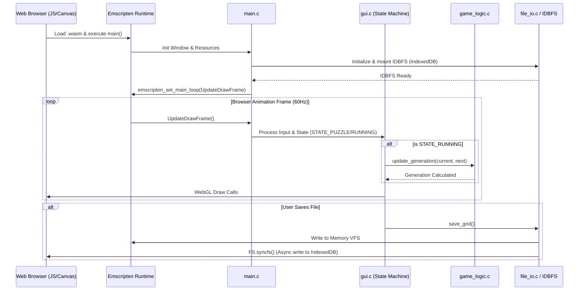

# Technical Design: Frictionless WASM Distribution and Onboarding Architecture

**Version:** 1.0
**Date:** 2026-05-05
**Author:** Gemini
**Related Documents:** [ADR-0005](../adr/ADR-0005-frictionless-wasm-onboarding.md), [DEV_SPEC-0004](../specs/DEV_SPEC-0004-frictionless-wasm-onboarding.md)

---

### 1. Introduction

This document provides a detailed technical design for the "Frictionless WASM Distribution and Onboarding Architecture" feature. It translates the requirements defined in DEV_SPEC-0004 into a concrete implementation plan, specifying the architecture, components, data models, and internal APIs for porting the C/Raylib codebase to WebAssembly (WASM) using Emscripten. Furthermore, it defines the technical structure for the new "Puzzle Campaign" state machine. The goal is to create a seamless web experience without compromising the core C simulation performance.

---

### 2. System Architecture and Components

The architecture adapts the existing monolithic native C application into a browser-compatible WASM module. The primary architectural change lies in the execution loop and the file system abstraction.

#### 2.1. Component Overview

*   **Platform Layer (Emscripten / HTML5):**
    *   **`index.html` & Javascript Glue:** Provides the HTML canvas element that Raylib/WebGL binds to, and handles browser-specific events.
    *   **Emscripten VFS (Virtual File System):** Emulates the POSIX file system in memory. We will utilize the `IDBFS` (IndexedDB File System) persistent storage module provided by Emscripten to allow `.bio` files to survive page reloads.

*   **Application Layer (`main.c` / `gui.c`):**
    *   **Main Loop Adapter:** Browsers do not support infinite `while(!WindowShouldClose())` blocking loops. The main application loop in `main.c` will be refactored into a discrete `UpdateDrawFrame()` function and yielded to the browser via `emscripten_set_main_loop()`.
    *   **State Machine (`gui.c`):** Extended to include `STATE_PUZZLE_CAMPAIGN`.

*   **Simulation Logic Layer (`game_logic.c`):**
    *   Remains largely untouched, but OpenMP compiler directives (`#pragma omp`) will be conditionally compiled based on the target platform (Native vs. WASM) to handle browser threading limitations.

*   **I/O Abstraction Layer (`file_io.c`):**
    *   Functions like `save_grid` and `load_grid` will interface with the Emscripten VFS. Async syncing functions (`EM_ASM` calls to `FS.syncfs`) will be required to commit memory changes to IndexedDB.

#### 2.2. Component Interaction Diagram

This diagram illustrates the high-level flow of the WebAssembly execution context.



---

### 3. Data Model Specification

#### 3.1. Puzzle Level Structure (`PuzzleConfig`)

To support the onboarding campaign, a new data structure is introduced to define the constraints and victory conditions of a specific puzzle level. This will be integrated into or act as a wrapper around the existing `GameConfig`.

```c
typedef struct {
    int level_id;                 // Sequential identifier (e.g., 1, 2, 3)
    char description[256];        // Tutorial text / Goal (e.g., "Defeat the Red Block")
    
    // Constraints
    int allowed_blue_cells;       // "Budget" of cells the player can place
    int max_rounds_limit;         // Time limit for the puzzle to resolve
    
    // Placement Bounding Box (Player can only place cells here)
    int valid_zone_start_row;
    int valid_zone_end_row;
    int valid_zone_start_col;
    int valid_zone_end_col;
    
    // Victory Condition
    int required_blue_dominance;  // Minimum blue cells required to win after rounds limit
} PuzzleConfig;
```

#### 3.2. File Format Expansion (`.bio` files)

The `.bio` file saving/loading mechanism in `file_io.c` will be extended to optionally parse `PuzzleConfig` headers when a level is loaded, ensuring the constraints are correctly applied to the UI.

---

### 4. Internal API Specification (C Functions)

#### 4.1. Main Loop Refactoring (`main.c`)

The traditional `main()` function blocking loop must be dismantled.

```c
// Native structure (Old)
int main() {
    InitWindow(...);
    while (!WindowShouldClose()) { UpdateDrawFrame(); }
    CloseWindow();
}

// WASM Compatible Structure (New)
#if defined(PLATFORM_WEB)
    #include <emscripten/emscripten.h>
#endif

void UpdateDrawFrame(void) {
    // Contains the logic formerly inside the while() loop
    run_gui_app_step(); // Step function extracted from run_gui_app()
}

int main(void) {
    InitWindow(...);
    // Init state, allocate worlds...

#if defined(PLATFORM_WEB)
    // 0 = browser controls FPS, 1 = simulate infinite loop
    emscripten_set_main_loop(UpdateDrawFrame, 0, 1);
#else
    SetTargetFPS(60);
    while (!WindowShouldClose()) {
        UpdateDrawFrame();
    }
#endif
    
    // Cleanup...
    return 0;
}
```

#### 4.2. File Syncing API (`file_io.c`)

When running in the browser, file writes only occur in memory. They must be explicitly synced to persistent storage (IndexedDB).

```c
// KI-Agent unterstützt: Web-compatible save function
int save_grid_web_safe(const char *filename, World *w, GameConfig *c) {
    int result = save_grid(filename, w, c); // Normal POSIX write to memory VFS
    
    if (result) {
#if defined(PLATFORM_WEB)
        // Execute inline JS to sync the Emscripten IDBFS to the browser
        EM_ASM(
            FS.syncfs(false, function (err) {
                if (err) console.error('IDBFS Sync Error:', err);
                else console.log('Biotope saved to IndexedDB');
            });
        );
#endif
    }
    return result;
}
```

---

### 5. Frontend & UI Specification (`gui.c` extensions)

#### 5.1. STATE_PUZZLE_CAMPAIGN Implementation

A new case in the main `switch(state)` statement in `gui.c` will handle the tutorial flow:

1.  **Render Mode:** Draws the grid, but applies a visual overlay (darkening/red hatching) to cells outside the `valid_zone` defined in the `PuzzleConfig`.
2.  **Input Filtering:** Mouse clicks are ignored if the coordinate falls outside the `valid_zone` or if `current_blue_pop >= allowed_blue_cells`.
3.  **Execution:** When the user presses ENTER, the state transitions to `STATE_RUNNING`, but with a strict round limit (`max_rounds_limit`).
4.  **Evaluation:** Once the simulation halts, the state machine evaluates the `required_blue_dominance`. If met, transition to a "Victory" overlay and load Level N+1. If failed, offer a "Retry" button to reload the puzzle's initial state.

---

### 6. Security Considerations

*   **Cross-Origin Isolation (WASM/SharedArrayBuffer):** If we choose to compile the WASM module with Pthreads/OpenMP support, the hosting environment (e.g., itch.io, GitHub Pages) must serve the files with `Cross-Origin-Opener-Policy: same-origin` and `Cross-Origin-Embedder-Policy: require-corp`. If the host does not support this, the WASM build will crash.
    *   *Mitigation:* The primary WASM target will be compiled *without* OpenMP (Single Threaded) to guarantee maximum compatibility across all web hosts. The "Epic Scale" native build will retain OpenMP.
*   **IndexedDB Quotas:** The browser imposes storage limits on IndexedDB. Storing thousands of massive `.bio` files could lead to quota exhaustion.
    *   *Mitigation:* Implement a simple cleanup/LRU (Least Recently Used) protocol or limit the maximum number of saved protocols in the web build.

---

### 7. Performance Considerations

*   **WASM Engine Penalty:** The C logic will run roughly 15-30% slower in the browser than a native executable. We will mitigate this by limiting the maximum grid size in the web build (e.g., max 500x500) to ensure a stable 60 FPS experience.
*   **Memory Management:** The Emscripten heap size must be predefined during compilation. Given the Double Buffering strategy (ADR-0004), allocating two massive worlds can cause `OOM (Out Of Memory)` exceptions in WASM.
    *   *Mitigation:* The `Makefile.web` will compile with `-s ALLOW_MEMORY_GROWTH=1`, allowing the WASM module to request more RAM dynamically, preventing crashes during resizing.
*   **VFS Latency:** `FS.syncfs()` is an asynchronous operation. To prevent UI stuttering, file saves will not block the main rendering loop. The UI will display a "Saving..." indicator until the async callback fires.