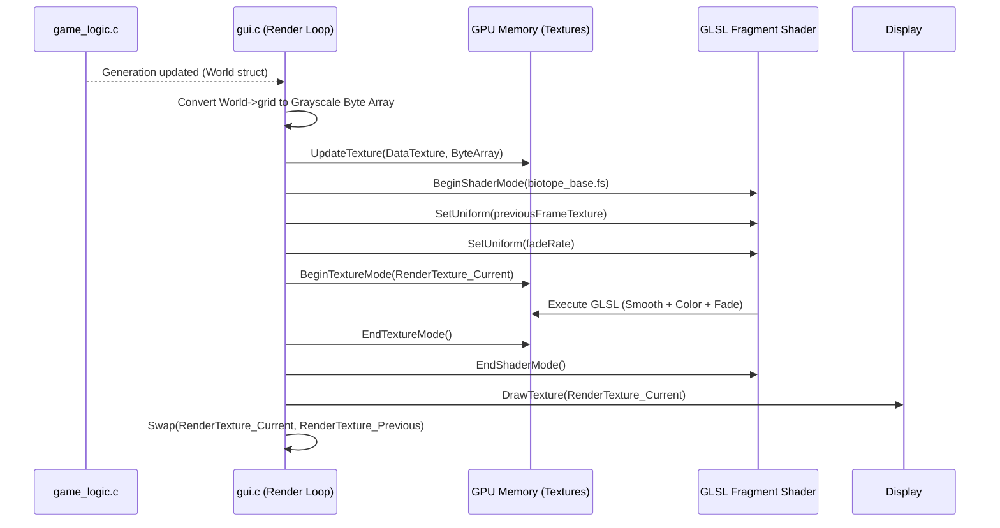

# Technical Design: GPU Aesthetic Overhaul via Shader Pipeline

**Version:** 1.0
**Date:** 2026-05-05
**Author:** Gemini
**Related Documents:** [ADR-0006](../adr/ADR-0006-gpu-aesthetic-overhaul.md), [DEV_SPEC-0006](../specs/DEV_SPEC-0006-gpu-aesthetic-overhaul.md)

---

### 1. Introduction

This document details the technical implementation for migrating the Biotope rendering system from a CPU-bound pixel updater to a GPU-accelerated Fragment Shader pipeline using Raylib and GLSL. This shift fulfills the requirements of DEV_SPEC-0006, creating the "Living Petri Dish" aesthetic (smoothing, bloom, and trails) while maintaining cross-platform compatibility (Native OpenGL 3.3 and WebGL).

---

### 2. System Architecture and Components

The architecture replaces the manual color assignment loop in `gui.c` with a direct data upload to the GPU, followed by multiple shader passes.

#### 2.1. Component Overview

*   **Data Serialization Layer (CPU - `gui.c`):**
    *   Converts the `World->grid` (integer array of DEAD, TEAM_RED, TEAM_BLUE) into a raw byte format that the GPU can natively interpret as a Texture. To save bandwidth, we will map the states to a single-channel format (e.g., `PIXELFORMAT_UNCOMPRESSED_GRAYSCALE`) where byte values represent the state (e.g., 0=Dead, 127=Blue, 255=Red).
*   **Raylib Render Pipeline (GPU):**
    *   **Data Texture:** The uncompressed grayscale texture holding the raw state.
    *   **Render Texture (Ping-Pong):** Two `RenderTexture2D` framebuffers (FBOs) used to achieve the "Temporal Fading" (Fossils) effect. We must read from the *previous* frame's visual output while drawing the *current* frame.
*   **GLSL Shader Programs:**
    *   `biotope_base.fs`: The core fragment shader. It reads the Data Texture, applies the color mapping, calculates smoothing (Metaballs), and blends with the previous frame for the fade effect.
    *   `biotope_bloom.fs` (Optional Post-Process): A secondary shader pass that applies a Gaussian blur to bright areas to create the glow effect.

#### 2.2. Component Interaction Diagram



---

### 3. Data Model Specification

#### 3.1. CPU-to-GPU Data Format

The `World->grid` is an `int` array. Uploading 4 bytes (int) per cell is wasteful when we only have 3 states. We will compress this into a 1-byte (`unsigned char`) format before upload.

```c
// Mapping in gui.c before UpdateTexture
// DEAD = 0
// TEAM_BLUE = 127
// TEAM_RED = 255

unsigned char *gpu_data_buffer = malloc(config.cols * config.rows * sizeof(unsigned char));

// During the loop:
if (cell == DEAD) gpu_data_buffer[i] = 0;
else if (cell == TEAM_BLUE) gpu_data_buffer[i] = 127;
else if (cell == TEAM_RED) gpu_data_buffer[i] = 255;
```

#### 3.2. Shader Uniforms (API)

The following variables must be passed from the C code to the GLSL shader every frame using Raylib's `SetShaderValueTexture` and `SetShaderValue`:

*   `sampler2D texture0`: The default texture passed by `DrawTexturePro` (This will be our raw `gpu_data_buffer`).
*   `sampler2D previousFrame`: The `RenderTexture2D` containing the visual output of frame N-1.
*   `vec2 resolution`: The dimensions of the grid (e.g., 200.0, 200.0) needed for calculating neighbor offsets in the shader for smoothing.
*   `float fadeRate`: The speed at which dead cells fade to black (e.g., 0.95).

---

### 4. GLSL Shader Specification

To maintain WebGL compatibility (WASM), we must use a syntax compatible with GLSL ES 100 or standard GLSL 330.

#### 4.1. Core Shader (`biotope_base.fs`) - Pseudocode Concept

```glsl
#version 100 // Or 330 depending on target
precision mediump float;

varying vec2 fragTexCoord;
uniform sampler2D texture0;       // Current raw data
uniform sampler2D previousFrame;  // Previous visual frame
uniform vec2 resolution;
uniform float fadeRate;

// Theme Colors (Passed as uniforms or hardcoded)
const vec4 COLOR_RED = vec4(1.0, 0.23, 0.39, 1.0);
const vec4 COLOR_BLUE = vec4(0.0, 0.86, 1.0, 1.0);
const vec4 COLOR_BG = vec4(0.08, 0.09, 0.12, 1.0);

void main() {
    // 1. Read Current State
    float state = texture2D(texture0, fragTexCoord).r; // 0.0, 0.5 (approx), or 1.0
    
    vec4 currentColor = COLOR_BG;
    if (state > 0.9) currentColor = COLOR_RED;
    else if (state > 0.4) currentColor = COLOR_BLUE;

    // 2. Read Previous Visual State
    vec4 prevColor = texture2D(previousFrame, fragTexCoord);
    
    // 3. Temporal Fading Logic
    vec4 finalColor;
    if (state > 0.1) {
        // Cell is alive, draw it brightly
        finalColor = currentColor;
    } else {
        // Cell is dead, fade the previous color
        finalColor = max(COLOR_BG, prevColor * fadeRate);
    }
    
    // 4. (Optional) Smoothing/Metaball logic would go here by sampling neighbors
    
    gl_FragColor = finalColor;
}
```

---

### 5. Frontend Specification (`gui.c` modifications)

The `DrawGridAndCells` function will be fundamentally rewritten.

1.  **Initialization Phase:**
    *   Allocate `unsigned char *gpu_data_buffer`.
    *   Create a single-channel Raylib Image: `GenImageColor(cols, rows, BLANK)` and set its format to `PIXELFORMAT_UNCOMPRESSED_GRAYSCALE`. Load into `Texture2D rawDataTex`.
    *   Load the shader: `LoadShader(0, "resources/shaders/biotope_base.fs")`.
    *   Create two `RenderTexture2D` framebuffers (Ping/Pong) matching the screen draw area dimensions.

2.  **Render Loop Phase (`DrawGridAndCells`):**
    *   Update `gpu_data_buffer` from `World->grid` (skipping the ghost border padding).
    *   `UpdateTexture(rawDataTex, gpu_data_buffer)`.
    *   `BeginTextureMode(pingPongTarget[currentIndex])`.
    *   `BeginShaderMode(biotopeShader)`.
    *   Set uniforms (`previousFrame` points to `pingPongTarget[1 - currentIndex]`).
    *   `DrawTexturePro(rawDataTex, ...)` -> This triggers the shader to process the entire grid.
    *   `EndShaderMode()`.
    *   `EndTextureMode()`.
    *   `DrawTextureRec(pingPongTarget[currentIndex].texture, ...)` to the actual screen.
    *   `currentIndex = 1 - currentIndex;` (Swap buffers).

---

### 6. Security Considerations

*   **Shader Injection:** As we are loading `.fs` files from the filesystem, ensure the `resources/shaders/` directory is read-only in production builds to prevent malicious shader injection. In the WASM build, these files must be packaged securely via Emscripten's `--preload-file` directive.

---

### 7. Performance Considerations

*   **Texture Upload Bottleneck:** Uploading the raw texture every frame (`UpdateTexture`) is the new bottleneck. Using `unsigned char` (1 byte per cell) instead of `Color` (4 bytes per cell) reduces the PCIe bus bandwidth requirement by 75%.
*   **Resolution vs. Simulation Size:** The `RenderTexture2D` framebuffers operate at the *screen resolution* (e.g., 1920x1080), not the *grid resolution* (e.g., 100x100). The shader executes per screen pixel. For very large screens, the fragment shader cost increases. If performance drops, we may need to render to a smaller, fixed-resolution FBO and scale it up.