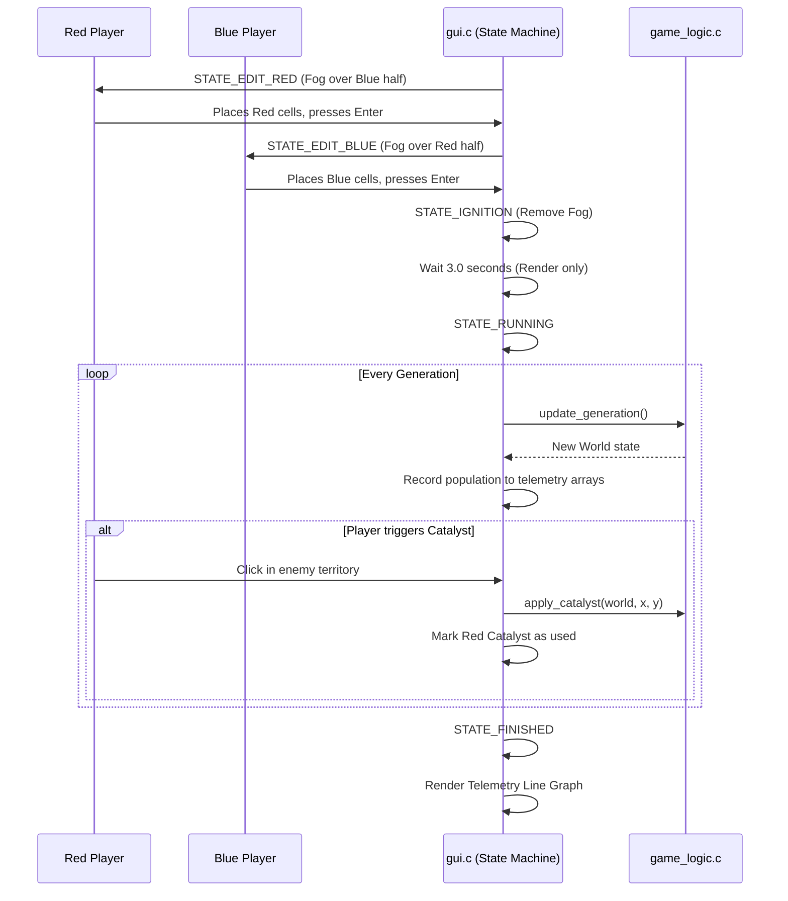

# Technical Design: Laser Focus on the "Biotope" Competitive USP

**Version:** 1.0
**Date:** 2026-05-05
**Author:** Gemini
**Related Documents:** [ADR-0007](../adr/ADR-0007-laser-focus-competitive-usp.md), [DEV_SPEC-0007](../specs/DEV_SPEC-0007-competitive-usp-focus.md)

---

### 1. Introduction

This document provides the technical design for implementing the competitive mechanics detailed in DEV_SPEC-0007. It outlines the architectural extensions required in `gui.c` to support the "Blind Draft" and "Ignition Sequence", the state modifications in `game_logic.c` for the "Catalyst" intervention, and the data structures needed to record and display post-match telemetry.

---

### 2. System Architecture and Components

The core architecture remains the state machine within `gui.c` and the simulation loop in `game_logic.c`. We are extending these components to support turn-based drafting and mid-simulation interventions.

#### 2.1. Component Overview

*   **GUI State Machine (`gui.c`):**
    *   **`STATE_EDIT_RED` / `STATE_EDIT_BLUE`:** Replaces the single `STATE_EDIT`. Controls which player can place cells and triggers the "Fog of War" rendering over the inactive half.
    *   **`STATE_IGNITION`:** A new transitional state. Renders the full grid (no fog) but bypasses `update_generation()` until a timer expires, building tension.
    *   **`STATE_RUNNING` (Modified):** Now listens for Catalyst inputs and updates telemetry arrays per frame.
    *   **`STATE_FINISHED` (Modified):** Renders the telemetry line graphs using Raylib drawing primitives.

*   **Simulation Core (`game_logic.c` / `game_logic.h`):**
    *   **`apply_catalyst(World *w, int center_r, int center_c)`:** A new function to forcefully set a localized 10x10 area to `DEAD`, bypassing standard Conway rules for one frame.

*   **Data Storage (`file_io.c`):**
    *   Serialization logic must be updated to append the dynamically allocated telemetry arrays to the `.bio` format.

#### 2.2. Component Interaction Diagram



---

### 3. Data Model Specification

#### 3.1. Telemetry Data Structures (`GameConfig` extension)

To support the "Post-Match Autopsy", `GameConfig` (defined in `gui.h`) must be expanded to hold historical data.

```c
typedef struct {
    // ... existing fields (rows, cols, delay_ms, max_rounds) ...
    
    // Catalyst Tracking
    bool red_catalyst_used;
    bool blue_catalyst_used;
    
    // Telemetry Arrays (Dynamically allocated based on max_rounds)
    int *history_red_pop;
    int *history_blue_pop;
    int history_count; // Number of rounds actually played
} GameConfig;
```

*Memory Management Note:* `history_red_pop` and `history_blue_pop` must be allocated during `STATE_IGNITION` (`malloc(max_rounds * sizeof(int))`) and freed when transitioning back to `STATE_CONFIG` or on application exit.

---

### 4. Internal API Specification

#### 4.1. Catalyst Intervention Logic (`game_logic.c`)

```c
// Forcefully kills a 10x10 area around the specified center.
// Bounds checking is critical to avoid segfaults near the grid edges.
void apply_catalyst(World *w, int center_r, int center_c) {
    int stride = w->cols + 2;
    int radius = 5; // 10x10 area
    
    for (int r = center_r - radius; r <= center_r + radius; r++) {
        for (int c = center_c - radius; c <= center_c + radius; c++) {
            // Strict bounds checking against the visible grid (excluding ghost borders)
            if (r >= 1 && r <= w->rows && c >= 1 && c <= w->cols) {
                int index = r * stride + c;
                w->grid[index] = DEAD;
            }
        }
    }
}
```

#### 4.2. Telemetry Recording (`gui.c` / `STATE_RUNNING`)

```c
// Inside the STATE_RUNNING loop, immediately after update_generation()
if (config.history_count < config.max_rounds) {
    config.history_red_pop[config.history_count] = config.current_red_pop;
    config.history_blue_pop[config.history_count] = config.current_blue_pop;
    config.history_count++;
}
```

---

### 5. Frontend Specification (`gui.c` modifications)

#### 5.1. Fog of War Rendering

During `STATE_EDIT_RED` or `STATE_EDIT_BLUE`, `DrawGridAndCells` will overlay a semi-transparent rectangle over the inactive half.

```c
// Concept inside DrawGridAndCells or the main render switch
int midX = startX + (drawWidth / 2);

if (state == STATE_EDIT_RED) {
    // Obscure Blue side (Left half)
    DrawRectangle(startX, startY, drawWidth / 2, drawHeight, Fade(BLACK, 0.8f));
    DrawText("FOG OF WAR", startX + 50, startY + drawHeight / 2, 20, DARKGRAY);
} else if (state == STATE_EDIT_BLUE) {
    // Obscure Red side (Right half)
    DrawRectangle(midX, startY, drawWidth / 2, drawHeight, Fade(BLACK, 0.8f));
    DrawText("FOG OF WAR", midX + 50, startY + drawHeight / 2, 20, DARKGRAY);
}
```

#### 5.2. Ignition Sequence Timer

The `STATE_IGNITION` uses Raylib's `GetTime()` to create a non-blocking delay.

```c
static double ignitionStartTime = 0.0;

case STATE_IGNITION:
    if (ignitionStartTime == 0.0) {
        ignitionStartTime = GetTime();
        // Play bass-drop sound here
    }
    
    DrawGridAndCells(...); // Draw full grid, no fog
    
    double elapsed = GetTime() - ignitionStartTime;
    if (elapsed >= 3.0) {
        state = STATE_RUNNING;
        ignitionStartTime = 0.0; // Reset for next match
    } else {
        // Draw dramatic countdown overlay
        DrawText(TextFormat("IGNITION IN: %.1f", 3.0 - elapsed), ...);
    }
    break;
```

---

### 6. Security Considerations

*   **Array Out of Bounds:** The `apply_catalyst` function directly manipulates the memory grid based on mouse coordinates. Strict clamping is required to ensure malicious or accidental clicks outside the grid do not cause a segmentation fault.
*   **Memory Leaks:** The new telemetry arrays in `GameConfig` introduce heap allocations that persist across states. A strict constructor/destructor pattern must be enforced whenever a match ends or restarts.

---

### 7. Performance Considerations

*   **Telemetry Overhead:** Recording two integers per generation adds negligible overhead to the simulation loop.
*   **Catalyst Mutability:** Modifying the grid directly via `apply_catalyst` breaks the read-only assumption of `current_gen` during a frame transition. The Catalyst must be applied to `current_gen` *before* the OpenMP `update_generation` loop begins, ensuring all threads read the altered state consistently.