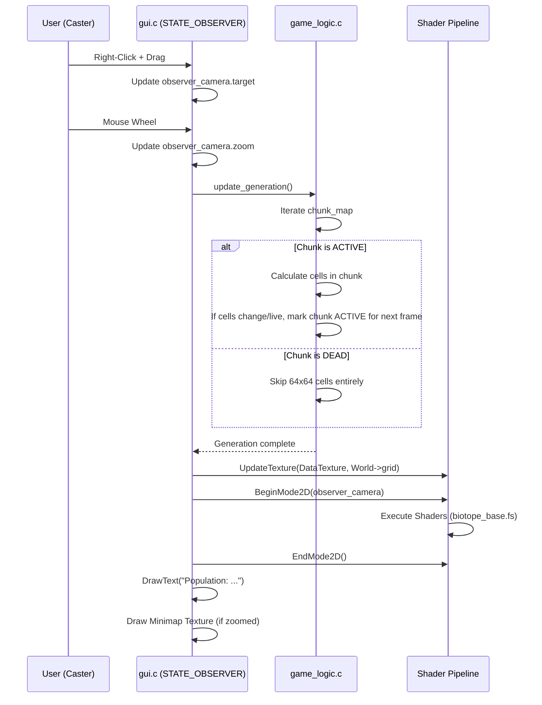

# Technical Design: "Epic Scale" Tournament Architecture

**Version:** 1.0
**Date:** 2026-05-05
**Author:** Gemini
**Related Documents:** [ADR-0008](../adr/ADR-0008-epic-scale-tournament-architecture.md), [DEV_SPEC-0008](../specs/DEV_SPEC-0008-epic-scale-tournament-architecture.md)

---

### 1. Introduction

This document details the technical implementation for the "Epic Scale Tournament Architecture" (DEV_SPEC-0008). It focuses on two major technical shifts: 
1. The algorithmic optimization of the C simulation core (`game_logic.c`) using an "Active Chunk" spatial partitioning heuristic to allow playable framerates on massive grids (e.g., 5000x5000).
2. The implementation of a free-cam broadcasting interface (`STATE_OBSERVER`) in `gui.c` using Raylib's `Camera2D` system, seamlessly integrated with the GPU shader pipeline from ADR-0006.

---

### 2. System Architecture and Components

The architecture introduces a spatial metadata layer on top of the raw integer grid and adds a virtual camera to the rendering pipeline.

#### 2.1. Component Overview

*   **Simulation Core (`game_logic.c`):**
    *   **`World` Struct Extension:** The `World` struct will now contain a secondary, lower-resolution grid called `chunk_map`. 
    *   **Chunking Logic:** The `update_generation` loop will be rewritten. Instead of a naive `for(r)...for(c)` loop over 25 million cells, it will first iterate over the `chunk_map`. If a chunk is marked "active", only then will it evaluate the cells within that specific chunk boundary.
*   **Observer UI (`gui.c`):**
    *   **`Camera2D observer_camera`:** A Raylib camera struct that defines the current viewport offset, rotation (always 0), and zoom level.
    *   **Rendering Pipeline:** The `DrawGridAndCells` function (which now uses GPU shaders) must wrap its core texture drawing commands inside `BeginMode2D(observer_camera)` and `EndMode2D()`.
    *   **UI Overlay:** Drawn *after* `EndMode2D()` so that population stats and the minimap remain fixed to the screen coordinates while the grid pans beneath them.

#### 2.2. Component Interaction Diagram



---

### 3. Data Model Specification

#### 3.1. Active Chunk Map (`game_logic.h`)

To implement spatial partitioning without the extreme overhead of a full QuadTree (Hashlife), we divide the grid into fixed-size chunks (e.g., 64x64 cells).

```c
#define CHUNK_SIZE 64

typedef struct {
    int *grid;          // The raw 1D array of cells (padded with ghost borders)
    int rows;           // e.g., 5000
    int cols;           // e.g., 5000
    
    // Spatial Partitioning (NEW)
    unsigned char *chunk_map; // 1D array representing the active state of chunks
    int chunk_rows;           // rows / CHUNK_SIZE (+1 if remainder)
    int chunk_cols;           // cols / CHUNK_SIZE (+1 if remainder)
} World;
```

**Chunk State Values:**
*   `0` (DEAD): The chunk contains entirely dead cells.
*   `1` (ACTIVE): The chunk contains living cells OR had living cells in the previous generation that might have influenced neighbors.

---

### 4. Internal API Specification

#### 4.1. Refactored `update_generation`

The core OpenMP loop must be restructured to utilize the `chunk_map`.

```c
void update_generation(World *current_gen, World *next_gen, ...) {
    sync_ghost_borders(current_gen);
    
    // 1. Clear the NEXT generation's chunk map completely
    memset(next_gen->chunk_map, 0, next_gen->chunk_rows * next_gen->chunk_cols);

    // 2. Iterate over CHUNKS, not cells
    #pragma omp parallel for // OpenMP now parallelizes chunk processing
    for (int cr = 0; cr < current_gen->chunk_rows; cr++) {
        for (int cc = 0; cc < current_gen->chunk_cols; cc++) {
            int chunk_idx = cr * current_gen->chunk_cols + cc;
            
            // Heuristic Bypass: If this chunk and all 8 neighbors were DEAD last frame, skip it!
            if (!is_chunk_or_neighbors_active(current_gen, cr, cc)) {
                continue; // Massive performance saving
            }
            
            // If active, process the cells inside this specific chunk
            int start_row = cr * CHUNK_SIZE + 1; // +1 for ghost border offset
            int end_row = min((cr + 1) * CHUNK_SIZE, rows);
            // ... similar for cols ...
            
            bool chunk_has_life = false;
            
            for (int r = start_row; r <= end_row; r++) {
                for (int c = start_col; c <= end_col; c++) {
                    // ... standard Conway logic ...
                    next_gen->grid[i] = new_state;
                    
                    if (new_state != DEAD) chunk_has_life = true;
                }
            }
            
            // If life was generated, mark this chunk as ACTIVE for the NEXT frame
            if (chunk_has_life) {
                next_gen->chunk_map[chunk_idx] = 1;
            }
        }
    }
}
```

#### 4.2. Camera & Shader Integration (`gui.c`)

When using a custom shader (from ADR-0006) and a `Camera2D`, Raylib requires specific ordering so the shader projection matrices align with the camera transform.

```c
// Inside DrawGridAndCells during STATE_OBSERVER

// 1. Upload new grid data to GPU (No camera transform needed here)
UpdateTexture(rawDataTex, gpu_data_buffer);

// 2. Begin Ping-Pong Render Texture
BeginTextureMode(pingPongTarget[currentIndex]);

    // 3. Begin Camera Transform
    BeginMode2D(observer_camera);
    
        // 4. Begin Shader
        BeginShaderMode(biotopeShader);
        
            // Draw the texture covering the whole grid space
            // The Camera2D will automatically handle panning/zooming this texture
            DrawTexturePro(rawDataTex, sourceRect, destRect, origin, 0.0f, WHITE);
            
        EndShaderMode();
    EndMode2D();
EndTextureMode();

// Finally, draw the resulting frame buffer to the screen
DrawTextureRec(pingPongTarget[currentIndex].texture, ...);
```

---

### 5. Security Considerations

*   **Memory Exhaustion (OOM):** Allowing 5000x5000 grids requires `5000 * 5000 * 4 bytes (int) = 100MB` per World. With Double Buffering, that's 200MB just for the raw grids, plus the shader framebuffers (which scale with screen resolution). While negligible for native desktop apps, if the WASM limits are removed, it will crash browser tabs. 
    *   *Mitigation:* The `GameConfig` maximums must remain strictly capped for the WASM build (e.g., 500x500) while allowing `5000x5000` only natively.

---

### 6. Performance Considerations

*   **Chunk Overhead:** The chunking logic introduces a slight overhead (checking the `chunk_map`). For very small, dense grids (e.g., 50x50), this might actually be *slower* than brute force.
    *   *Optimization:* We can add a dynamic threshold in `update_generation`. If `rows * cols < 10000`, bypass the chunk map entirely and run the classic brute-force loop.
*   **Neighbor Chunk Checks:** The function `is_chunk_or_neighbors_active` must be highly optimized. It should ideally use bitwise logic or a fast array lookup to avoid slowing down the OpenMP thread allocation phase.