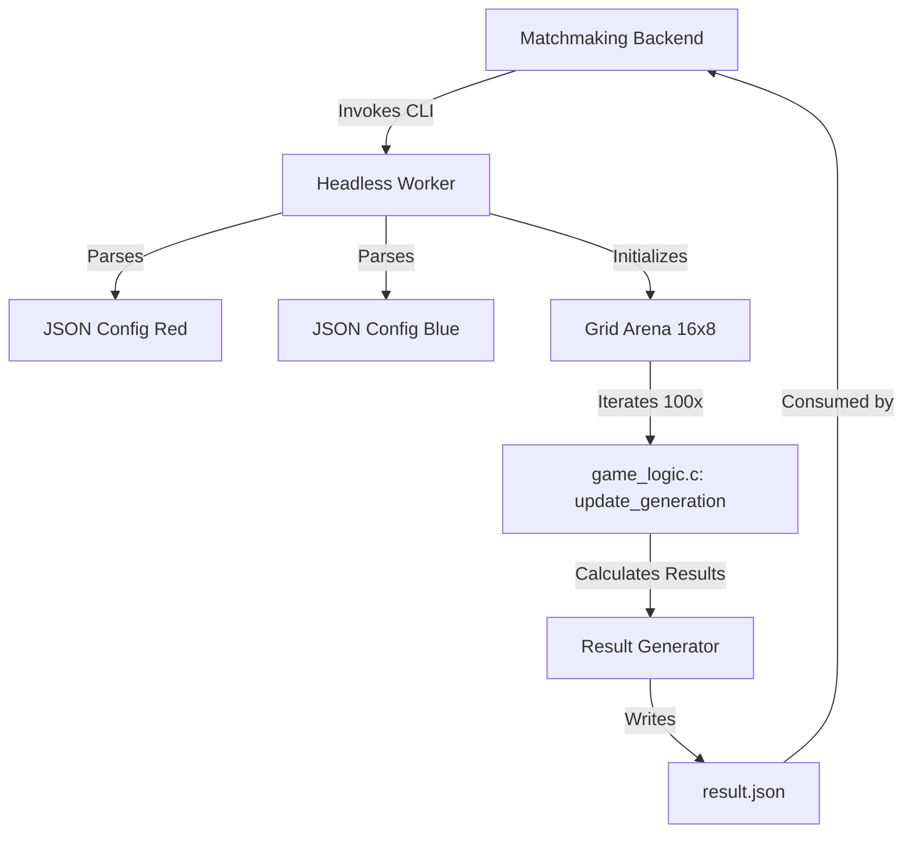

# Technical Design: Headless Simulation Worker

**Version:** 1.0
**Date:** 2026-05-22
**Author:** Gemini
**Related Documents:** [ADR-0010](../adr/ADR-0010-headless-simulation-worker.md), [DEV_SPEC-0010](../specs/DEV_SPEC-0010-headless-simulation-worker.md)

---

### 1. Introduction

This document provides a detailed technical design for the **Headless Simulation Worker**. It translates the requirements defined in DEV_SPEC-0010 into a concrete implementation plan, specifying the architecture, components, data models, and execution flow. The goal is to provide a high-performance, CLI-based execution environment for Game of Life matches that can be easily integrated into a backend matchmaking system.

---

### 2. System Architecture and Components

The Headless Worker is a specialized execution mode of the Biotope application. It reuses the core simulation logic while stripping away all graphical dependencies.

#### 2.1. Component Overview

*   **Entry Point (`main_headless.c` or `main.c` with flags):**
    *   Handles CLI argument parsing.
    *   Initializes the simulation environment.
    *   Coordinates the loading of patterns, the simulation loop, and result generation.

*   **Simulation Engine (`game_logic.c`):**
    *   Provides the `World` structure and `update_generation` logic.
    *   Remains unchanged to ensure behavior parity with the visual version.

*   **Persistence Layer (`file_io.c` / `cJSON`):**
    *   Uses `cJSON` to parse incoming 8x8 pattern files.
    *   Handles the serialization of the final match results into JSON format.

*   **Build System (`Makefile`):**
    *   A new `headless` target that excludes `gui.c` and links only the standard library and OpenMP (if used), omitting Raylib and OpenGL.

#### 2.2. Component Interaction Diagram



---

### 3. Data Model Specification

#### 3.1. Input Pattern (ADR-0009 / DEV_SPEC-0009)
The worker expects JSON files with the following structure:
```json
{
  "config": {
    "cells": [[x1, y1], [x2, y2], ...]
  }
}
```
*Note: x and y are relative coordinates within the 8x8 box.*

#### 3.2. Output Result (Match Outcome)
The worker will produce a JSON result file (or stdout string):
```json
{
  "winner": "red" | "blue" | "draw",
  "red_population": number,
  "blue_population": number,
  "generations": 100,
  "timestamp": "ISO8601_string"
}
```

---

### 4. Implementation Details

#### 4.1. CLI Interface
The binary will be invoked as follows:
`./biotope_headless <path_to_red_json> <path_to_blue_json> [output_path]`

#### 4.2. Execution Flow
1.  **Parse Arguments:** Validate that two files are provided.
2.  **Load JSON:** Use `cJSON_Parse` to read the cell coordinates.
3.  **Initialize World:** Create a `World` struct of size 16x8 (or larger if needed, but 16x8 fits two 8x8 side-by-side).
4.  **Stamp Patterns:** 
    *   Red cells are placed at `[x, y]`.
    *   Blue cells are placed at `[x + 8, y]`.
5.  **Simulation Loop:**
    ```c
    for (int i = 0; i < 100; i++) {
        update_generation(current, next, ...);
        swap(current, next);
    }
    ```
6.  **Calculate Stats:** Iterate through the grid and count cells belonging to `TEAM_RED` and `TEAM_BLUE`.
7.  **Write Output:** Generate the result JSON and write it to the specified output path or stdout.

---

### 5. Security Considerations

*   **Input Validation:** The worker must check that cell coordinates in the JSON are within the 0-7 range. Invalid coordinates must be ignored or trigger an error to prevent out-of-bounds memory access in the C array.
*   **Memory Management:** Strictly follow the project's memory rules. Every `cJSON` object and `World` struct must be explicitly freed before the process exits to ensure zero memory leaks.
*   **Resource Limits:** Since this runs on a server, we must ensure the simulation cannot enter an infinite loop (fixed 100 generations prevents this).

---

### 6. Performance Considerations

*   **No Graphics:** By not linking Raylib, the binary size is minimized and startup time is near-instant.
*   **Memory Efficiency:** For an 8x8 or 16x8 grid, the memory footprint is negligible (a few kilobytes).
*   **Headless Optimization:** We can disable any sleep/delay logic (`usleep`) that exists in the original simulation loop to ensure the 100 generations run as fast as the CPU allows.

---

### 🎓 Für den Informatik-Studenten (Das Design)
In diesem Design nutzen wir das Prinzip der **Kommandozeilen-Werkzeuge (CLI Tools)**. Das Programm arbeitet nach dem EVA-Prinzip: **E**ingabe (JSON-Dateien), **V**erarbeitung (100 Generationen GOL-Logik), **A**usgabe (Ergebnis-JSON). Durch die strikte Trennung von Logik und Grafik können wir denselben "Kern" (`game_logic.c`) für zwei völlig verschiedene Zwecke verwenden: Einmal für ein buntes Spiel mit Effekten und einmal für eine blitzschnelle Berechnung im Hintergrund eines Servers.
