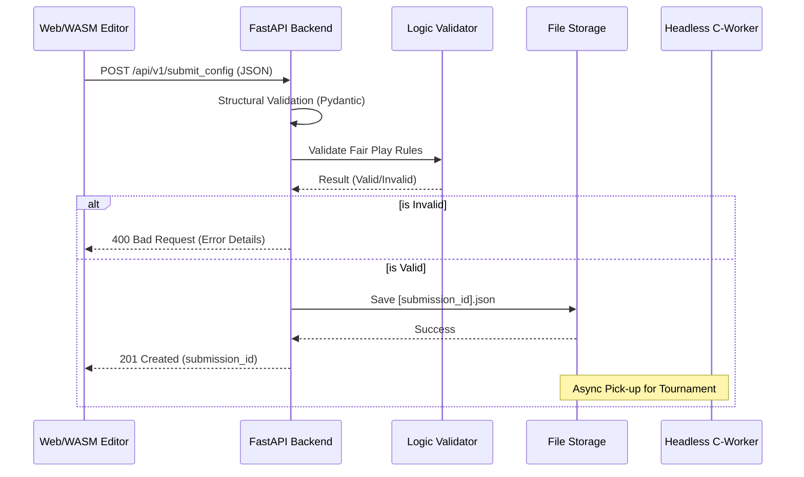

# Technical Design: REST API and Server-Side Validation

**Version:** 1.0
**Date:** 2026-05-22
**Author:** Gemini
**Related Documents:** [ADR-0011](../adr/ADR-0011-rest-api-and-server-side-validation.md), [DEV_SPEC-0011](../specs/DEV_SPEC-0011-rest-api-and-server-side-validation.md)

---

### 1. Introduction

This document provides a detailed technical design for the centralized REST API and server-side validation engine. It defines the implementation of the `POST /api/v1/submit_config` endpoint using FastAPI, ensuring that all player-submitted patterns adhere to the strict "Fair Play" rules of the Biotope multiplayer ecosystem.

---

### 2. System Architecture and Components

The backend follows a modular architecture based on the EVA principle (Input-Process-Output).

#### 2.1. Component Overview

*   **API Layer (FastAPI):**
    *   Handles HTTP routing and request/response lifecycle.
    *   Provides automatic OpenAPI/Swagger documentation.
*   **Validation Layer (Pydantic & Custom Validators):**
    *   **Pydantic:** Enforces structural integrity (types, required fields).
    *   **Business Logic Validator:** Performs deep inspection of the cell grid (Biomass limit, Bounding Box constraints).
*   **Storage Layer (Repository Pattern):**
    *   Initial implementation: `FileRepository` to save valid JSON configurations to a dedicated directory for the `biotope_headless` worker.
    *   Future implementation: `DatabaseRepository` for persistent storage and matchmaking queries.
*   **Common Infrastructure:**
    *   Docker container housing the Python environment and shared volumes for simulation results.

#### 2.2. Component Interaction Diagram



---

### 3. Data Model Specification

Using Pydantic for robust type enforcement.

```python
from pydantic import BaseModel, Field, validator
from typing import List, Tuple

class Metadata(BaseModel):
    player_id: str = Field(..., example="user_123")
    nickname: str = Field(..., example="VibeMaster")
    league: str = Field("local", example="local")

class Config(BaseModel):
    bounding_box_x: int = Field(8, const=True)
    bounding_box_y: int = Field(8, const=True)
    cells: List[Tuple[int, int]] # Relative [x, y] coordinates

class Submission(BaseModel):
    metadata: Metadata
    config: Config
```

---

### 4. Backend Specification

#### 4.1. API Endpoints

*   **`POST /api/v1/submit_config`**
    *   **Description:** Receives and validates an 8x8 pattern submission.
    *   **Request Body:** `Submission` model (JSON).
    *   **Validation Logic:**
        1.  **Count:** `len(cells)` must be `<= 24`.
        2.  **Range:** For every `(x, y)` in `cells`, `0 <= x < 8` and `0 <= y < 8`.
    *   **Success Response:** `201 Created` with `{"status": "success", "submission_id": "...", "timestamp": "..."}`.
    *   **Error Response:** `400 Bad Request` with `{"detail": "Biomass limit exceeded: 25/24 cells"}`.

#### 4.2. Service Layer (`validation_service.py`)

A specialized service will encapsulate the "Fair Play" rules to keep the API layer lean.

```python
def validate_biotope_rules(submission: Submission):
    # Rule 1: Biomass
    cell_count = len(submission.config.cells)
    if cell_count > 24:
        raise ValueError(f"Biomass limit exceeded: {cell_count}/24 cells")
    
    # Rule 2: Bounding Box
    for x, y in submission.config.cells:
        if not (0 <= x < 8 and 0 <= y < 8):
            raise ValueError(f"Cell ({x}, {y}) is outside the 8x8 bounding box")
```

---

### 5. Security Considerations

*   **Input Sanitization:** Pydantic automatically sanitizes types and prevents common injection vectors through strict schema enforcement.
*   **Payload Size Limit:** FastAPI will be configured to limit the maximum request size (e.g., 10KB) to prevent Denial of Service (DoS) attacks via massive JSON payloads.
*   **Strict Typing:** The use of `const=True` for bounding box dimensions prevents players from submitting patterns for leagues that are not yet active.

---

### 6. Performance Considerations

*   **Asynchronous Execution:** FastAPI's `async def` handlers will ensure that the server can handle high-concurrency during peak event hours (e.g., at a university fair).
*   **O(N) Validation:** The validation logic scales linearly with the number of cells (max 24), ensuring sub-millisecond processing time for every request.
*   **Statelessness:** The API remains stateless, allowing for horizontal scaling behind a load balancer if needed.

// AI-attributed: Technical design for the Biotope REST API and Validation Engine.
