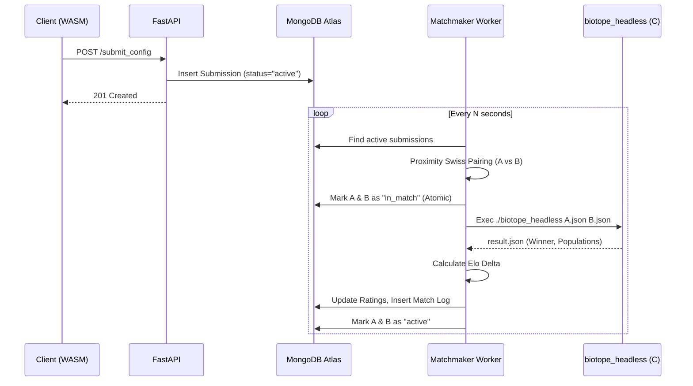

# Technical Design: Matchmaking Service and Tournament Architecture

**Version:** 1.0
**Date:** 2026-05-22
**Author:** Gemini CLI
**Related Documents:** [ADR-0012](../adr/ADR-0012-matchmaking-and-tournament-architecture.md), [DEV_SPEC-0012](../specs/DEV_SPEC-0012-matchmaking-and-tournament-architecture.md)

---

### 1. Introduction

This document provides the technical design for the Biotope Matchmaking Service (Issue #5). It describes how the Python backend will orchestrate automated Game of Life matches using MongoDB Atlas for state management and the `biotope_headless` C-binary for simulation execution.

---

### 2. System Architecture

The architecture transitions from a stateless file-writing API to a stateful, worker-driven ecosystem.

#### 2.1. Component Overview

*   **FastAPI REST App (`backend/app/main.py`):**
    *   Continues to handle `POST /api/v1/submit_config`.
    *   *Change:* Instead of writing to the local filesystem (`results/`), it now writes the submission directly to the MongoDB `submissions` collection.
*   **MongoDB Atlas (Cluster0):**
    *   The central persistent store. Houses `players`, `submissions`, and `matches`.
*   **Matchmaker Worker (`backend/app/worker.py`):**
    *   A continuous asynchronous background process (started alongside or separate from Uvicorn).
    *   Polls MongoDB for active submissions.
    *   Applies the "Proximity Swiss" algorithm to pair submissions.
    *   Spawns `biotope_headless` via `asyncio.create_subprocess_exec`.
    *   Updates the Elo ratings in the database after the match concludes.

#### 2.2. Component Interaction Diagram



---

### 3. Data Model Specification

The database will use `motor` (asynchronous MongoDB driver). Documents will map to Pydantic models.

#### 3.1. Collection: `players`
Stores global player statistics.
```json
{
  "_id": "ObjectId",
  "player_id": "string (unique)",
  "nickname": "string",
  "elo_rating": "integer (default: 1200)",
  "matches_played": "integer (default: 0)",
  "created_at": "datetime"
}
```

#### 3.2. Collection: `submissions`
Stores the actual 8x8 patterns.
```json
{
  "_id": "ObjectId",
  "player_id": "string (ref -> players.player_id)",
  "config": {
    "bounding_box_x": 8,
    "bounding_box_y": 8,
    "cells": [[x, y], ...]
  },
  "status": "string ('active', 'in_match', 'retired')",
  "elo_rating": "integer (default: 1200)", 
  "matches_played": "integer (default: 0)",
  "created_at": "datetime"
}
```
*Note: We track Elo on the submission level to see how good a specific pattern is, and on the player level as an aggregate. For MVP, we will focus on **Submission Elo** for matchmaking.*

#### 3.3. Collection: `matches`
Audit log of all simulations.
```json
{
  "_id": "ObjectId",
  "timestamp": "datetime",
  "red_submission_id": "ObjectId",
  "blue_submission_id": "ObjectId",
  "winner": "string ('red', 'blue', 'draw')",
  "red_population": "integer",
  "blue_population": "integer",
  "generations": 100,
  "elo_delta": "integer (e.g., +25 for red, -25 for blue)"
}
```

---

### 4. Implementation Details

#### 4.1. "Proximity Swiss" Algorithm (`backend/app/matchmaker.py`)
1.  **Fetch Candidates:** Query MongoDB for submissions where `status == "active"`, sorted by `matches_played` ASC (prioritize new submissions). Limit to top N.
2.  **Select Target A:** Pick the first submission.
3.  **Find Target B:** Query MongoDB for another `status == "active"` submission where:
    *   `_id != A._id`
    *   `player_id != A.player_id` (Don't match against yourself).
    *   `elo_rating` is between `A.elo - 150` and `A.elo + 150`.
4.  **Fallback:** If no close match is found after a timeout, expand the Elo bracket or select a random active opponent.

#### 4.2. Elo Calculation Logic (`backend/app/ranking.py`)
```python
def calculate_elo(rating_a: int, rating_b: int, score_a: float, matches_played_a: int) -> int:
    """
    score_a: 1.0 (win), 0.5 (draw), 0.0 (loss)
    """
    expected_a = 1 / (1 + 10 ** ((rating_b - rating_a) / 400))
    k_factor = 40 if matches_played_a < 10 else 20
    new_rating = rating_a + k_factor * (score_a - expected_a)
    return int(round(new_rating))
```

#### 4.3. Headless Execution Security
To execute the C-worker safely:
1.  Use `tempfile.NamedTemporaryFile` to securely write `Target A` and `Target B` JSON patterns to the isolated `/app/results/` volume.
2.  Use Python's `asyncio.create_subprocess_exec` to run `./biotope_headless`. This prevents shell injection vulnerabilities (do not use `shell=True`).
3.  Implement a strict timeout (e.g., 2 seconds). The C-simulation should take <10ms. If it hangs, kill the process to prevent worker starvation.
4.  Parse the stdout or the resulting JSON file, then explicitly delete the temporary pattern files.

---

### 5. Security & Performance Considerations

*   **Concurrency:** When fetching pairs, the worker must use `find_one_and_update(..., update={"$set": {"status": "in_match"}})` to lock the documents. This prevents two workers from grabbing the same submission simultaneously.
*   **Database Indexes:** Create compound indexes in MongoDB:
    *   `submissions`: `{"status": 1, "elo_rating": 1}` to optimize the Proximity Swiss queries.
    *   `players`: `{"player_id": 1}` (Unique).
*   **Connection Pooling:** `motor` handles connection pooling automatically, ensuring the FastAPI and Worker processes do not overwhelm the Atlas cluster.

---

### 🎓 Für den Informatik-Studenten (Das Technische Design)
Dieses Design zeigt den Übergang von einer **monolithischen** Architektur (alles passiert im Hauptprogramm) zu einer **Microservice/Worker** Architektur.
Das API-Backend nimmt nur noch Anfragen entgegen und speichert sie extrem schnell in der Datenbank (MongoDB). Ein völlig separater Prozess (der "Worker") kümmert sich um die schwere Arbeit: Er sucht Gegner, startet das C-Programm im Hintergrund und berechnet das Elo-Rating. Das nennt man **Asynchrone Verarbeitung**. Wenn unser Spiel plötzlich berühmt wird, können wir einfach 10 weitere Worker-Prozesse starten, die alle aus derselben Datenbank lesen, ohne dass das API-Backend langsamer wird.
