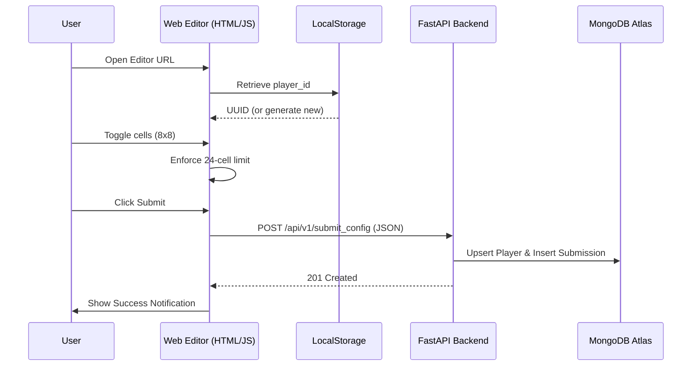

# Technical Design: Mobile-First Web Draft Editor

**Version:** 2.0
**Date:** 2026-05-22
**Author:** Gemini CLI
**Related Documents:** [ADR-0013](../adr/ADR-0013-wasm-draft-mode-and-level-editor.md), [DEV_SPEC-0013](../specs/DEV_SPEC-0013-wasm-draft-mode-and-level-editor.md)

---

### 1. Introduction

This document provides the technical design for the **Standalone Web Draft Editor**. Moving away from the integrated Raylib C editor, this solution focuses on a lightweight, mobile-first web interface to maximize accessibility and ease of use on smartphones.

---

### 2. System Architecture and Components

#### 2.1. Component Overview

*   **Micro-Frontend (HTML5 / CSS3 / Vanilla JS):**
    *   **Responsive Grid:** A CSS Grid-based 8x8 interactive area.
    *   **State Store:** A simple JavaScript object managing the grid state and metadata.
    *   **Identity Manager:** Native JavaScript `localStorage` handling for `player_id` persistence.
    *   **Networking:** Native `fetch()` API for asynchronous JSON submissions.

*   **Backend (Python / FastAPI):**
    *   **API:** `/api/v1/submit_config` endpoint.
    *   **Security:** CORS middleware configured to allow requests from the web editor's origin.

*   **Main Application (C / Raylib / WASM):**
    *   **Viewer:** Continues to function as the primary simulation and tournament hub.
    *   **Redirection:** Links users to the `editor.html` via a simple URL or button.

#### 2.2. Component Interaction Diagram



---

### 3. Data Model Specification

The payload sent to `/api/v1/submit_config` strictly follows the `Submission` Pydantic model:

```json
{
  "metadata": {
    "player_id": "83be7b71-29e3-460d-85f2-959648259d60",
    "nickname": "MobileGamer",
    "league": "local"
  },
  "config": {
    "bounding_box_x": 8,
    "bounding_box_y": 8,
    "cells": [[0, 0], [1, 1], [2, 2]]
  }
}
```

---

### 4. Implementation Details

#### 4.1. The Grid (CSS & JS)
- **HTML:** A container `<div id="grid-container">` with 64 `<div class="cell">` elements.
- **CSS:** `display: grid; grid-template-columns: repeat(8, 1fr); gap: 2px;`
- **JS:** `eventDelegation` on the container to capture clicks. Toggle a `data-active` attribute.

#### 4.2. Identity Persistence
```javascript
function getPlayerId() {
    let id = localStorage.getItem('biotope_player_id');
    if (!id) {
        id = crypto.randomUUID();
        localStorage.setItem('biotope_player_id', id);
    }
    return id;
}
```

#### 4.3. Validation Logic
```javascript
function toggleCell(x, y) {
    const activeCells = getActiveCells();
    if (isCellActive(x, y)) {
        removeCell(x, y);
    } else if (activeCells.length < 24) {
        addCell(x, y);
    } else {
        showError("Biomass limit (24) reached!");
    }
}
```

---

### 5. Integration with Raylib Viewer

The Raylib application (`gui.c`) will provide a transition point:
- **Web-Only:** A button using `OpenURL("editor.html")`.
- **Desktop:** Display a QR code generated locally (or a static image) that points to the hosted URL of the editor.

---

### 6. Security Considerations

- **CORS:** Ensure `CORSMiddleware` in FastAPI includes the editor's domain.
- **Input Sanitization:** Backend continues to validate all business rules.
- **Payload Size:** Request body size is limited to prevent DoS attacks.

---

### 7. Performance Considerations

- **Asset Weight:** Total page weight targets < 50KB for instant loading on mobile networks.
- **Battery Life:** No continuous simulation loop in the editor; UI only updates on interaction.
