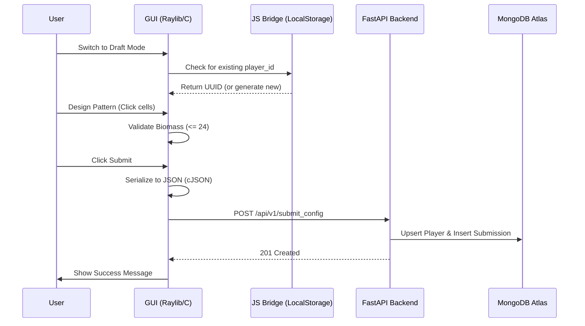

# Technical Design: WASM Draft Mode and Level Editor

**Version:** 1.0
**Date:** 2026-05-22
**Author:** Gemini CLI
**Related Documents:** [ADR-0013](../adr/ADR-0013-wasm-draft-mode-and-level-editor.md), [DEV_SPEC-0013](../specs/DEV_SPEC-0013-wasm-draft-mode-and-level-editor.md)

---

### 1. Introduction

This document provides a detailed technical design for the **WASM Draft Mode and Level Editor** feature. It outlines the integration of interactive pattern editing into the Raylib-based GUI, the management of persistent player identities via browser `LocalStorage`, and the asynchronous submission protocol to the FastAPI backend.

---

### 2. System Architecture and Components

#### 2.1. Component Overview

*   **Frontend (C / Raylib / WASM):**
    *   **UI State Manager:** A state machine in `gui.c` to toggle between `UI_STATE_VIEWER` and `UI_STATE_DRAFT`.
    *   **Interactive Grid:** Logic to capture mouse clicks and translate them to relative coordinates within an 8x8 drafting box.
    *   **Identity Manager:** Uses `EM_JS` to bridge C with JavaScript for UUID generation and `LocalStorage` persistence.
    *   **Submission Engine:** Uses `cJSON` for payload construction and `emscripten_fetch` for non-blocking HTTP POST requests.

*   **Backend (Python / FastAPI):**
    *   **Config API:** Existing `/api/v1/submit_config` endpoint.
    *   **Validation:** Pydantic-based enforcement of the 8x8 box and 24-cell limit (redundant to frontend validation for security).

*   **Database (MongoDB Atlas):**
    *   Stores `submissions` and `players`.

#### 2.2. Component Interaction Diagram



---

### 3. Data Model Specification

The frontend will construct a JSON object matching the `Submission` Pydantic model:

```json
{
  "metadata": {
    "player_id": "uuid-string-here",
    "nickname": "UserEnteredName",
    "league": "local"
  },
  "config": {
    "bounding_box_x": 8,
    "bounding_box_y": 8,
    "cells": [[x1, y1], [x2, y2], ...]
  }
}
```

---

### 4. Identity and Persistence Specification

To avoid requiring a login system while maintaining ranking continuity, we use **Persistent Guest Identities**:

1.  **C-Function:** `char* get_or_create_player_id()`
2.  **Implementation:**
    ```c
    #ifdef PLATFORM_WEB
    EM_JS(char*, js_get_player_id, (), {
        let id = localStorage.getItem('biotope_player_id');
        if (!id) {
            id = crypto.randomUUID();
            localStorage.setItem('biotope_player_id', id);
        }
        let lengthBytes = lengthBytesUTF8(id) + 1;
        let stringOnWasmHeap = _malloc(lengthBytes);
        stringToUTF8(id, stringOnWasmHeap, lengthBytes);
        return stringOnWasmHeap;
    });
    #endif
    ```

---

### 5. Frontend Specification (gui.c)

#### 5.1. Grid Interaction Logic
In `UI_STATE_DRAFT`, the `UpdateGUI()` loop will:
1.  Calculate grid cell under mouse: `int gx = (mx - grid_offset_x) / cell_size`.
2.  Restrict to `0 <= gx < 8` and `0 <= gy < 8`.
3.  If `IsMouseButtonPressed(MOUSE_LEFT_BUTTON)`:
    - If cell is dead AND `count < 24`: Add cell, `count++`.
    - If cell is alive: Remove cell, `count--`.

#### 5.2. UI Elements
- **Overlay:** A semi-transparent `Color{ 0, 121, 241, 50 }` rectangle over the 8x8 area.
- **Counter:** `DrawText(TextFormat("Biomass: %d/24", count), ...)`
- **Nickname:** A simple input box using `GetCharPressed()` to fill a `char nickname[32]` buffer.
- **Submit Button:** A `DrawRectangleRec` that triggers the submission logic when clicked.

#### 5.3. Asynchronous Submission
Using `emscripten_fetch`:
- `emscripten_fetch_attr_t attr;`
- `attr.requestMethod = "POST";`
- `attr.onsuccess = handle_submit_success;`
- `attr.onerror = handle_submit_error;`
- Payload: `cJSON_PrintUnformatted(root)`.

---

### 6. Security Considerations

- **Server-Side Validation:** The backend MUST re-validate the 8x8 box and 24-cell limit. We do not trust the WASM client.
- **CORS:** The FastAPI backend must be configured to allow requests from the domain hosting `biotope.html`.
- **Sanitization:** Nicknames must be sanitized on the backend to prevent injection attacks in future leaderboards.

---

### 7. Performance Considerations

- **Non-Blocking IO:** `emscripten_fetch` is used to ensure the GUI loop doesn't freeze while waiting for the network response.
- **Memory Management:** `cJSON` objects must be explicitly deleted using `cJSON_Delete()` after serialization to prevent leaks in the long-running WASM environment.
- **Redraw Efficiency:** Grid interaction logic is only executed when `UI_STATE_DRAFT` is active.
