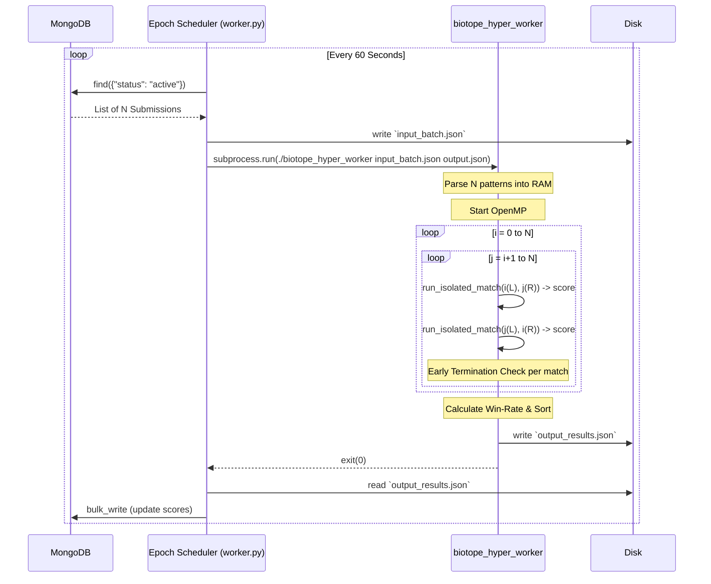

# Technical Design: Global Tournament Epoch Architecture

**Version:** 1.0
**Date:** 2026-05-23
**Author:** Gemini
**Related Documents:** [ADR-0014](../adr/ADR-0014-global-tournament-epoch-architecture.md), [DEV_SPEC-0014](../specs/DEV_SPEC-0014-global-tournament-epoch-architecture.md)

---

### 1. Introduction

This document provides a detailed technical design for the "Global Tournament Epoch Architecture". It translates the requirements defined in DEV_SPEC-0014 into a concrete implementation plan, specifying the system components, data flow, memory management, and the `cJSON` interfaces required to execute a massive $O(N^2)$ Round-Robin tournament reliably and extremely fast.

---

### 2. System Architecture and Components

The architecture represents a paradigm shift from a continuous queue-based worker (Python-centric) to a batch-processing engine (C-centric). The Python backend acts solely as a scheduler and data provider, while the C-Hyper-Worker acts as a pure calculation engine.

#### 2.1. Component Overview

*   **Epoch Scheduler (`backend/app/worker.py`):**
    *   **Responsibility:** Wakes up every 60 seconds (via `asyncio.sleep` loop).
    *   **Action:** Fetches all valid submissions from MongoDB, structures them into an `input_batch.json`, invokes `./biotope_hyper_worker`, reads `output_results.json`, and bulk-updates the MongoDB.

*   **Hyper-Worker Entry Point (`main_hyper.c`):**
    *   **Responsibility:** The new C executable. It replaces `main_headless.c`.
    *   **Action:** Handles file I/O, parses the `input_batch.json` using `cJSON`, allocates memory for $N$ competitors, orchestrates the OpenMP loop, and formats the `output_results.json`.

*   **Simulation Engine (`game_logic.c/h`):**
    *   **Responsibility:** The core Game of Life ruleset.
    *   **Modification:** Needs a new function `run_isolated_match(Player A, Player B)` that allocates its own local `World` pointers to ensure thread safety during OpenMP execution. Implements the `Early Termination` check.

#### 2.2. Interaction Flow (Sequence)



---

### 3. Data Models and APIs

The interface between Python and C is purely file-based using JSON. This avoids complex IPC (Inter-Process Communication) and makes debugging trivial (we can manually run the C-binary with test files).

#### 3.1. Input: `input_batch.json` (Python -> C)

A flat array containing all active competitors and their $8 \times 8$ starting patterns.

```json
{
  "epoch_id": "ep_12345",
  "max_generations": 1000,
  "competitors": [
    {
      "player_id": "usr_abc",
      "cells": [[0,0], [1,0], [2,0], [1,1], [0,2]] // 8x8 local coordinates
    },
    {
      "player_id": "usr_xyz",
      "cells": [[7,7], [6,7], [7,6]]
    }
    // ... up to 500+ entries
  ]
}
```

#### 3.2. Output: `output_results.json` (C -> Python)

The aggregated results. The C-worker handles the summation, so Python only needs to update the database.

```json
{
  "epoch_id": "ep_12345",
  "total_matches_played": 124750,
  "execution_time_ms": 3450,
  "rankings": [
    {
      "player_id": "usr_xyz",
      "total_score": 998.5,   // 1.0 per win, 0.5 per draw
      "matches_played": 499,  // N-1
      "win_rate": 0.998,
      "avg_stable_generation": 142
    },
    {
      "player_id": "usr_abc",
      "total_score": 5.0,
      "matches_played": 499,
      "win_rate": 0.010,
      "avg_stable_generation": 980
    }
  ]
}
```

---

### 4. Technical Implementation Details

#### 4.1. Thread Safety (OpenMP)

The current `create_world()` function allocates memory. If multiple OpenMP threads attempt to use a global `World` pointer, the state will corrupt immediately.

*   **Solution:** The C-loop must allocate a `current_gen` and `next_gen` pointer **inside** the thread-local scope of the parallel `for` loop.
*   **Memory Management:** Each thread `malloc`s its own 8x16 grid at the start of a match and `free`s it at the end. For an 8x16 grid, this is just 128 bytes, making local allocation extremely fast and preventing heap fragmentation.

#### 4.2. The Early Termination Algorithm (Still-Life)

To detect a Still-Life, we need to compare `current_gen` with `next_gen` *after* the `update_generation` step.

*   **Implementation in `game_logic.c`:**
    ```c
    // Inside the match loop (up to max_generations):
    update_generation(local_current, local_next, 8, 16, &r, &b);
    
    // Fast memory comparison
    if (memcmp(local_current->grid, local_next->grid, sizeof(int) * 10 * 18) == 0) {
        // Grid hasn't changed. Still-Life reached.
        match_stats.stable_at_generation = current_step;
        break; // Exit the 1000-generation loop early
    }
    
    // Swap pointers
    World *temp = local_current;
    local_current = local_next;
    local_next = temp;
    ```
    *Note: The size calculation (`10 * 18`) accounts for the padding/ghost-cells used in the current engine.*

#### 4.3. Atomic Scoring

Because multiple threads will be reporting the results of matches simultaneously, adding points to a player's `total_score` variable could cause race conditions.

*   **Solution:** We allocate an array of `Score` structs in `main_hyper.c`. We use the OpenMP `#pragma omp atomic` directive when incrementing a player's score to ensure thread-safe addition without locking the entire process.

---

### 5. Security and Performance Considerations

*   **JSON Parsing Limits:** `cJSON` loads the entire file into memory. A batch of 1000 players will result in a JSON file of roughly 1-2 MB. This is entirely safe and will not cause Out-Of-Memory (OOM) errors.
*   **Validation:** The C-worker must gracefully handle cases where a player submits cells outside the allowed 8x8 bounds (e.g., negative coordinates or coordinates $>7$). Any invalid cell coordinate should be ignored or clamped during initialization to prevent Buffer Overflows in the `grid` array.
*   **Timeouts:** If, for any reason, a match enters an infinite oscillator loop (preventing Early Termination) and `max_generations` is not respected, the C-worker could hang. The `max_generations` limit (e.g., 1000) acts as a hard failsafe. The Python `subprocess.run` call must also include a `timeout` parameter (e.g., `timeout=30`) to kill the C-worker if a catastrophic bug occurs, preventing the server queue from blocking indefinitely.