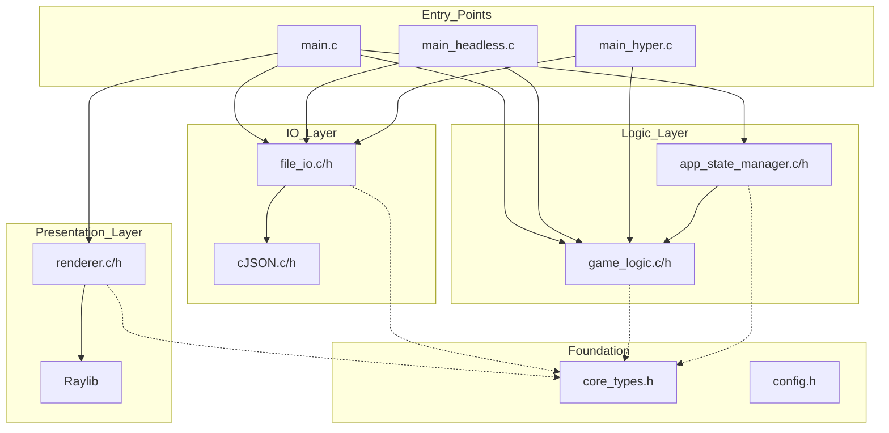
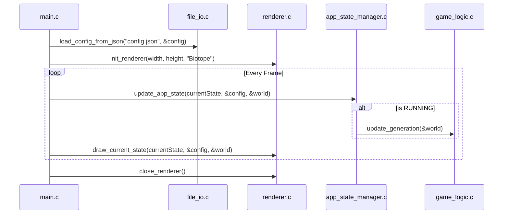

# Technical Design: Architectural Consolidation and Modularization

**Version:** 1.0
**Date:** 2026-05-23
**Author:** Gemini
**Related Documents:** [ADR-0015](../adr/ADR-0015-architectural-consolidation-and-modularization.md), [DEV_SPEC-0015](../specs/DEV_SPEC-0015-architectural-consolidation.md)

---

### 1. Introduction

This document provides a detailed technical design for the Architectural Consolidation feature. It translates the requirements defined in DEV_SPEC-0015 into a concrete implementation plan, specifying the C architecture, modules, shared data models, and API boundaries. The goal is to create a clean, decoupled system that shares core logic across all three entry points (GUI, Headless CLI, Hyper Worker) without redundancy or circular dependencies.

---

### 2. System Architecture and Components

The architecture shifts from a UI-centric monolith (`gui.c`) to a layered procedural architecture where data models and interfaces form the foundation.

#### 2.1. Component Overview

*   **Foundation Layer:**
    *   `core_types.h`: A pure C header defining all central structures (`World`, `GameConfig`, `AppState`, `Team`, `MatchResult`). Contains no business logic, only data definitions.
    *   `config.h`: Contains preprocessor `#define` directives for all "magic numbers", default paths, grid chunk sizes, and static layout metrics.

*   **Logic Layer:**
    *   `game_logic.c/h`: Unchanged at its core, but now strictly includes `core_types.h` instead of defining its own `World` struct.
    *   `app_state_manager.c/h`: A new module that extracts the state machine out of `gui.c`. It handles state transitions (e.g., CONFIG -> RUNNING) and user interactions logically, without rendering.

*   **I/O & Persistence Layer:**
    *   `file_io.c/h`: The sole module allowed to include `cJSON.h`. It wraps all file parsing and writing operations into clean, high-level C functions.

*   **Presentation Layer:**
    *   `renderer.c/h`: The only module allowed to include `raylib.h`. Exposes drawing functions that read from the `AppState` and `World` buffers to render to the screen.

*   **Entry Points:**
    *   `main.c`, `main_headless.c`, `main_hyper.c`: Orchestrators that wire the above components together and contain the `main()` function.

#### 2.2. Component Interaction Diagram



---

### 3. Data Model Specification

The following core structures will be moved to `core_types.h`:

```c
#ifndef CORE_TYPES_H
#define CORE_TYPES_H

#include <stdint.h>
#include <stdbool.h>

// AppState Definition
typedef enum {
    STATE_CONFIG,
    STATE_RUNNING,
    STATE_FINISHED,
    STATE_MELTDOWN
} AppState;

// Simulation Config
typedef struct {
    int epochs;
    int ticks_per_second;
    bool grid_wrapped;
    // ... other config fields
} GameConfig;

// Core Simulation Data
typedef struct {
    uint8_t* grid;
    int width;
    int height;
    // ... double buffering ptrs
} World;

// Team and Match structures
typedef struct {
    int id;
    int score;
} Team;

typedef struct {
    Team winner;
    int total_ticks;
    // ... result metrics
} MatchResult;

#endif // CORE_TYPES_H
```

---

### 4. API Specifications

#### 4.1. IO Layer (`file_io.h`)

This API serves all entry points. It completely hides the `cJSON` dependency.

```c
#include "core_types.h"

// Loads configuration from a JSON file. Returns true on success.
bool load_config_from_json(const char* filepath, GameConfig* config);

// Writes a match result to a JSON log file.
bool append_protocol_result(const char* filepath, const MatchResult* result);

// Loads an initial grid state into a World structure.
bool load_grid(const char* filepath, World* world);

// Saves the current World grid state to a JSON file.
bool save_grid(const char* filepath, const World* world);
```

#### 4.2. Logic Layer (`app_state_manager.h`)

```c
#include "core_types.h"

// Processes input and updates the logical state of the application.
// Returns the next AppState.
AppState update_app_state(AppState current_state, GameConfig* config, World* world);
```

#### 4.3. Presentation Layer (`renderer.h`)

```c
#include "core_types.h"

// Initializes the Raylib window context.
void init_renderer(int window_width, int window_height, const char* title);

// Renders a single frame based on the current state.
void draw_current_state(AppState state, const GameConfig* config, const World* world);

// Cleans up the Raylib context.
void close_renderer(void);
```

---

### 5. Sequence Diagram: Refactored GUI Main Loop



---

### 6. Security Considerations

*   **JSON Parsing:** The `file_io.c` module must validate all incoming JSON fields. Unchecked `cJSON_GetObjectItem` calls can lead to segmentation faults if a user provides malformed JSON files. Type checks (e.g., `cJSON_IsNumber`) must be performed prior to data extraction.
*   **Buffer Overflows:** `load_grid` in `file_io.c` must strictly check the dimensions of the provided arrays against the initialized `World` dimensions. Array bounds checking is mandatory when parsing `.json` grid coordinates.

---

### 7. Performance Considerations

*   **Pass by Reference:** The `World` struct is large (containing grid buffers). It must ALWAYS be passed by pointer (`World*` or `const World*`) across the new API boundaries (to `renderer`, `app_state_manager`, `file_io`) to prevent expensive memory copying.
*   **Include Guards:** Heavy reliance on `core_types.h` means it will be included in almost every `.c` file. It must only contain simple C data types, avoiding any external `#include` directives (like `raylib.h` or `omp.h`) to ensure minimal compile times.
*   **Double Buffering Continuity:** The core architectural strength (ADR-0004) relies on flipping pointers. The `World` struct in `core_types.h` must retain `uint8_t *grid` and `uint8_t *next_grid` to ensure `game_logic.c` can still perform 0-allocation buffer swaps.

#### **AI Attribution**
// KI-Agent unterstützt: Technical design, API specification, and Mermaid architecture modeling.
