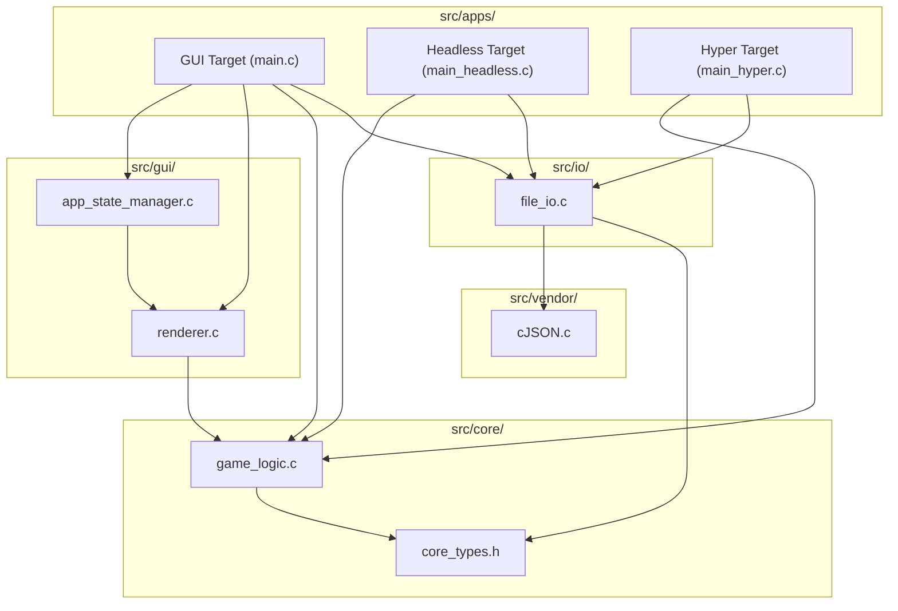
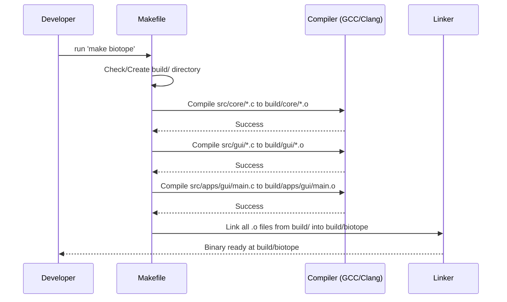

# Technical Design: Clean Architecture Restructuring

**Version:** 1.0
**Date:** 2026-05-26
**Author:** Gemini
**Related Documents:** [ADR-0016](../adr/ADR-0016-clean-architecture-and-project-restructuring.md), [DEV_SPEC-0016](../specs/DEV_SPEC-0016-clean-architecture-restructuring.md)

---

### 1. Introduction

This document provides a detailed technical design for the "Clean Architecture Restructuring" feature. It translates the requirements of physical file organization and build system modernization into a concrete implementation plan. The goal is to move from a flat, cluttered root directory to a modular hierarchy that separates the core simulation engine from target-specific application logic and presentation layers.

---

### 2. System Architecture and Components

The restructuring follows a "Domain-Driven" approach, isolating the core business logic (Game of Life rules) from infrastructure and delivery mechanisms (Raylib GUI, Headless CLI, Tournament Worker).

#### 2.1. Component Overview (Physical Layout)

*   **`src/core/` (Simulation Domain):**
    *   Stateless and infrastructure-agnostic logic.
    *   Files: `game_logic.c/h`, `core_types.h`, `config.h`.
*   **`src/gui/` (Presentation Domain):**
    *   Raylib-dependent rendering and UI state management.
    *   Files: `renderer.c/h`, `app_state_manager.c/h`.
*   **`src/io/` (Infrastructure Domain):**
    *   Persistence and external data interchange.
    *   Files: `file_io.c/h`.
*   **`src/apps/` (Application Domain):**
    *   Entry points that compose core/gui/io components into functional binaries.
    *   Targets: `gui/main.c`, `headless/main_headless.c`, `hyper/main_hyper.c`.
*   **`src/vendor/` (External Domain):**
    *   Third-party source code.
    *   Files: `cJSON/cJSON.c/h`.

#### 2.2. Component Interaction Diagram

This diagram illustrates how the different domains interact. Note that `core` is at the center, with no dependencies on outer layers.



---

### 3. Build System Specification (Makefile)

The `Makefile` must be refactored to support the new directory structure while maintaining portability and efficiency.

#### 3.1. Directory Variables
The Makefile will define directory variables to manage paths centrally:
```makefile
SRC_DIR = src
BUILD_DIR = build
CORE_DIR = $(SRC_DIR)/core
GUI_DIR = $(SRC_DIR)/gui
IO_DIR = $(SRC_DIR)/io
APPS_DIR = $(SRC_DIR)/apps
VENDOR_DIR = $(SRC_DIR)/vendor
```

#### 3.2. Compiler Flags
Include paths will be added to the preprocessor flags to avoid deep relative include paths (e.g., `#include "../../core/game_logic.h"`):
```makefile
CFLAGS += -I$(CORE_DIR) -I$(GUI_DIR) -I$(IO_DIR) -I$(VENDOR_DIR)/cJSON -I$(SRC_DIR)
```

#### 3.3. Build Pattern (Object Files)
All object files will be directed to the `$(BUILD_DIR)` directory. This requires a rule that mirrors the source tree or flattens it into the build folder:
```makefile
$(BUILD_DIR)/%.o: $(SRC_DIR)/%.c
	@mkdir -p $(dir $@)
	$(CC) $(CFLAGS) -c $< -o $@
```

---

### 4. Implementation Strategy: File Relocation

The relocation must use `git mv` to ensure the version control system tracks the file history correctly.

| Source File | Destination |
| :--- | :--- |
| `game_logic.c/h` | `src/core/` |
| `core_types.h` | `src/core/` |
| `config.h` | `src/core/` |
| `main.c` | `src/apps/gui/` |
| `main_headless.c` | `src/apps/headless/` |
| `main_hyper.c` | `src/apps/hyper/` |
| `renderer.c/h` | `src/gui/` |
| `app_state_manager.c/h` | `src/gui/` |
| `file_io.c/h` | `src/io/` |
| `cJSON.c/h` | `src/vendor/cJSON/` |
| `editor.html` | `web/editor/` |
| `submit.php` | `web/bridge/` |
| `resources/shaders/*` | `assets/shaders/` |
| `run_test_suite.py` | `scripts/testing/` |

---

### 5. Sequence Diagram: Build Process



---

### 6. Security Considerations

*   **File Permissions:** The `build/` directory and its contents should be created with standard user permissions. Executable bits must only be set on the final binaries.
*   **Build Artifact Isolation:** Keeping binaries in `build/` prevents accidental exposure of intermediate debug symbols or temporary files in the source repository.
*   **Web Asset Isolation:** Moving `submit.php` and `editor.html` to a `web/` folder allows for easier configuration of web server access controls (e.g., restricting the `src/` directory from being served).

---

### 7. Performance Considerations

*   **Parallel Compilation:** The new Makefile structure must support `make -j` for parallel compilation across the different subdirectories.
*   **Minimal Rebuilds:** Dependency tracking (using `-MMD`) should be implemented to ensure that modifying a file in `src/gui/` doesn't trigger a re-compilation of the `src/core/` logic.
*   **Include Path Overhead:** Using `-I` flags for each domain folder slightly increases the compiler's search time, but this is negligible compared to the maintainability gains.
