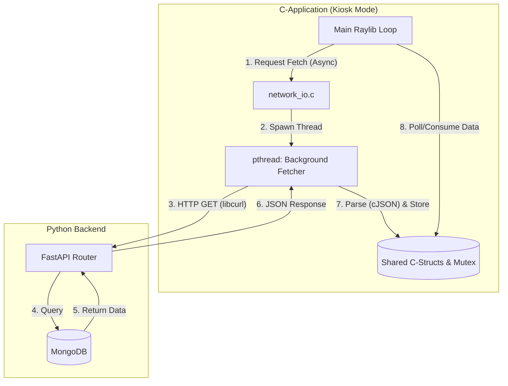
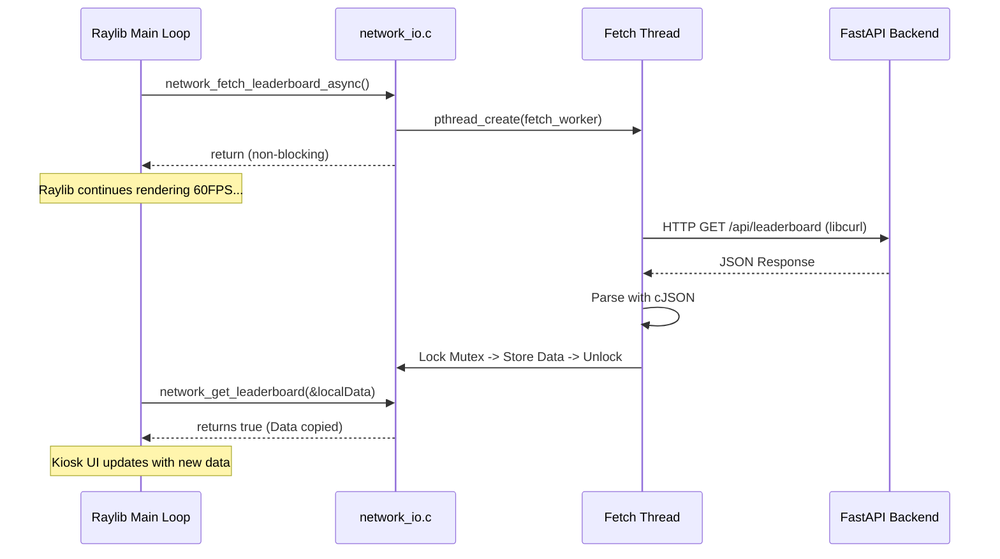

# Technical Design: C-Networking and API Integration

**Version:** 1.0
**Date:** 2026-05-27
**Author:** Gemini
**Related Documents:** [ADR-0017](../adr/ADR-0017-c-networking-and-api-integration.md), [DEV_SPEC-0017](../specs/DEV_SPEC-0017-c-networking-and-api-integration.md)

---

### 1. Introduction

This document provides a detailed technical design for the "C-Networking and API Integration" feature. It translates the requirements defined in DEV_SPEC-0017 into a concrete implementation plan, specifying the architecture, components, data models, and APIs. The goal is to establish a non-blocking `libcurl` layer within the C-Application to fetch and parse (`cJSON`) JSON payloads from the FastAPI backend, enabling the Uni-Messe Kiosk Mode without dropping the Raylib frame rate.

---

### 2. System Architecture and Components

The integration bridges two existing macro-components: The FastAPI Python Backend and the Raylib C-Application. 

#### 2.1. Component Overview

*   **Backend (Python/FastAPI):**
    *   **`main.py` (API Router):** Extended with two new GET endpoints: `/api/leaderboard` and `/api/epoch/highlights`.
    *   **`worker.py` (Tournament Logic):** Extended to identify highlight matches (via metrics 1 and 4) at the end of an epoch and push the seeds to the database.
    *   **`database.py` & MongoDB:** Introduces a new collection `epoch_highlights` that stores historical highlights persistently.

*   **Frontend (C-Application):**
    *   **`src/io/network_io.c` & `network_io.h`:** A new module responsible for handling HTTP communication. It abstracts `libcurl` implementation details.
    *   **Background Fetch Thread (POSIX Threads / `pthread`):** Since synchronous `libcurl` operations block, `network_io.c` will spawn a detached background thread to execute the HTTP request. Once the request completes, the thread parses the response with `cJSON`, populates a shared data structure, and sets a "ready" flag.
    *   **`src/vendor/cJSON/`:** Existing lightweight C library used for parsing the JSON strings into C structs.
    *   **Main Thread (`app_state_manager.c` / Kiosk Mode):** Periodically checks the "ready" flag from the `network_io` module, consumes the struct data, and updates the rendering states.

#### 2.2. Component Interaction Diagram



---

### 3. Data Model Specification

#### 3.1. C Data Structures (`network_io.h`)

To avoid dynamic memory complexities in the main loop, we will use fixed-size arrays where possible for the leaderboard and highlights.

```c
#define MAX_LEADERBOARD_ENTRIES 20
#define MAX_NAME_LENGTH 32
#define GRID_SIZE_8X8 64

typedef struct {
    char name[MAX_NAME_LENGTH];
    int elo;
    float win_rate;
} LeaderboardEntry;

typedef struct {
    LeaderboardEntry entries[MAX_LEADERBOARD_ENTRIES];
    int count;
    bool is_ready; // Flag indicating data is fresh and ready to consume
} LeaderboardData;

typedef struct {
    char participant_red[MAX_NAME_LENGTH];
    char participant_blue[MAX_NAME_LENGTH];
    int seed_red[GRID_SIZE_8X8];   // 0 or 1
    int seed_blue[GRID_SIZE_8X8];  // 0 or 1
    char metric_reason[64];        // e.g., "Longest Match", "Highest Volatility"
} MatchHighlight;

typedef struct {
    MatchHighlight matches[4];     // Assume top 4 highlights for Multicam
    int count;
    bool is_ready;
} HighlightData;
```

#### 3.2. Database Schema (MongoDB `epoch_highlights`)

```json
{
  "_id": "ObjectId",
  "epoch_id": "string",
  "timestamp": "ISODate",
  "highlights": [
    {
      "metric_type": "duration",
      "red_name": "Player1",
      "blue_name": "Player2",
      "red_seed": [0,1,0,...],
      "blue_seed": [1,1,0,...]
    }
  ]
}
```

---

### 4. Backend Specification

#### 4.1. API Endpoints

*   **`GET /api/leaderboard`**
    *   *Description:* Retrieves the top N participants sorted by Elo.
    *   *Response (200 OK):*
        ```json
        {
          "leaderboard": [
            {"name": "Alice", "elo": 1500, "win_rate": 0.65},
            {"name": "Bob", "elo": 1450, "win_rate": 0.55}
          ]
        }
        ```

*   **`GET /api/epoch/highlights`**
    *   *Description:* Retrieves the top match seeds from the latest epoch.
    *   *Response (200 OK):*
        ```json
        {
          "epoch_id": "epoch_123",
          "highlights": [
            {
              "metric_reason": "Longest Duration",
              "red_name": "Alice",
              "blue_name": "Bob",
              "red_seed": [0,1,0,...], 
              "blue_seed": [1,0,1,...] 
            }
          ]
        }
        ```

---

### 5. Frontend Specification (C-Application)

#### 5.1. `network_io.c` Implementation

The `network_io.c` module will expose an asynchronous API to the main loop:

```c
// Initializes libcurl globally and sets up mutexes
void network_init(void);

// Spawns a background thread to fetch the leaderboard. Returns immediately.
void network_fetch_leaderboard_async(void);

// Spawns a background thread to fetch highlights. Returns immediately.
void network_fetch_highlights_async(void);

// Thread-safe getters. If `is_ready` is true, copies data to `out_data` and sets `is_ready` to false.
bool network_get_leaderboard(LeaderboardData* out_data);
bool network_get_highlights(HighlightData* out_data);

// Cleans up libcurl and mutexes
void network_cleanup(void);
```

#### 5.2. Sequence Diagram: Asynchronous Polling



---

### 6. Security Considerations

*   **Memory Leaks:** `cJSON_Parse` allocates memory that MUST be explicitly freed using `cJSON_Delete` inside the fetch thread after data extraction. Failure to do so will leak memory over the days the Kiosk runs.
*   **Buffer Overflows:** C string copies (`strncpy`) must respect `MAX_NAME_LENGTH - 1` to ensure null-termination. `cJSON` array bounds must be checked before iterating to prevent out-of-bounds writes into `seed_red` or `entries`.
*   **Thread Safety:** A `pthread_mutex_t` must be used to protect the shared `LeaderboardData` and `HighlightData` structs from being read by the main thread while the fetch thread is writing to them.

### 7. Performance Considerations

*   **Non-Blocking UI:** The primary performance directive is ensuring `libcurl` does not block the Raylib thread. The `pthread` approach guarantees 60 FPS rendering regardless of network latency.
*   **Connection Timeouts:** The `libcurl` fetch thread must use `CURLOPT_TIMEOUT` (e.g., 5 seconds) to avoid hanging threads indefinitely if the backend becomes unreachable.
*   **JSON Parsing:** `cJSON` is highly efficient, but parsing large arrays (like 8x8 grids) should still be handled in the background thread, shifting CPU load away from the rendering thread.
*   **Polling Frequency:** The C-App should only trigger `network_fetch_..._async()` at controlled intervals (e.g., every 30-60 seconds) governed by a timer in `STATE_KIOSK_MODE`, preventing backend flooding.
