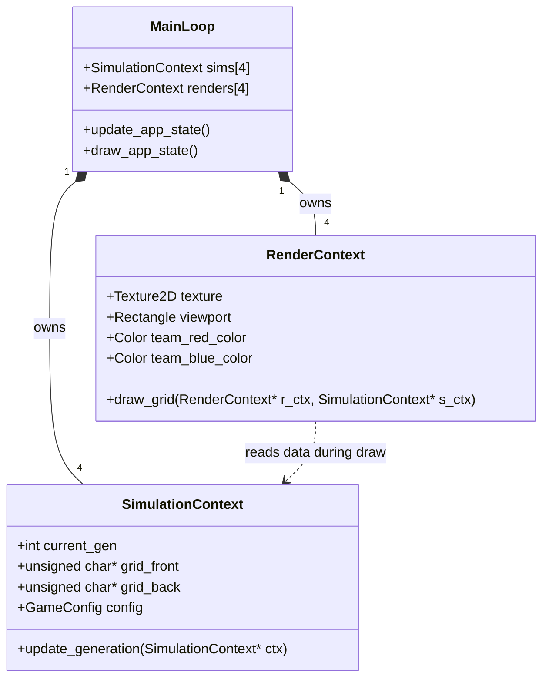
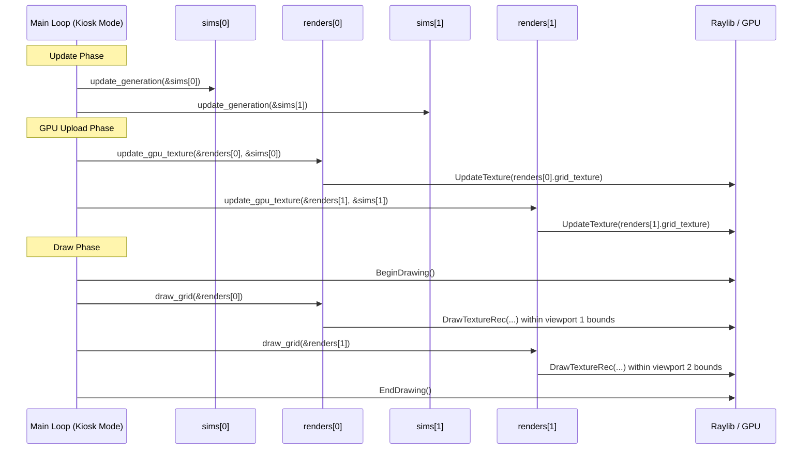

# Technical Design: Multicam Render Context Architecture

**Version:** 1.0
**Date:** 2026-05-27
**Author:** Gemini
**Related Documents:** [ADR-0018](../adr/ADR-0018-multicam-render-context-architecture.md), [DEV_SPEC-0018](../specs/DEV_SPEC-0018-multicam-render-context-architecture.md)

---

### 1. Introduction

This document details the technical implementation plan to eliminate global states from the C-Application's rendering and simulation modules. By introducing `SimulationContext` and `RenderContext` structures, the application will transition from a hardcoded single-view architecture to an object-oriented, instanced architecture, enabling the 2x2 "Wusel-Multicam" Kiosk display.

---

### 2. System Architecture and Components

The refactoring completely changes how data flows from the main application loop down to the Raylib GPU interface.

#### 2.1. Component Overview

*   **`src/core/core_types.h` & `game_logic.c`:**
    *   Currently relies on hidden static/global arrays for the cell grid.
    *   *Change:* We will define a comprehensive `SimulationContext` struct. All simulation functions (`update_generation`, `set_cell`) will be modified to accept a `SimulationContext*`.

*   **`src/gui/renderer.h` & `renderer.c`:**
    *   Currently relies on a global `Texture2D gridTex`, global `unsigned char* gpu_data_buffer`, and a global `Shader`.
    *   *Change:* We will define a `RenderContext` struct. All drawing functions (`draw_grid`, `update_gpu_texture`) will be modified to accept a `RenderContext*` and operate strictly on its members.

*   **`src/gui/app_state_manager.c` (Multicam Manager):**
    *   Currently assumes one world.
    *   *Change:* The `STATE_KIOSK_MODE` will instantiate arrays: `SimulationContext sims[4]` and `RenderContext renders[4]`. It will loop through these arrays, calling the refactored logic and rendering functions for each instance.

#### 2.2. Component Interaction Diagram

This diagram illustrates the new object-oriented data flow, demonstrating how multiple independent contexts are managed by the main loop.



---

### 3. Data Model Specification

#### 3.1. `SimulationContext` (`core_types.h`)

This struct encapsulates all logical data for a single game instance.

```c
// In src/core/core_types.h
typedef struct {
    int rows;
    int cols;
    int current_generation;
    int max_generations;
    unsigned char* grid_buffer_a; // Dynamically allocated based on rows*cols
    unsigned char* grid_buffer_b; // Double buffer
    unsigned char* current_grid;  // Pointer to the active buffer
    unsigned char* next_grid;     // Pointer to the background buffer
    
    // Player/Match metadata
    char participant_red[32];
    char participant_blue[32];
    
    bool is_active;               // Flags if this context is currently running
} SimulationContext;

// Constructor/Destructor pattern
void init_simulation_context(SimulationContext* ctx, int rows, int cols);
void free_simulation_context(SimulationContext* ctx);
```

#### 3.2. `RenderContext` (`renderer.h`)

This struct encapsulates all Raylib GPU resources for a single viewport.

```c
// In src/gui/renderer.h
#include "raylib.h"
#include "../core/core_types.h"

typedef struct {
    Texture2D grid_texture;
    unsigned char* pixel_buffer; // CPU-side pixel data before uploading to GPU texture
    Rectangle viewport_bounds;   // x, y, width, height on the physical screen
    
    // Shader uniforms specific to this view (optional, but good practice)
    Color col_background;
    Color col_team_red;
    Color col_team_blue;
} RenderContext;

// Constructor/Destructor pattern
void init_render_context(RenderContext* ctx, int grid_width, int grid_height, Rectangle bounds);
void free_render_context(RenderContext* ctx);
```

---

### 4. Interface/API Refactoring Specification

This is the most critical part of the refactoring. Every function that previously relied on global state must be updated.

#### 4.1. Core Logic API (`game_logic.h`)

```c
// OLD: void update_generation(void);
// NEW:
void update_generation(SimulationContext* ctx);

// OLD: void set_cell_state(int x, int y, int state);
// NEW:
void set_cell_state(SimulationContext* ctx, int x, int y, int state);

// OLD: int get_cell_state(int x, int y);
// NEW:
int get_cell_state(const SimulationContext* ctx, int x, int y);
```

#### 4.2. Renderer API (`renderer.h`)

```c
// OLD: void init_renderer(void);
// NEW (Shader initialization happens once globally, contexts handle textures):
void init_global_shaders(void);

// OLD: void update_gpu_texture(void);
// NEW:
void update_gpu_texture(RenderContext* r_ctx, const SimulationContext* s_ctx);

// OLD: void draw_grid(void);
// NEW:
void draw_grid(const RenderContext* r_ctx);
```

---

### 5. Sequence Diagram: Multicam Rendering Loop



---

### 6. Security & Memory Considerations

*   **Dangling Pointers:** The introduction of dynamically allocated buffers inside `SimulationContext` and `RenderContext` requires strict adherence to constructor/destructor pairing (`init_...` and `free_...`). Memory leaks will occur if contexts are re-initialized without freeing the previous buffers.
*   **VRAM Leaks:** Raylib's `UnloadTexture()` MUST be called inside `free_render_context()` for every instantiated context before the application exits or swaps modes, otherwise the GPU VRAM will leak.

### 7. Performance Considerations

*   **Texture Upload Bottleneck:** Calling `UpdateTexture` 4 times per frame (for the 2x2 grid) is generally fine for modern GPUs if the grids are 128x128 or 256x256. However, to optimize, `update_gpu_texture` should check a dirty flag in `SimulationContext` and only upload if a new generation was actually calculated.
*   **Cache Locality:** By packing data into structs (`SimulationContext`), CPU cache locality is generally improved compared to scattered global variables.
*   **Viewport Scissor:** When drawing UI overlays over specific Multicam viewports, `BeginScissorMode(bounds.x, bounds.y, bounds.width, bounds.height)` should be used to prevent text from bleeding into neighboring quadrants.
