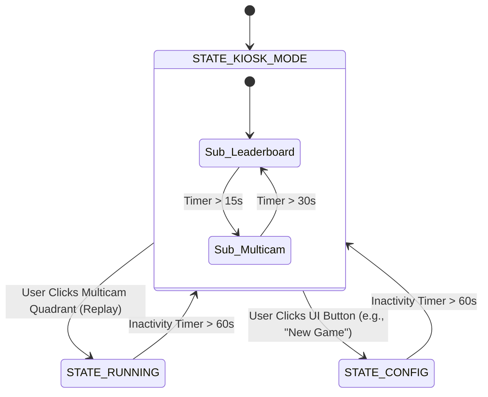
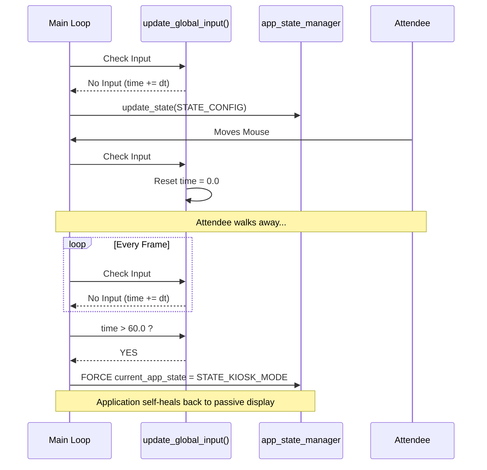

# Technical Design: Kiosk Mode State Machine and UI

**Version:** 1.0
**Date:** 2026-05-27
**Author:** Gemini
**Related Documents:** [ADR-0019](../adr/ADR-0019-kiosk-mode-state-machine-and-ui.md), [DEV_SPEC-0019](../specs/DEV_SPEC-0019-kiosk-mode-state-machine-and-ui.md)

---

### 1. Introduction

This document provides a detailed technical design for the final "Kiosk Mode State Machine and UI" feature. It defines the implementation strategy for extending `src/gui/app_state_manager.c` to orchestrate an autonomous display loop between the Leaderboard and Multicam views. It also details the global inactivity timer and the user-interrupt (click-to-replay) logic required to seamlessly connect the passive Kiosk mode with the active `STATE_RUNNING` simulation.

---

### 2. System Architecture and Components

The core of this feature resides entirely within the C-Application's frontend logic.

#### 2.1. Component Overview

*   **`src/gui/app_state_manager.h` & `.c`:**
    *   *Change:* Addition of `STATE_KIOSK_MODE` to the `AppState` enum.
    *   *Change:* Introduction of `KioskSubState` (Leaderboard vs. Multicam) and local static timers.
    *   *Change:* Implementation of the top-level input hook to track `time_since_last_input`.

*   **`src/gui/ui_elements.c` (or new `kiosk_ui.c`):**
    *   *Change:* Implementation of `draw_leaderboard(LeaderboardData* data)` utilizing Raylib's text rendering over a stylized background panel.

*   **`src/core/game_logic.c` & `network_io.h`:**
    *   *Integration:* The state manager will orchestrate calls to `network_fetch_..._async()` and map fetched `HighlightData` seeds directly into `SimulationContext` buffers.

#### 2.2. State Machine Diagram

This diagram illustrates the flow between the passive Kiosk states and the interactive single-player states.



---

### 3. Data Model & Logic Specification

#### 3.1. Kiosk State Control Structure

To manage the internal logic of the Kiosk Mode cleanly, we will define a local control structure within `app_state_manager.c`.

```c
typedef enum {
    KIOSK_SUB_LEADERBOARD,
    KIOSK_SUB_MULTICAM
} KioskSubState;

typedef struct {
    KioskSubState current_sub_state;
    float state_timer;
    
    // Pointers to the pre-allocated structures defined in ADR-0018
    RenderContext* renders; 
    SimulationContext* sims;
    
} KioskController;
```

#### 3.2. Global Inactivity Tracking

At the very beginning of the main application loop (before any state-specific `update_...` functions), we will track input.

```c
// Inside main.c or the top of app_state_manager update
static double time_since_last_input = 0.0;

void update_global_input(void) {
    if (IsKeyPressed(KEY_NULL) || IsMouseButtonPressed(MOUSE_LEFT_BUTTON) || 
        IsMouseButtonPressed(MOUSE_RIGHT_BUTTON) || GetMouseDelta().x != 0 || GetMouseDelta().y != 0) {
        time_since_last_input = 0.0;
    } else {
        time_since_last_input += GetFrameTime();
    }
}
```

---

### 4. Interface Specification

#### 4.1. Network Fetch Orchestration

To avoid spamming the backend, data fetching is strictly tied to sub-state transitions.

*   **Transition to `KIOSK_SUB_LEADERBOARD`:**
    *   Call `network_fetch_leaderboard_async()`.
*   **Transition to `KIOSK_SUB_MULTICAM`:**
    *   Call `network_fetch_highlights_async()`.
    *   When `network_get_highlights(&data)` returns true, map the 8x8 seeds into the 4 `SimulationContext` grids and reset their generation counters.

#### 4.2. Click-to-Replay Calculation

When `IsMouseButtonPressed(MOUSE_LEFT_BUTTON)` is detected inside `KIOSK_SUB_MULTICAM`, the logic must identify the clicked quadrant.

```c
// Conceptual logic inside update_kiosk_mode()
Vector2 mousePos = GetMousePosition();
for (int i = 0; i < 4; i++) {
    if (CheckCollisionPointRec(mousePos, kiosk_ctrl.renders[i].viewport_bounds)) {
        // Quadrant 'i' was clicked!
        
        // 1. Copy seed from kiosk_ctrl.sims[i] to the global single-player SimulationContext
        copy_simulation_state(&global_single_sim, &kiosk_ctrl.sims[i]);
        
        // 2. Transition State
        current_app_state = STATE_RUNNING;
        break;
    }
}
```

---

### 5. Sequence Diagram: Global Inactivity Failsafe



---

### 6. Security Considerations

*   **State Machine Entanglement:** Forcing a state transition (via the inactivity timer) while deep inside a nested configuration menu (e.g., `STATE_EDIT_RED`) requires careful memory management. The transition hook must trigger the standard cleanup/exit functions for the current state to prevent leaking UI components or leaving half-written buffers.

### 7. Performance Considerations

*   **Raylib Text Rendering:** Drawing complex tabular text (the Leaderboard) every frame can be surprisingly CPU intensive. Ensure `DrawTextEx` uses a pre-loaded Font resource rather than relying on Raylib's default pixel font, which performs poorly at large scales.
*   **Mouse Delta Tracking:** Tracking `GetMouseDelta()` every frame is computationally trivial and highly effective for inactivity detection.
