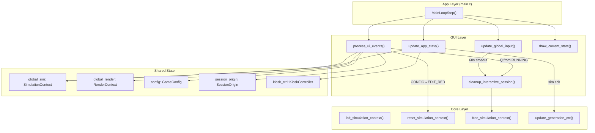
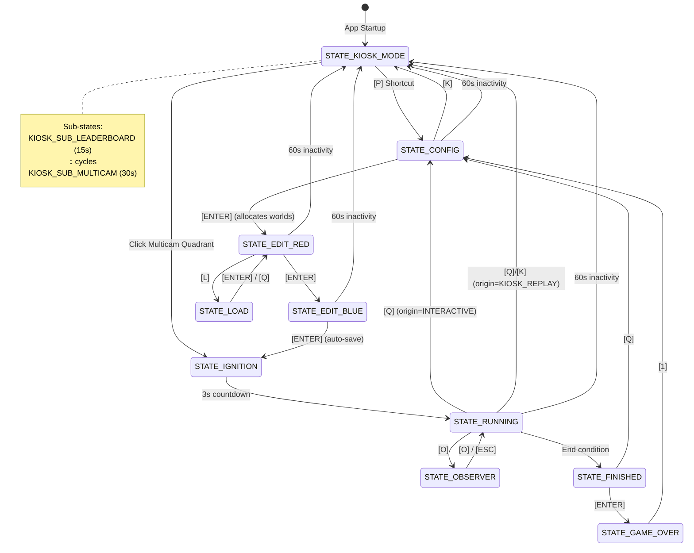
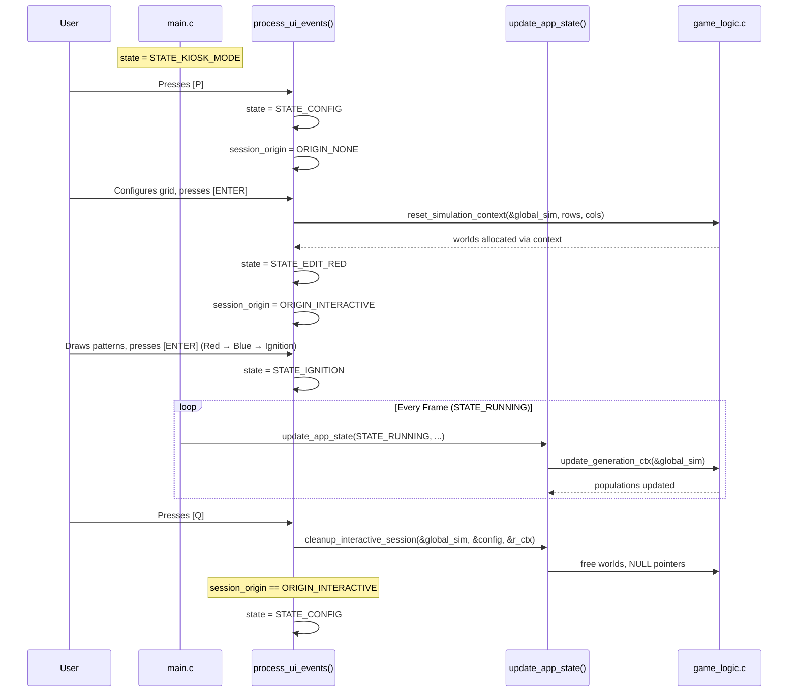
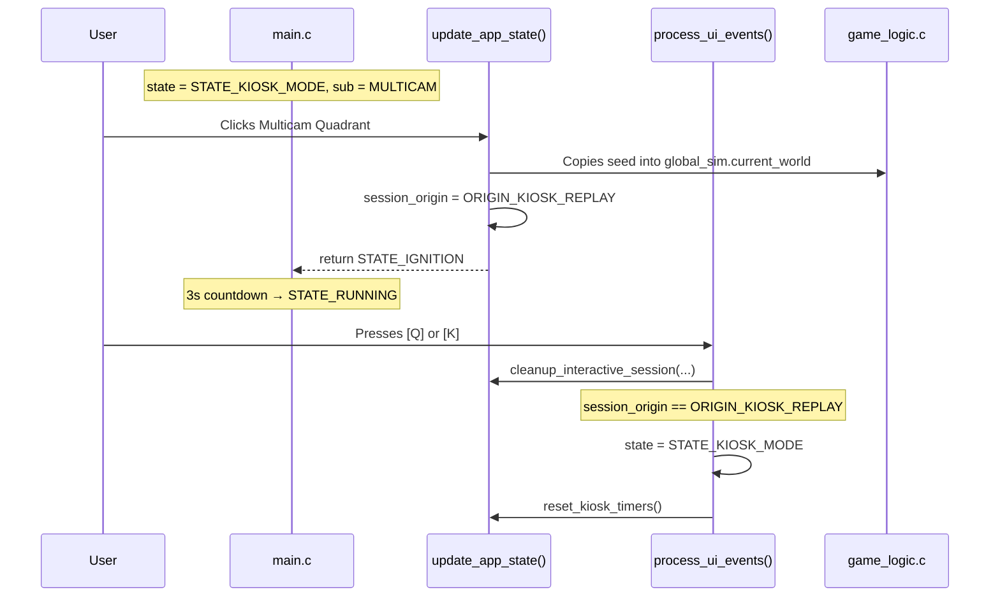
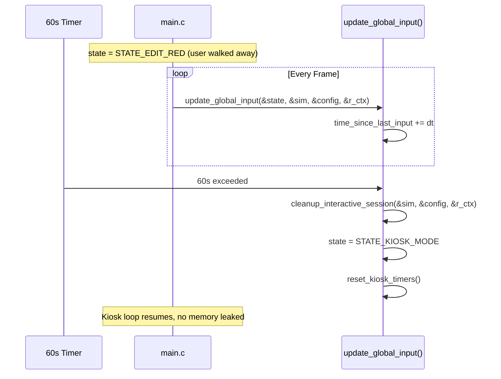

# Technical Design: Surgical Code Recovery and Logical State Separation

**Version:** 1.0
**Date:** 2026-05-29
**Author:** Gemini
**Related Documents:** [ADR-0020](../adr/ADR-0020-surgical-code-recovery.md), [DEV_SPEC-0020](../specs/DEV_SPEC-0020-surgical-code-recovery.md), [ADR-0019](../adr/ADR-0019-kiosk-mode-state-machine-and-ui.md), [ADR-0018](../adr/ADR-0018-multicam-render-context-architecture.md)

---

### 1. Introduction

This document provides a detailed technical design for restoring the interactive single-player features and implementing clean logical state separation within the Biotope Game of Life application. It translates the requirements defined in DEV_SPEC-0020 into a concrete implementation plan, specifying the exact code changes, new data models, function signatures, and state transition contracts.

**Core Problem Summary:** The `process_ui_events()` function in `renderer.c` manages world allocation via raw `World**` indirection. When it calls `create_world()` and writes back via `*p_current_world = gui_world`, it directly overwrites the `SimulationContext.current_world` pointer — orphaning the worlds originally allocated by `init_simulation_context()` and breaking the double-buffer lifecycle (`world_a`/`world_b`). Additionally, the 60-second inactivity timeout performs no cleanup, causing memory leaks on forced transitions.

---

### 2. System Architecture and Components

#### 2.1. Component Overview

The changes affect 4 source files across 3 architectural layers:

*   **Core Layer (`src/core/`):**
    *   `core_types.h` — New `SessionOrigin` enum; new `cleanup_interactive_session()` declaration.
    *   `game_logic.c` — New `reset_simulation_context()` function (lighter than full free+reinit).

*   **GUI Layer (`src/gui/`):**
    *   `renderer.h` — Updated `process_ui_events()` signature (accepts `SimulationContext*` instead of `World**`).
    *   `renderer.c` — Refactored world lifecycle in all interactive states; unified timer variables; `[P]lay` shortcut hint rendering; session-origin-aware back-navigation.
    *   `app_state_manager.h` — Export `cleanup_interactive_session()` declaration.
    *   `app_state_manager.c` — Safe cleanup in `update_global_input()`; scoped kiosk timer.

*   **App Layer (`src/apps/gui/`):**
    *   `main.c` — Updated call to `process_ui_events()` with new signature.

#### 2.2. Component Interaction Diagram



#### 2.3. State Machine Transition Map



---

### 3. Data Model Specification

#### 3.1. New Type: `SessionOrigin` (in `core_types.h`)

Tracks how the current interactive session was initiated, enabling correct back-navigation routing.

```c
// KI-Agent unterstützt: Session origin tracking for back-navigation
typedef enum {
    ORIGIN_NONE,           // No active session (Kiosk or Config idle)
    ORIGIN_INTERACTIVE,    // User entered via Play → Config → Edit → Ignition
    ORIGIN_KIOSK_REPLAY    // User clicked a Multicam quadrant
} SessionOrigin;
```

**Placement:** After the `AppState` enum in `core_types.h` (after line 34).

**Rationale:** This is a core type used by both `renderer.c` (to set origin) and `app_state_manager.c` (to read origin during cleanup). Placing it in `core_types.h` avoids circular header dependencies.

#### 3.2. Modified Struct: `GameConfig` — No Changes

The existing `GameConfig` struct is sufficient. The telemetry arrays (`history_red_pop`, `history_blue_pop`) and counters (`current_round`, `current_red_pop`, `current_blue_pop`) already exist and will be managed by the new cleanup function.

#### 3.3. Existing Struct: `SimulationContext` — No Structural Changes

The existing `SimulationContext` struct with `world_a`, `world_b`, `current_world`, `next_world` is architecturally correct. The bug is not in the struct definition but in how `process_ui_events()` bypasses it. The fix is in the function logic, not the data model.

**Key Ownership Invariants (must be maintained by all code):**
1. `world_a` and `world_b` are the **owned** allocations (paired with `free`).
2. `current_world` and `next_world` are **aliases** pointing to either `world_a` or `world_b`.
3. `create_world()` MUST only be called to assign to `world_a`/`world_b` (never to orphan them).
4. `free_simulation_context()` frees `world_a` and `world_b`, then NULLs all four pointers.

---

### 4. API Specification — New and Modified Functions

#### 4.1. New Function: `reset_simulation_context()`

**File:** `src/core/game_logic.c` / `src/core/game_logic.h`

**Purpose:** Re-initializes a `SimulationContext` for a new game session. If the existing worlds match the requested dimensions, it clears the grids in-place (avoiding deallocation/reallocation). If dimensions differ, it frees and reallocates.

```c
// KI-Agent unterstützt: Reset simulation context for a new interactive session
void reset_simulation_context(SimulationContext *ctx, int rows, int cols) {
    if (!ctx) return;

    // If dimensions match, just clear the grids (fast path)
    if (ctx->world_a && ctx->world_a->rows == rows && ctx->world_a->cols == cols) {
        int stride = cols + 2;
        int total = (rows + 2) * stride;
        memset(ctx->world_a->grid, 0, total * sizeof(int));
        memset(ctx->world_b->grid, 0, total * sizeof(int));
        if (ctx->world_a->chunk_map)
            memset(ctx->world_a->chunk_map, 0, ctx->world_a->chunk_rows * ctx->world_a->chunk_cols);
        if (ctx->world_b->chunk_map)
            memset(ctx->world_b->chunk_map, 0, ctx->world_b->chunk_rows * ctx->world_b->chunk_cols);
    } else {
        // Dimensions changed: full teardown + rebuild
        if (ctx->world_a) free_world(ctx->world_a);
        if (ctx->world_b) free_world(ctx->world_b);
        ctx->world_a = create_world(rows, cols);
        ctx->world_b = create_world(rows, cols);
    }

    ctx->rows = rows;
    ctx->cols = cols;
    ctx->current_generation = 0;
    ctx->max_generations = MAX_ROUNDS;
    ctx->current_world = ctx->world_a;
    ctx->next_world = ctx->world_b;
    ctx->is_active = false;
}
```

**Header Declaration (game_logic.h):**
```c
void reset_simulation_context(SimulationContext *ctx, int rows, int cols);
```

#### 4.2. New Function: `cleanup_interactive_session()`

**File:** `src/gui/app_state_manager.c` / `src/gui/app_state_manager.h`

**Purpose:** Centralizes all cleanup logic for exiting an interactive session. Called from multiple exit paths (timeout, manual exit, game over) to ensure no memory leaks.

```c
// KI-Agent unterstützt: Centralized cleanup for interactive sessions
void cleanup_interactive_session(SimulationContext *sim, GameConfig *config,
                                 RenderContext *r_ctx) {
    // 1. Free simulation worlds (but keep SimulationContext struct alive)
    if (sim->world_a) { free_world(sim->world_a); sim->world_a = NULL; }
    if (sim->world_b) { free_world(sim->world_b); sim->world_b = NULL; }
    sim->current_world = NULL;
    sim->next_world = NULL;
    sim->current_generation = 0;
    sim->is_active = false;

    // 2. Free telemetry arrays
    if (config->history_red_pop) {
        free(config->history_red_pop);
        config->history_red_pop = NULL;
    }
    if (config->history_blue_pop) {
        free(config->history_blue_pop);
        config->history_blue_pop = NULL;
    }
    config->history_count = 0;

    // 3. Reset config counters
    config->current_red_pop = 0;
    config->current_blue_pop = 0;
    config->current_round = 0;
    config->is_paused = false;

    // 4. Reset camera
    if (r_ctx) {
        r_ctx->camera.zoom = 1.0f;
        r_ctx->camera.target = (Vector2){ 0, 0 };
        r_ctx->camera.offset = (Vector2){ 0, 0 };
    }
}
```

**Header Declaration (app_state_manager.h):**
```c
void cleanup_interactive_session(SimulationContext *sim, GameConfig *config,
                                 RenderContext *r_ctx);
```

#### 4.3. Modified Function: `process_ui_events()`

**File:** `src/gui/renderer.c` / `src/gui/renderer.h`

**Current Signature (BEFORE):**
```c
AppState process_ui_events(AppState state, GameConfig* config,
                           World** p_current_world, World** p_swap_world,
                           RenderContext *r_ctx);
```

**New Signature (AFTER):**
```c
AppState process_ui_events(AppState state, GameConfig* config,
                           SimulationContext *sim_ctx, RenderContext *r_ctx,
                           SessionOrigin *session_origin);
```

**Rationale:** Passing `SimulationContext*` instead of `World**` ensures all world operations go through the context's ownership model. Passing `SessionOrigin*` allows this function to set the origin when entering `STATE_RUNNING` and to read it when handling `[Q]` for back-navigation.

**Call Site Update (main.c:38):**
```c
// BEFORE:
state = process_ui_events(state, &config, &global_sim.current_world,
                          &global_sim.next_world, &global_render);

// AFTER:
state = process_ui_events(state, &config, &global_sim, &global_render,
                          &session_origin);
```

#### 4.4. Modified Function: `update_global_input()`

**File:** `src/gui/app_state_manager.c`

**Current Signature:** `void update_global_input(AppState* current_app_state);`

**New Signature:**
```c
void update_global_input(AppState* current_app_state, SimulationContext *sim,
                         GameConfig *config, RenderContext *r_ctx);
```

**Rationale:** The function needs access to the simulation context, config, and render context to perform safe cleanup before forcing the timeout transition.

**Implementation Change:**
```c
void update_global_input(AppState* current_app_state, SimulationContext *sim,
                         GameConfig *config, RenderContext *r_ctx) {
    // ... existing input detection ...

    if (time_since_last_input > 60.0 && *current_app_state != STATE_KIOSK_MODE) {
        // KI-Agent unterstützt: Safe cleanup before forced transition
        cleanup_interactive_session(sim, config, r_ctx);
        *current_app_state = STATE_KIOSK_MODE;
        reset_kiosk_timers();
    }
}
```

---

### 5. Implementation Specification — Code Changes by File

#### 5.1. `src/core/core_types.h`

| Change | Lines | Description |
|:-------|:------|:-----------|
| Add `SessionOrigin` enum | After L34 | New enum: `ORIGIN_NONE`, `ORIGIN_INTERACTIVE`, `ORIGIN_KIOSK_REPLAY` |

#### 5.2. `src/core/game_logic.h`

| Change | Lines | Description |
|:-------|:------|:-----------|
| Add `reset_simulation_context()` declaration | After L14 | `void reset_simulation_context(SimulationContext *ctx, int rows, int cols);` |

#### 5.3. `src/core/game_logic.c`

| Change | Lines | Description |
|:-------|:------|:-----------|
| Add `reset_simulation_context()` implementation | After `free_simulation_context()` (~L297) | ~25 lines: fast-path clear or full teardown+rebuild (see §4.1) |

#### 5.4. `src/gui/renderer.h`

| Change | Lines | Description |
|:-------|:------|:-----------|
| Update `process_ui_events()` signature | L36 | Replace `World** p_current_world, World** p_swap_world` with `SimulationContext *sim_ctx, SessionOrigin *session_origin` |

#### 5.5. `src/gui/renderer.c` — Major Refactoring

This is the largest and most critical file to change. The changes are organized by function and state:

**A. Remove duplicate `ignitionStartTime` (L365)**

```diff
-static double ignitionStartTime = 0.0;
```

The `ignitionStartTime` in `app_state_manager.c:9` becomes the single source of truth. It must be made accessible to `renderer.c` — either by declaring it `extern` in the header, or by passing it as a function parameter. **Chosen approach:** Move it to `app_state_manager.c` and expose via a getter/setter pair to avoid exposing internal state directly.

```c
// In app_state_manager.h:
double get_ignition_start_time(void);
void set_ignition_start_time(double t);
```

**B. Refactor `process_ui_events()` signature and internal logic**

Replace `World** p_current_world, World** p_swap_world` parameters with `SimulationContext *sim_ctx, SessionOrigin *session_origin`.

Replace all internal references:
```diff
-    World* gui_world = *p_current_world;
-    World* swap_world = *p_swap_world;
+    World* gui_world = sim_ctx->current_world;
```

Remove write-back at end of function:
```diff
-    *p_current_world = gui_world;
-    *p_swap_world = swap_world;
```

**C. STATE_CONFIG → STATE_EDIT_RED transition (L512-530)**

```diff
             if (IsKeyPressed(KEY_ENTER)) {
-                gui_world = create_world(config->rows, config->cols);
-                swap_world = create_world(config->rows, config->cols);
-                int stride = config->cols + 2;
-                for(int r=0; r < config->rows + 2; r++) {
-                    for(int c=0; c < config->cols + 2; c++) {
-                        gui_world->grid[r * stride + c] = DEAD;
-                    }
-                }
+                // KI-Agent unterstützt: Allocate via SimulationContext
+                reset_simulation_context(sim_ctx, config->rows, config->cols);
+                gui_world = sim_ctx->current_world;
+
                 config->current_blue_pop = 0;
                 config->current_red_pop = 0;
                 config->current_round = 0;
+                *session_origin = ORIGIN_INTERACTIVE;
                 state = STATE_EDIT_RED;
             }
```

**D. STATE_EDIT_BLUE → STATE_IGNITION transition (L659-671)**

```diff
                 if (IsKeyPressed(KEY_ENTER)) {
                     if (state == STATE_EDIT_RED) {
                         state = STATE_EDIT_BLUE;
                     } else {
                         char autoFilename[128];
                         time_t now = time(NULL);
                         strftime(autoFilename, sizeof(autoFilename),
                             "biotope_results/run_%Y%m%d_%H%M%S.json", localtime(&now));
                         strcpy(currentProtocolFilename, autoFilename);
-                        save_grid(autoFilename, gui_world, config);
+                        save_grid(autoFilename, sim_ctx->current_world, config);
                         state = STATE_IGNITION;
                     }
                 }
```

**E. STATE_RUNNING [Q] exit (L708-724) — Session-origin-aware routing**

```diff
             case STATE_RUNNING:
                 if (IsKeyPressed(KEY_BACKSPACE) || IsKeyPressed(KEY_Q)) {
-                    if (config->history_red_pop) { free(config->history_red_pop); config->history_red_pop = NULL; }
-                    if (config->history_blue_pop) { free(config->history_blue_pop); config->history_blue_pop = NULL; }
-                    if (gui_world) { free_world(gui_world); gui_world = NULL; }
-                    if (swap_world) { free_world(swap_world); swap_world = NULL; }
-                    state = STATE_CONFIG;
-                    ignitionStartTime = 0.0;
-                    config->is_paused = false;
-                    r_ctx->camera.zoom = 1.0f;
-                    r_ctx->camera.target = (Vector2){ 0, 0 };
-                    r_ctx->camera.offset = (Vector2){ 0, 0 };
+                    // KI-Agent unterstützt: Route based on session origin
+                    cleanup_interactive_session(sim_ctx, config, r_ctx);
+                    set_ignition_start_time(0.0);
+                    if (*session_origin == ORIGIN_KIOSK_REPLAY) {
+                        state = STATE_KIOSK_MODE;
+                        reset_kiosk_timers();
+                    } else {
+                        state = STATE_CONFIG;
+                    }
+                    *session_origin = ORIGIN_NONE;
                     break;
                 }
+                // KI-Agent unterstützt: [K] always returns to Kiosk
+                if (IsKeyPressed(KEY_K)) {
+                    cleanup_interactive_session(sim_ctx, config, r_ctx);
+                    set_ignition_start_time(0.0);
+                    state = STATE_KIOSK_MODE;
+                    reset_kiosk_timers();
+                    *session_origin = ORIGIN_NONE;
+                    break;
+                }
```

**F. STATE_LOAD file loading (L682-694) — Use SimulationContext**

```diff
                 if (IsKeyPressed(KEY_ENTER) && fileCount > 0) {
-                    if (load_grid(fileList[selectedFileIndex].filepath, gui_world, config)) {
+                    if (load_grid(fileList[selectedFileIndex].filepath,
+                                  sim_ctx->current_world, config)) {
                         strcpy(statusMsg, "Protocol Loaded!");
                         statusTimer = 2.0f;
-                        swap_world = create_world(config->rows, config->cols);
-                        int stride = config->cols + 2;
-                        for(int i=0; i < (config->rows + 2) * stride; i++)
-                            swap_world->grid[i] = DEAD;
+                        // KI-Agent unterstützt: Rebuild swap world via context
+                        if (sim_ctx->world_b) free_world(sim_ctx->world_b);
+                        sim_ctx->world_b = create_world(config->rows, config->cols);
+                        sim_ctx->next_world = sim_ctx->world_b;
                     }
```

**G. Kiosk `[P]lay` shortcut hint rendering (in `draw_current_state`, STATE_KIOSK_MODE case)**

Add at the end of both Kiosk sub-state draw blocks:

```c
// KI-Agent unterstützt: Play shortcut hint for interactive entry
DrawText("PRESS [P] TO PLAY",
         screenWidth / 2 - MeasureText("PRESS [P] TO PLAY", 20) / 2,
         screenHeight - 100, 20, THEME_ACCENT);
```

**H. Kiosk `[P]lay` shortcut input handling (in `process_ui_events`, STATE_KIOSK_MODE case)**

```c
case STATE_KIOSK_MODE:
    // KI-Agent unterstützt: [P] keyboard shortcut to enter interactive mode
    if (IsKeyPressed(KEY_P)) {
        state = STATE_CONFIG;
        *session_origin = ORIGIN_NONE;
    }
    break;
```

#### 5.6. `src/gui/app_state_manager.h`

| Change | Lines | Description |
|:-------|:------|:-----------|
| Add `cleanup_interactive_session()` declaration | After L30 | See §4.2 |
| Update `update_global_input()` signature | L27 | Add `SimulationContext*`, `GameConfig*`, `RenderContext*` params |
| Add ignition time accessors | After L27 | `double get_ignition_start_time(void);` `void set_ignition_start_time(double t);` |

#### 5.7. `src/gui/app_state_manager.c`

| Change | Lines | Description |
|:-------|:------|:-----------|
| Rename `timeAccumulator` → `kiosk_time_accumulator` | L10 | Scoped name to avoid confusion with interactive sim timing |
| Add `cleanup_interactive_session()` implementation | After L43 | ~30 lines (see §4.2) |
| Add ignition time getter/setter | After L9 | 2 small functions wrapping the static variable |
| Update `update_global_input()` | L31-43 | Add cleanup call before timeout transition (see §4.4) |
| Update Kiosk MULTICAM tick to use `kiosk_time_accumulator` | L153-160 | Rename references |
| Set `session_origin = ORIGIN_KIOSK_REPLAY` in Click-to-Replay | L168-218 | Before `return STATE_IGNITION` |

**Note on Click-to-Replay:** `update_app_state()` currently does not have access to `session_origin`. Two options:

*   **Option A (chosen):** Add `SessionOrigin *session_origin` parameter to `update_app_state()`.
*   **Option B (rejected):** Move Click-to-Replay logic to `process_ui_events()` in `renderer.c`.

Option A is chosen because the Click-to-Replay logic is tightly coupled with the Kiosk sub-state machine, which belongs in `app_state_manager.c`.

**Updated signature:**
```c
AppState update_app_state(AppState current_state, GameConfig* config,
                          SimulationContext *sim_ctx, float delta_time,
                          double current_time, SessionOrigin *session_origin);
```

#### 5.8. `src/apps/gui/main.c`

| Change | Lines | Description |
|:-------|:------|:-----------|
| Add `static SessionOrigin session_origin = ORIGIN_NONE;` | After L33 | New global state variable |
| Update `MainLoopStep()` calls | L36-40 | Pass new parameters to updated function signatures |

**Updated `MainLoopStep()`:**
```c
void MainLoopStep(void) {
    update_global_input(&state, &global_sim, &config, &global_render);

    state = process_ui_events(state, &config, &global_sim, &global_render,
                              &session_origin);
    state = update_app_state(state, &config, &global_sim, GetFrameTime(),
                             GetTime(), &session_origin);
    draw_current_state(state, &config, global_sim.current_world, &global_render);
}
```

---

### 6. Sequence Diagrams

#### 6.1. Interactive Game Flow (Play → Config → Edit → Run → Exit)



#### 6.2. Kiosk Replay Flow (Click Quadrant → Replay → Back)



#### 6.3. Inactivity Timeout Flow



---

### 7. Memory Lifecycle Matrix

Every state transition that involves world allocation or deallocation is catalogued below:

| Transition | Worlds Allocated | Worlds Freed | Telemetry Freed | Function Responsible |
|:-----------|:----------------|:-------------|:----------------|:--------------------|
| KIOSK → CONFIG ([P]) | None | None | None | `process_ui_events()` |
| CONFIG → EDIT_RED (Enter) | `world_a`, `world_b` via `reset_simulation_context()` | Previous `world_a`/`world_b` (if any) | N/A | `process_ui_events()` → `reset_simulation_context()` |
| EDIT_BLUE → IGNITION (Enter) | None | None | None | `process_ui_events()` |
| IGNITION → RUNNING (3s) | None (telemetry arrays allocated) | None | None | `update_app_state()` |
| RUNNING → CONFIG (Q, interactive) | None | `world_a`, `world_b` | `history_red/blue_pop` | `cleanup_interactive_session()` |
| RUNNING → KIOSK (Q, replay) | None | `world_a`, `world_b` | `history_red/blue_pop` | `cleanup_interactive_session()` |
| RUNNING → KIOSK (60s timeout) | None | `world_a`, `world_b` | `history_red/blue_pop` | `cleanup_interactive_session()` |
| FINISHED → CONFIG (Q) | None | `world_a`, `world_b` | `history_red/blue_pop` | `cleanup_interactive_session()` |
| GAME_OVER → CONFIG (1) | None | `world_a`, `world_b` | `history_red/blue_pop` | `cleanup_interactive_session()` |
| LOAD → EDIT_RED (Enter) | `world_b` rebuilt | Previous `world_b` | None | `process_ui_events()` |
| App shutdown | N/A | All remaining | All remaining | `main.c` cleanup block |

---

### 8. Security Considerations

This is a standalone desktop/kiosk application without network authentication or user data persistence. Security concerns are limited to:

*   **Buffer Overflow Prevention:** All `sprintf` calls use fixed-size buffers. The existing code uses `char buf[64]`, `char autoFilename[128]`, etc. No changes are needed, but all new `sprintf` calls in this increment MUST use `snprintf` with explicit buffer limits.

*   **Null Pointer Safety:** Every function that operates on `SimulationContext` or `World` pointers MUST perform NULL checks before dereferencing. The existing `update_generation_ctx()` already does this (`if (!ctx || !ctx->current_world || !ctx->next_world) return 0;`). The new `cleanup_interactive_session()` and `reset_simulation_context()` follow the same pattern.

*   **Kiosk Physical Security:** The application runs in a public exhibition setting. The `KEY_ESCAPE` / `WindowShouldClose()` exit path remains active. For a true kiosk deployment, this should be disabled (e.g., `SetExitKey(0)`). This is out of scope for ADR-0020 but noted for operational awareness.

---

### 9. Performance Considerations

*   **`reset_simulation_context()` Fast Path:** When the user restarts a game with the same grid dimensions (the common case), the function clears the existing grid buffers with `memset()` instead of freeing and reallocating. This avoids heap fragmentation and is approximately 10x faster for large grids (e.g., 1000×500 = 500K cells).

*   **Kiosk Context Preservation (FR-06):** The Kiosk's 4 `SimulationContext`/`RenderContext` pairs remain allocated during interactive sessions. This adds ~4× the base memory footprint (~4 × 50×50 × sizeof(int) × 2 buffers = ~80 KB) but avoids the GPU texture reload cost (~5ms per context × 4 contexts = ~20ms) on every return to Kiosk mode.

*   **No Hot-Path Impact:** All changes in this increment are to state transition code (input handling, state entry/exit), NOT to the simulation tick loop (`update_generation()`, `update_generation_ctx()`) or the render loop (`DrawGridAndCellsCtx()`). Therefore, there is zero FPS impact during normal operation.

*   **Valgrind Overhead:** When running with Valgrind for memory verification, expect ~10-20x slowdown. The 60-second inactivity timer and Kiosk cycling timers will behave differently under Valgrind. Use `--tool=memcheck --leak-check=full` with a scripted test that exercises all transition paths, not wall-clock-dependent behavior.
