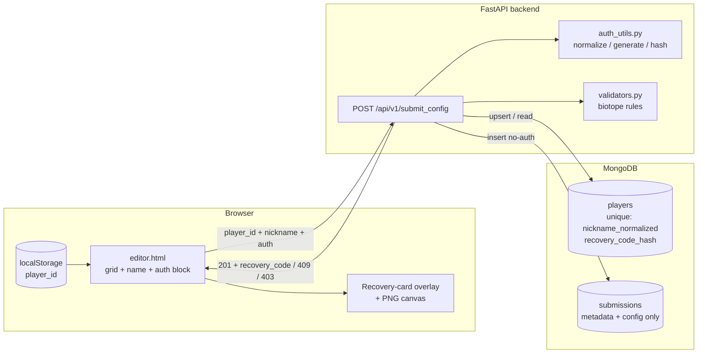
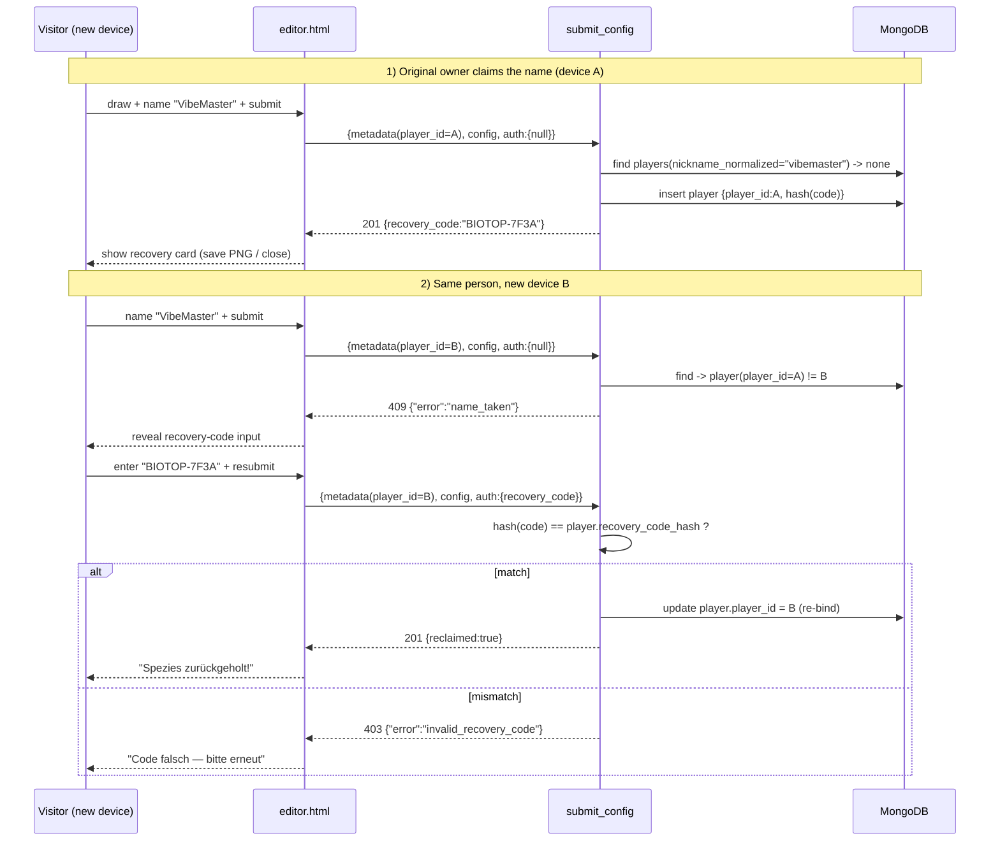

# Technical Design: Name-Claiming with Recovery Code

**Version:** 1.0
**Date:** 2026-06-12
**Author:** Claude (KI-Agent) & Friedemann Decker
**Related Documents:** [ADR-0027](../adr/ADR-0027-name-claiming-with-recovery-code.md), [DEV_SPEC-0027](../specs/DEV_SPEC-0027-name-claiming-with-recovery-code.md)

---

### 1. Introduction

This document provides a detailed technical design for the "Name-Claiming with Recovery Code"
feature. It translates the requirements in DEV_SPEC-0027 into a concrete implementation plan:
data-model changes to the `players` and submission documents, the rewritten claim/reclaim logic in
`submit_config`, a new authentication helper module, and the web-editor UI for showing/entering the
recovery code. The design integrates with the existing FastAPI/Motor/MongoDB backend
(`backend/app/`) and the standalone web editor (`web/editor/editor.html`), and leaves the C
application untouched (the C-GUI never POSTs submissions).

---

### 2. System Architecture and Components

#### 2.1. Component Overview

*   **Frontend (`web/editor/editor.html`):**
    *   Continues to generate/persist the silent `player_id` in `localStorage`.
    *   Adds the top-level `auth` block to the submit payload (`{"recovery_code": null}`).
    *   New **recovery-card overlay**: shown on first claim (`201` with `recovery_code`), closable,
        with an optional "save as PNG" download rendered from a `<canvas>`.
    *   New **reclaim flow**: on `409 name_taken` reveals a code input; on submit re-sends the same
        request with `auth.recovery_code`; on `403 invalid_recovery_code` keeps the field and shows
        a hint.

*   **Backend:**
    *   **`models.py`** — `Metadata` unchanged in payload; new optional top-level `Auth` model and
        `Submission.auth`; `Player` gains `nickname_normalized` and `recovery_code_hash`.
    *   **`auth_utils.py` (new)** — pure helpers: `normalize_nickname()`, `generate_recovery_code()`,
        `hash_recovery_code()`. No DB, no FastAPI — unit-testable in isolation.
    *   **`main.py` `submit_config`** — rewritten claim/reclaim decision logic; corrected exception
        handling so `409`/`403`/`400` are not swallowed into `500`; persists submission without the
        `auth` block.
    *   **`worker.py`** — unchanged logic; its `players` update keys on the stored original
        `nickname` (`worker.py:243`), which still matches. Noted as unaffected.

*   **Database (MongoDB, `players` collection):**
    *   New fields `nickname_normalized` (string) and `recovery_code_hash` (string).
    *   New **unique index** on `nickname_normalized`.

*   **Operations (`backend/scripts/reset_db.py`, new):**
    *   Clears `players` + `submissions`, then ensures the unique index. Run once before the fair.

#### 2.2. Component Interaction Diagram



---

### 3. Data Model Specification

**`players` document (extended)**

| Field | Type | Notes |
|---|---|---|
| `player_id` | string | Currently-bound device UUID. Overwritten on reclaim (re-binding). |
| `nickname` | string | Original spelling, for display. |
| `nickname_normalized` | string | `trim()`+`lowercase`. **Unique index.** Identity key for claiming. |
| `recovery_code_hash` | string | SHA-256 hex of the plaintext code. Never the plaintext. |
| `elo_rating`, `matches_played`, `win_rate`, `created_at`, … | — | Existing fields, unchanged (set via `$setOnInsert`). |

**Submission payload / `Submission` model (extended)**

| Field | Type | Notes |
|---|---|---|
| `metadata` | `Metadata` | Unchanged: `player_id`, `nickname`, `league`. |
| `config` | `Config` | Unchanged: `bounding_box_x/y`, `cells`. |
| `auth` | `Auth` (optional) | `{ "recovery_code": str | null }`. Default `Auth()` with `recovery_code=None`. |

**Persistence rule:** `DBSubmission` is built from `metadata` + `config` **only**. The `auth` block
is excluded from the stored submission document (FR-7). `nickname_normalized`/`recovery_code_hash`
exist only on `players`, never in the payload.

`Auth` model:

```python
class Auth(BaseModel):
    recovery_code: str | None = Field(None, description="Recovery code, only sent during reclaim")
```

---

### 4. Backend Specification

#### 4.1. API Endpoints

**`POST /api/v1/submit_config`** — request body = `Submission` (now incl. optional `auth`).

Outcome matrix (status + body):

| Condition | Status | Body |
|---|---|---|
| Domain rule violation (biomass > 24, out of box) | `400` | `{"detail": "<reason>"}` |
| Name free → claim | `201` | `{"status":"success","submission_id":...,"recovery_code":"BIOTOP-7F3A"}` |
| Name taken, `player_id` matches | `201` | `{"status":"success","submission_id":...}` (no code) |
| Name taken, valid `auth.recovery_code` → reclaim | `201` | `{"status":"success","submission_id":...,"reclaimed":true}` |
| Name taken, **no** code | `409` | `{"error":"name_taken"}` |
| Name taken, **wrong** code | `403` | `{"error":"invalid_recovery_code"}` |
| Unexpected | `500` | `{"detail":"Internal server error"}` |

**Exception handling fix:** Replace the broad `except Exception → 500` so that `ValueError`
(validation, `400`) and the new conflict responses (`409`/`403`) propagate via `HTTPException`. The
`409`/`403` are raised as `HTTPException(status_code=..., detail={"error": ...})`.

#### 4.2. Service Layer

**`auth_utils.py` (new, pure functions — `# KI-Agent unterstützt`)**

```python
def normalize_nickname(nickname: str) -> str:
    # trim + lowercase; collapse internal runs of whitespace to single space
    return " ".join(nickname.strip().lower().split())

_ALPHABET = "0123456789ABCDEFGHJKMNPQRSTVWXYZ"  # Crockford Base32 (no I, L, O, U)

def generate_recovery_code(n_chars: int = 4, prefix: str = "BIOTOP") -> str:
    import secrets
    body = "".join(secrets.choice(_ALPHABET) for _ in range(n_chars))
    return f"{prefix}-{body}"

def hash_recovery_code(code: str) -> str:
    import hashlib
    # Normalize input (upper, strip) so user typing is forgiving
    return hashlib.sha256(code.strip().upper().encode("utf-8")).hexdigest()
```

**`submit_config` decision logic (pseudocode):**

```
validate_biotope_rules(submission)            # -> 400 on ValueError
norm = normalize_nickname(metadata.nickname)
player = players.find_one({nickname_normalized: norm})

if player is None:                            # free name -> CLAIM
    code = generate_recovery_code()
    players.insert_one({player_id, nickname, nickname_normalized: norm,
                        recovery_code_hash: hash(code), elo defaults, created_at})
    persist_submission()                      # metadata+config only
    return 201 + {recovery_code: code}

elif player.player_id == metadata.player_id:  # silent owner
    persist_submission()
    return 201

else:                                         # name taken by someone else
    code = submission.auth.recovery_code if submission.auth else None
    if code is None:
        raise 409 {"error":"name_taken"}
    if hash(code) != player.recovery_code_hash:
        raise 403 {"error":"invalid_recovery_code"}
    # RECLAIM -> re-bind player_id to this device
    players.update_one({_id: player._id}, {$set: {player_id: metadata.player_id}})
    persist_submission()
    return 201 + {reclaimed: true}
```

**Concurrency:** Two simultaneous claims of the same free name race on `insert_one`; the unique
index on `nickname_normalized` makes the second insert raise `DuplicateKeyError`, which is caught
and converted to `409 name_taken` (the loser is treated as "name taken by someone else").

**Index creation:** A startup hook (or the reset script) ensures
`players.create_index("nickname_normalized", unique=True)`.

#### 4.3. Reset script (`backend/scripts/reset_db.py`)

Async script using the existing `get_db()`: `delete_many({})` on `players` and `submissions`, then
`create_index("nickname_normalized", unique=True)`. Prints a summary. Guarded so it only runs when
invoked directly.

---

### 5. Frontend Specification

#### 5.1. Submit payload

`submitBtn.onclick` adds the `auth` block; `recovery_code` is `null` unless the reclaim input is
visible and filled:

```js
auth: { recovery_code: reclaimInput.value.trim() || null }
```

#### 5.2. HTML / UI additions

*   **Reclaim input group** (hidden by default): a text input `#recovery-input` + helper text,
    revealed when the backend returns `409`.
*   **Recovery overlay** `#recovery-overlay`: a modal containing the **card** `#recovery-card`
    (species name + big code + date), a **"Als Bild speichern"** button, and a **"Verstanden /
    Schließen"** button. The card markup is also mirrored onto a `<canvas>` for PNG export
    (`canvas.toBlob` → `<a download>`); if `<canvas>`/`toBlob` is unavailable, the button is hidden
    (graceful degradation — the user can still take an OS screenshot of the card).

Response handling in `submitBtn.onclick`:

| Response | Frontend action |
|---|---|
| `201` + `recovery_code` | Show recovery overlay with the code; success status. |
| `201` (no code) | Success status only ("Erfolgreich eingereicht!"). |
| `201` + `reclaimed` | Success status ("Spezies zurückgeholt!"); hide reclaim input. |
| `409 name_taken` | Reveal `#recovery-input`; status "Name vergeben — Recovery-Code eingeben". |
| `403 invalid_recovery_code` | Keep input visible; status "Code falsch — bitte erneut". |
| `400` | Show `detail` as error. |

#### 5.3. Sequence Diagram: Claim → Block → Reclaim



---

### 6. Security Considerations

*   **Secret at rest:** Recovery codes are stored only as SHA-256 hashes (`recovery_code_hash`).
    The plaintext leaves the server exactly once, in the first-claim response. For the fair's
    threat model an unsalted SHA-256 is acceptable; the code's entropy (Crockford Base32, 4 chars ≈
    20 bits) is the limiting factor, not the hash — brute force is mitigated by it being a one-shot,
    booth-only flow, not a public login.
*   **Secret/content separation:** The recovery code lives in the top-level `auth` block and is
    explicitly excluded from the persisted submission, so no `model_dump()` path leaks it into
    `submissions` (verified in tests by asserting absence after a reclaim).
*   **Impersonation:** Normalized uniqueness (`trim`+`lowercase`+collapsed whitespace) blocks
    case/whitespace look-alikes. The unique index is the authoritative guard, including under
    concurrent claims.
*   **Input validation:** `auth.recovery_code` is an optional string; absent/empty is treated as
    "no code". Hash comparison is on normalized (upper/trim) input to tolerate user transcription.
*   **Authorization model:** Ownership = knowledge of the bound `player_id` **or** the recovery
    code. Re-binding intentionally lets a code-holder take over — accepted (password-reset
    semantics), immaterial at a booth.
*   **No new exposure surface:** No new public read endpoints; the leaderboard continues to expose
    only display data (ADR-0025). Codes/hashes are never returned by any GET.

---

### 7. Performance Considerations

*   **Query cost:** Claim/reclaim adds at most one indexed `find` on `nickname_normalized` (unique
    index → O(log n)) plus one `insert`/`update`. No N+1, no scans.
*   **Hashing cost:** A single SHA-256 per submit is negligible.
*   **Load expectation:** Fair-scale traffic (≤ ~1000 submissions per the worker's batch limit,
    bursty manual submits). No caching needed; the unique index both enforces correctness and keeps
    lookups fast.
*   **Worker interaction:** `worker.py` updates `players` by exact `nickname` (`worker.py:243`),
    unchanged and unaffected; it neither creates players nor touches `recovery_code_hash`. The
    leaderboard reads from `submissions` (ADR-0025), so the new fields add no read-path cost.
