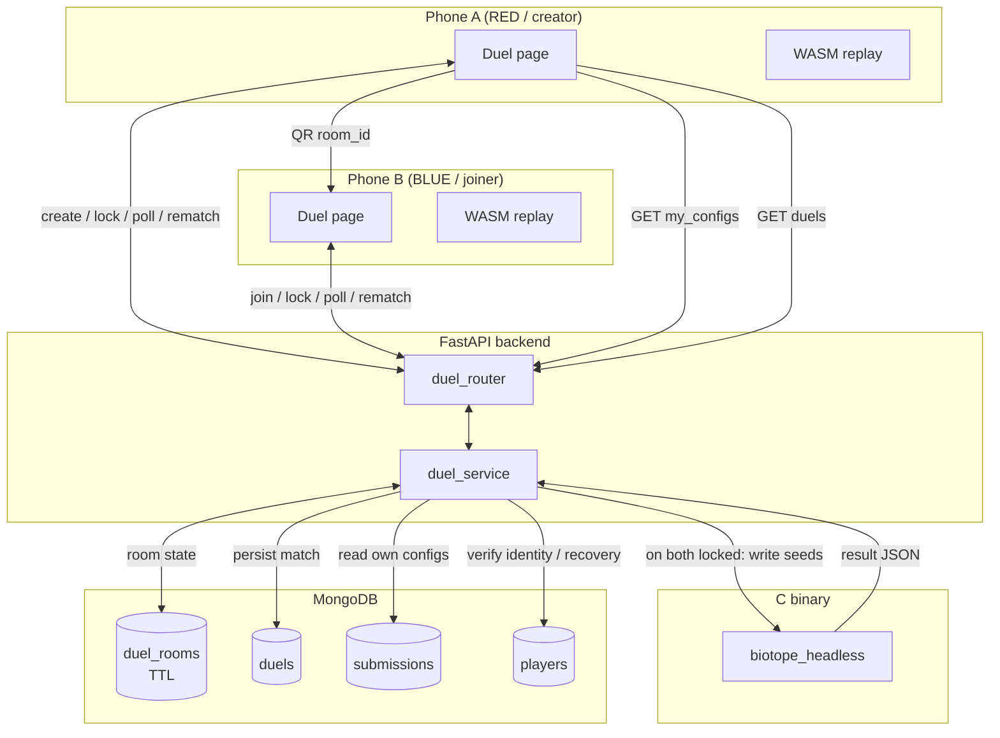

# Technical Design: Shoulder-Duel Mode

**Version:** 1.0
**Date:** 2026-06-13
**Author:** Claude (KI-Agent) with developer
**Related Documents:** [ADR-0028](../adr/ADR-0028-shoulder-duel-mode.md), [DEV_SPEC-0028](../specs/DEV_SPEC-0028-shoulder-duel-mode.md)

---

### 1. Introduction

This document provides a detailed technical design for the **Shoulder-Duel Mode** feature. It
translates the requirements of DEV_SPEC-0028 into a concrete implementation plan: a new web flow
for an on-demand, server-authoritative 1:1 duel between two co-located phones, backed by new
FastAPI endpoints and two new MongoDB collections (`duel_rooms`, `duels`).

The design deliberately maximizes reuse of existing infrastructure (ADR-0028 §3): the deterministic
`build/biotope_headless` binary is the match referee; the ADR-0027 identity (`player_id`,
`nickname`, recovery code) is reused for pairing and record ownership; the FastAPI/MongoDB stack
and the `asyncio.create_subprocess_exec` invocation pattern from `worker.py` are extended rather
than replaced. The C application is untouched.

**Key terms:**
- **Duel room** — ephemeral server-side shared state coordinating two phones through one or more
  matches. Identified by a short `room_id` (QR payload) with a 4-char `room_code` fallback.
- **Slot** — `red` (room creator) or `blue` (joiner). Slot determines team color in the match.
- **Lock-in** — a participant's hidden, committed configuration choice.

---

### 2. System Architecture and Components

The duel is a thin synchronous coordination layer over the existing asynchronous stack. Phones hold
no shared state with each other; all coordination flows through the server via short polling. The
match itself is computed once by the existing headless binary.

#### 2.1. Component Overview

*   **Frontend (`web/duel/`, new):**
    *   **Duel page** (`web/duel/duel.html`) — a standalone mobile-first page (sibling to
        `web/editor/editor.html`), served as a FastAPI static mount (`/duel`). Reuses the
        `biotope_player_id` / nickname conventions from the editor.
    *   **Pairing UI** — "Duel" (create room → render QR + room code) and "Scan" (camera QR scan,
        with manual code entry fallback). QR rendering and scanning use a small vendored JS library
        (e.g. a QR generator + a `getUserMedia`-based scanner); no backend dependency for the scan.
    *   **Choice UI** — lists the player's own configurations (from `GET /api/v1/my_configs`) plus a
        quick-draw 8×8 grid; "Lock in" commits the choice.
    *   **Match UI** — VS splash, deterministic local replay canvas, WIN/LOSE result, Rematch.
    *   **Replay engine** — reuses the existing **WASM core** (`Makefile.wasm`) to re-run the
        deterministic simulation from both seeds (Should-Have; FR-10). The displayed winner always
        comes from the server result, never the local re-run.
    *   **Audio** — a self-hosted Suno track in `web/assets/`, played with build-up on the VS splash
        and payoff on the result screen, plus an unobtrusive Suno credit link.
    *   **"My Duels" UI** — local-first record from `localStorage['biotope_duels']`, reconciled with
        `GET /api/v1/duels` when an identity is present.

*   **Backend (`backend/app/`):**
    *   **Duel router** (new `duel_router.py`, included by `main.py`) — REST endpoints for room
        lifecycle, lock-in, result polling, rematch, own-configs, and the personal record.
    *   **Duel service** (new `duel_service.py`) — room state transitions, headless invocation
        (mirroring `worker.py`'s `create_subprocess_exec` + temp-file pattern), result persistence,
        and duel-record aggregation (head-to-head, best weapon).
    *   **Models** (extend `models.py`) — `DuelRoom`, `DuelParticipant`, `DuelRecord`, request/
        response schemas.

*   **Database (MongoDB):**
    *   **`duel_rooms`** — ephemeral room state with a TTL index for automatic expiry/cleanup.
    *   **`duels`** — the permanent, authoritative per-match record powering "My Duels".
    *   Reuses **`submissions`** (read-only) as the source of a player's own configurations and
        **`players`** (read-only) for identity/recovery verification (ADR-0027).

#### 2.2. Component Interaction Diagram



---

### 3. Data Model Specification

#### 3.1. `duel_rooms` collection (ephemeral)

| Field | Type | Notes |
| :-- | :-- | :-- |
| `room_id` | string | Short URL-safe id (QR payload), unique index |
| `room_code` | string | 4-char human fallback (Crockford-style, no confusables), unique while active |
| `status` | string | `waiting` → `choosing` → `computing` → `result` → (`choosing` on rematch) / `expired` |
| `red` | DuelParticipant | Creator slot |
| `blue` | DuelParticipant \| null | Joiner slot (null until join) |
| `result` | DuelResultEmbed \| null | Set when status reaches `result` |
| `rematch` | `{red: bool, blue: bool}` | Both true → reset to `choosing` |
| `created_at` | datetime | |
| `expires_at` | datetime | **TTL index** drives automatic cleanup |

**DuelParticipant (embedded):**

| Field | Type | Notes |
| :-- | :-- | :-- |
| `player_id` | string | From `localStorage` (ADR-0027) |
| `nickname` | string | Display name, or guest tag (e.g. `Gast-7F3K`) |
| `is_guest` | bool | True if no claimed name |
| `locked` | bool | Has this participant locked in this round |
| `config` | Config \| null | **Hidden** chosen config; never exposed to the opponent until `computing`/`result` |
| `config_id` | string \| null | Optional reference to a `submissions` doc the choice came from |

**DuelResultEmbed (embedded):** `winner` (`red`/`blue`/`draw`), `generations`, `red_population`,
`blue_population`, `red_seed` (64-int grid), `blue_seed` (64-int grid), `computed_at`. The seeds are
included so each phone can run the local replay without a second round-trip.

> **Hidden-choice rule:** `GET /api/v1/duel/rooms/{room_id}` returns each participant's `nickname`,
> `is_guest`, and `locked` flag, but **omits the opponent's `config`/`config_id`** while status is
> `choosing`/`computing`. The chosen seeds appear only inside `result` once the match is computed.

#### 3.2. `duels` collection (permanent record)

| Field | Type | Notes |
| :-- | :-- | :-- |
| `_id` | ObjectId | |
| `room_id` | string | Provenance link |
| `timestamp` | datetime | |
| `red` | `{player_id, nickname, config_id?, seed}` | |
| `blue` | `{player_id, nickname, config_id?, seed}` | |
| `winner` | string | `red` / `blue` / `draw` |
| `generations` | int | From headless (currently fixed 100) |
| `red_population` | int | |
| `blue_population` | int | |

**Indexes:** compound on `red.player_id` and `blue.player_id` (separate indexes) to make the "all
my duels" query efficient. Aggregation for head-to-head and best weapon runs over this collection.

> Mirrors the existing `MatchResult` shape (`models.py:81`) but is keyed by **player identity**
> (not submission id), because the duel record is per-person, not per-pool-entry.

#### 3.3. Frontend local mirror

`localStorage['biotope_duels']` holds a capped array of `{opponent_nickname, my_team, winner,
my_config_label, timestamp}` written immediately after each result (local-first, FR-17). When an
identity is present, the server copy is authoritative on reconciliation.

---

### 4. Backend Specification

#### 4.1. API Endpoints

All under the existing FastAPI app; new router prefixed `/api/v1/duel`. Error contract follows the
ADR-0027 convention (deterministic `409`/`403`/`400`, no catch-all `500` swallowing).

| Method | Path | Body / Query | Success | Purpose |
| :-- | :-- | :-- | :-- | :-- |
| POST | `/api/v1/duel/rooms` | `{player_id, nickname}` | `201 {room_id, room_code, slot:"red"}` | Create room; creator is RED |
| POST | `/api/v1/duel/rooms/{room_id}/join` | `{player_id, nickname}` | `200 {slot:"blue", red_nickname, blue_nickname}` | Join; `409 room_full`, `404 room_not_found`, `410 room_expired` |
| GET | `/api/v1/duel/rooms/{room_id}` | — | `200` room view (hidden-choice rule applied) | **Short-poll** state |
| POST | `/api/v1/duel/rooms/{room_id}/lock` | `{player_id, config \| config_id}` | `200 {locked:true}` | Hidden lock-in; when both locked → compute |
| POST | `/api/v1/duel/rooms/{room_id}/rematch` | `{player_id}` | `200 {rematch:{red,blue}}` | Request rematch; both → reset to `choosing` |
| GET | `/api/v1/my_configs` | `?player_id=` | `200 {configs:[{config_id, nickname, seed}]}` | Player's own pool configs to choose from |
| GET | `/api/v1/duels` | `?player_id=` (+ optional `recovery_code` for cross-device) | `200 {head_to_head:[...], best_weapon:{...}, tally:{w,l,d}}` | Personal duel record |

**Resolution of the "where do my configs come from?" gap (DEV_SPEC FR-6):** a player's
configurations are their **own active `submissions`** (filtered by `metadata.player_id`), returned
by `GET /api/v1/my_configs`. Additionally, `lock` accepts an **inline `config`** so a player who has
never submitted can quick-draw one on the spot (supports the guest path, FR-4). `config_id` is
recorded when the choice references a submission, enabling the "best weapon" attribution.

#### 4.2. Service Layer (`duel_service.py`)

- **`create_room(player_id, nickname) -> DuelRoom`** — generate `room_id` + `room_code`, set
  `red` participant, `status=waiting`, `expires_at = now + ROOM_TTL`. `is_guest` derived from
  whether the nickname matches a claimed `players` doc.
- **`join_room(room_id, player_id, nickname)`** — validate existence/expiry/fullness; set `blue`;
  transition `waiting → choosing`. Idempotent for the same `player_id` (re-join after a dropped
  poll must not 409).
- **`lock_choice(room_id, player_id, config|config_id)`** — resolve `config_id` → seed from
  `submissions`; store the participant's hidden `config`, set `locked=true`. If **both** locked,
  transition `choosing → computing` and call `run_match`.
- **`run_match(room)`** — mirrors `worker.py`: write `red.json`/`blue.json` to a temp dir, locate
  the binary among `["./build/biotope_headless", "/app/build/biotope_headless", "./biotope_headless"]`,
  invoke via `asyncio.create_subprocess_exec` with an output path, parse the result JSON
  (`{winner, generations, red:{population}, blue:{population}}`), embed it (with both seeds) into the
  room, set `status=result`, and **persist a `duels` document**. Temp files are always cleaned up.
- **`request_rematch(room_id, player_id)`** — set the slot's rematch flag; when both set, clear
  `locked`/`config`/`result`/`rematch` and return to `choosing` (same room, same participants).
- **`get_my_record(player_id, recovery_code=None)`** — aggregate `duels` for the identity:
  head-to-head grouped by opponent nickname, best weapon (most-winning own `config_id`/seed), and a
  win/loss/draw tally. If `recovery_code` is supplied, verify it against `players.recovery_code_hash`
  (reusing `auth_utils.hash_recovery_code`) before returning — enabling cross-device recovery (FR-19).

**Concurrency:** lock-in and rematch transitions use a conditional MongoDB update
(`find_one_and_update` with a status/locked guard) so a double lock-in or a race between the two
phones cannot compute the match twice. `run_match` is triggered only by the update that observes the
*second* lock.

---

### 5. Frontend Specification

#### 5.1. Page structure (`web/duel/duel.html`)

A single mobile-first page with screen states mirrored from the server room status, driven by a poll
loop (`GET /api/v1/duel/rooms/{room_id}` every ~1.5 s while a room is active):

1. **Home** — "Start Duel" / "Scan to Join".
2. **Lobby** — QR code + room code (creator) or scanning view (joiner); shows "Waiting for
   opponent…" then both names when paired.
3. **Choice** — own configs (from `my_configs`) + quick-draw; "Lock in"; then "Waiting for
   opponent's choice…" (opponent's pick stays hidden).
4. **VS splash** — both names/seeds, soundtrack build-up.
5. **Replay** — WASM-driven deterministic animation + live population bar.
6. **Result** — WIN/LOSE payoff, soundtrack cue, **Rematch** + "Back".
7. **My Duels** — head-to-head list + best weapon (local-first, server-reconciled).

#### 5.2. Reuse and conventions

- `playerId` / `nickname` handling copied from `editor.html:320-321` (`biotope_player_id` in
  `localStorage`).
- Grid drawing/serialization reuses the editor's 8×8 cell model (`cells: List[[x,y]]`, max 24).
- Audio element preloads the self-hosted asset; gated behind the first user tap (mobile autoplay
  policy). Suno credit link rendered in the footer.

#### 5.3. Sequence Diagram: One duel round

```mermaid
sequenceDiagram
    participant A as Phone A (RED)
    participant B as Phone B (BLUE)
    participant API as duel_router/service
    participant H as biotope_headless
    participant DB as MongoDB

    A->>API: POST /duel/rooms {player_id,nickname}
    API->>DB: insert duel_rooms (status=waiting)
    API-->>A: room_id, room_code, slot=red
    A-->>B: show QR (room_id)
    B->>API: POST /duel/rooms/{id}/join
    API->>DB: set blue, status=choosing
    API-->>B: slot=blue, names
    loop poll ~1.5s
        A->>API: GET /duel/rooms/{id}
        B->>API: GET /duel/rooms/{id}
    end
    A->>API: POST /lock {config}
    B->>API: POST /lock {config}
    API->>DB: second lock -> status=computing
    API->>H: run red.json vs blue.json
    H-->>API: {winner,generations,populations}
    API->>DB: status=result (+seeds); insert duels
    A->>API: GET /duel/rooms/{id}  (sees result+seeds)
    B->>API: GET /duel/rooms/{id}
    Note over A,B: VS splash -> WASM replay -> WIN/LOSE
    A->>API: POST /rematch
    B->>API: POST /rematch
    API->>DB: both -> reset status=choosing
```

---

### 6. Security Considerations

- **Hidden-choice integrity:** the room-state response **must** strip the opponent's `config`/
  `config_id` while status is `choosing`/`computing` (server-side projection, not client-side
  hiding), or a player could poll the API to peek at the opponent's pick before locking. This is the
  single most important security rule of the feature.
- **No secret exposure:** duel endpoints never return recovery codes or hashes. Recovery codes, when
  used for cross-device record retrieval, travel in a dedicated request field (never in `metadata`),
  consistent with ADR-0027's `auth` separation, and are compared only as SHA-256 hashes.
- **Identity is advisory, not trusted:** `player_id` is a client-supplied UUID and can be spoofed.
  This is acceptable — duels are a playful exhibit, the *match outcome* is server-computed and
  unspoofable, and name *ownership* for the record still rests on the ADR-0027 recovery code. No
  privileged action depends on an unverified `player_id`.
- **Input validation:** inline configs submitted to `lock` are validated with the existing
  `validate_biotope_rules` (8×8 bounds, max-cell/biomass rules) before being written to a temp file
  and handed to the C binary — preventing malformed or oversized inputs from reaching `headless`.
- **Subprocess safety:** configs are written to temp files and passed as file-path arguments (as in
  `worker.py`); no user string is interpolated into a shell command.
- **Resource/DoS bounding:** room creation is cheap, but `run_match` spawns a process. Rooms carry a
  TTL and a one-match-per-lock-pair guard; a per-room match-rate limit and a cap on concurrent
  `headless` subprocesses bound abuse.
- **CORS:** the app already allows all origins (`main.py:23`) for mobile access; no change, but noted
  as an existing posture.

### 7. Performance Considerations

- **Short polling load:** ~1.5 s polling per phone with two phones per room is negligible at fair
  scale (tens of concurrent rooms). The room-state read is a single indexed `room_id` lookup. The
  poll interval can back off in `waiting`/`result` states to cut idle traffic.
- **Match computation:** `biotope_headless` runs a fixed 100-generation 1:1 match in milliseconds;
  cost is dominated by process spawn + temp I/O, identical to the existing worker path. Matches run
  only once per lock-pair, never per frame.
- **TTL cleanup:** the `expires_at` TTL index on `duel_rooms` offloads room garbage collection to
  MongoDB, keeping the ephemeral collection small without a sweeper job.
- **`duels` queries:** per-player indexes on `red.player_id` / `blue.player_id` keep "My Duels"
  aggregation fast; the record set per player at a fair is small. Head-to-head and best-weapon can be
  computed in a single aggregation pipeline or in-app over the (small) result set.
- **Replay is client-side:** the match animation runs locally in WASM from two 64-int seeds — zero
  server cost and zero per-frame network traffic, which is the core robustness property (NFR-2).
- **Audio:** the self-hosted track is browser-cached after first load; no repeated network cost per
  duel.
