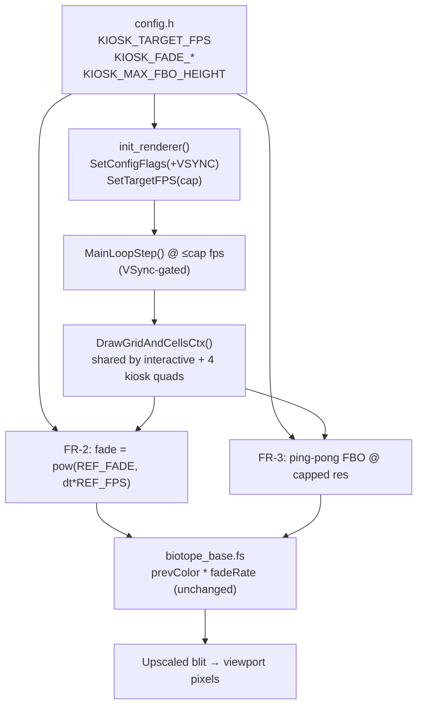

# Technical Design: Kiosk Mode Render Budget for Office-Laptop Operation

**Version:** 1.0
**Date:** 2026-06-20
**Author:** Claude Code (KI-Agent)
**Related Documents:** [ADR-0033](../adr/ADR-0033-kiosk-office-laptop-render-budget.md), [DEV_SPEC-0033](../specs/DEV_SPEC-0033-kiosk-office-laptop-render-budget.md)

---

### 1. Introduction

This document provides the detailed technical design for reducing the Kiosk
Mode render budget so the GUI can run unattended on an ordinary office laptop.
It translates DEV_SPEC-0033 into a concrete implementation plan touching three
files only: `src/core/config.h` (new tuning constants), `src/gui/renderer.c`
(window setup + the shared grid-draw path), and `src/gui/renderer.h`
(`RenderContext` gains two FBO-size fields). The shaders themselves are **not**
modified — the fade change is driven entirely from the C side via the existing
`fadeRate` uniform.

The design is deliberately confined to the render pipeline. The state machine
(`app_state_manager.c`), the simulation (`game_logic.c`), the I/O layer, and the
backend are untouched. There is no data-model, database, or network surface in
this increment.

---

### 2. System Architecture and Components

The change has no new components. It modifies the existing render path that is
already shared by interactive states and the four Kiosk Multicam quadrants
through one function, `DrawGridAndCellsCtx`. Because the fade and FBO-cap changes
live inside that shared function, every consumer (interactive + kiosk) inherits
them uniformly — which is exactly the parity guarantee NFR-1/NFR-3 require.

#### 2.1. Component Overview

*   **Configuration (`src/core/config.h`):**
    *   New named constants (replacing magic numbers): `KIOSK_TARGET_FPS`,
        `KIOSK_FADE_REF_FPS`, `KIOSK_FADE_PER_REF_FRAME`, `KIOSK_FADE_DT_MAX`,
        `KIOSK_MAX_FBO_HEIGHT`.
    *   `KIOSK_TARGET_FPS` is the single per-device tuning knob (NFR-5).

*   **Renderer setup (`init_renderer`, `renderer.c:482`):**
    *   `SetConfigFlags(... | FLAG_VSYNC_HINT)` (FR-4).
    *   `SetTargetFPS(KIOSK_TARGET_FPS)` replacing the `120` literal (FR-1).

*   **Shared grid draw (`DrawGridAndCellsCtx`, `renderer.c:232`):**
    *   FR-2: compute `fadeRate` from `GetFrameTime()` instead of the constant
        `0.95f`, so wall-clock decay is frame-rate-independent.
    *   FR-3: allocate the ping-pong FBO at a capped resolution and upscale on
        the final blit.

*   **Render context (`RenderContext`, `renderer.h`):**
    *   Two new ints, `fbo_w` / `fbo_h`, store the (possibly capped) FBO
        resolution so the draw step can size the FBO render-target rect and the
        screen-blit source rect correctly.

*   **Shaders (`assets/shaders/biotope_base.fs` + `_web.fs`):**
    *   **Unchanged.** They already accept `fadeRate` as a uniform; only the
        value supplied from C changes.

#### 2.2. Component Interaction Diagram



---

### 3. Data Model Specification

No persistent data model. The only state additions are two integer fields on the
in-memory `RenderContext` and five compile-time constants.

**`src/core/config.h` — new constants:**

```c
// KI-Agent unterstützt: Kiosk render budget (ADR-0033)
#define KIOSK_TARGET_FPS          30      // per-device tuning knob (FR-1); default 30 for cool office-laptop operation, raise to 60 for smoother motion
#define KIOSK_FADE_REF_FPS        120.0f  // reference fps the 0.95 fade was tuned at (FR-2)
#define KIOSK_FADE_PER_REF_FRAME  0.95f   // fossil fade per frame @ reference fps (FR-2)
#define KIOSK_FADE_DT_MAX         0.1f    // clamp frame-time spikes so a stall can't wipe trails (FR-2)
#define KIOSK_MAX_FBO_HEIGHT      1080    // cap for ping-pong FBO height; no-op at ≤1080p (FR-3)
```

**`src/gui/renderer.h` — `RenderContext` additions:**

```c
int tex_w;
int tex_h;
int last_draw_w;
int last_draw_h;
int fbo_w;          // KI-Agent unterstützt: capped ping-pong FBO width  (ADR-0033)
int fbo_h;          // KI-Agent unterstützt: capped ping-pong FBO height (ADR-0033)
```

**Derivation rule (pure, aspect-preserving):**

```
fbo_h = min(draw_h, KIOSK_MAX_FBO_HEIGHT)
fbo_w = draw_w * (fbo_h / draw_h)        // integer, rounded
```

When `draw_h ≤ KIOSK_MAX_FBO_HEIGHT` the result is `fbo == draw` (no-op).

---

### 4. Core / Render Module Specification

> The template's "Backend" section is repurposed for the C render module, since
> this feature has no server component.

#### 4.1. `init_renderer` (`renderer.c:482`)

Two edits, both in the `#ifndef PLATFORM_WEB` path so WASM is unaffected:

```c
// Before:
SetConfigFlags(FLAG_WINDOW_RESIZABLE);
...
SetTargetFPS(120);

// After (KI-Agent unterstützt: ADR-0033 FR-1/FR-4):
SetConfigFlags(FLAG_WINDOW_RESIZABLE | FLAG_VSYNC_HINT);
...
SetTargetFPS(KIOSK_TARGET_FPS);
```

`FLAG_VSYNC_HINT` must be set **before** `InitWindow` (already the case — it sits
above `InitWindow` at `renderer.c:483-484`).

#### 4.2. FBO-size helper (new, file-static in `renderer.c`)

A single pure helper keeps the cap logic in one place, used by both
`init_render_context` and the reallocation branch of `DrawGridAndCellsCtx`:

```c
// KI-Agent unterstützt: Aspect-preserving FBO resolution cap (ADR-0033 FR-3)
static void compute_fbo_size(int draw_w, int draw_h, int *out_w, int *out_h) {
    if (draw_h <= KIOSK_MAX_FBO_HEIGHT) {
        *out_w = draw_w;
        *out_h = draw_h;
        return;
    }
    float scale = (float)KIOSK_MAX_FBO_HEIGHT / (float)draw_h;
    *out_h = KIOSK_MAX_FBO_HEIGHT;
    *out_w = (int)(draw_w * scale + 0.5f);
    if (*out_w < 1) *out_w = 1;
}
```

#### 4.3. `DrawGridAndCellsCtx` (`renderer.c:232`)

**(a) FR-3 — allocation block (`renderer.c:248-290`).** Compute `fbo_w/fbo_h`
via the helper, allocate the ping-pong targets at that size instead of
`drawWidth/drawHeight`, store the values on the context, and set bilinear
filtering on the upscaled targets:

```c
compute_fbo_size(drawWidth, drawHeight, &r_ctx->fbo_w, &r_ctx->fbo_h);
r_ctx->ping_pong_target[0] = LoadRenderTexture(r_ctx->fbo_w, r_ctx->fbo_h);
r_ctx->ping_pong_target[1] = LoadRenderTexture(r_ctx->fbo_w, r_ctx->fbo_h);
SetTextureFilter(r_ctx->ping_pong_target[0].texture, TEXTURE_FILTER_BILINEAR);
SetTextureFilter(r_ctx->ping_pong_target[1].texture, TEXTURE_FILTER_BILINEAR);
```

The reallocation trigger at line 248 stays keyed on
`drawWidth != last_draw_w || drawHeight != last_draw_h` (viewport change), so the
cap is recomputed whenever the window resizes. `grid_texture` keeps
`TEXTURE_FILTER_POINT` — live cells stay crisp; only the soft trail buffer is
bilinear-upscaled when the cap bites.

**(b) FR-3 — draw step (`renderer.c:312-340`).** The FBO render-target and the
screen-blit source must use `fbo_w/fbo_h`, while the screen destination stays in
true viewport pixels (this is where the upscale happens):

```c
Rectangle fboDest     = { 0, 0, (float)r_ctx->fbo_w, (float)r_ctx->fbo_h };
...
Rectangle screenSource = { 0, 0, (float)r_ctx->fbo_w, -(float)r_ctx->fbo_h };
Rectangle screenDest   = { (float)startX, (float)startY,
                           (float)drawWidth, (float)drawHeight };
```

The shader samples `previousFrame` in **normalized** coords (`fragTexCoord`), so
the temporal feedback is resolution-independent and needs no change.

**(c) FR-2 — fade uniform (`renderer.c:323-324`).** Replace the constant:

```c
// Before:
float fade = 0.95f;

// After (KI-Agent unterstützt: frame-rate-independent fossil fade, ADR-0033 FR-2):
float dt = GetFrameTime();
if (dt > KIOSK_FADE_DT_MAX) dt = KIOSK_FADE_DT_MAX;  // clamp stall spikes
float fade = (dt > 0.0f)
    ? powf(KIOSK_FADE_PER_REF_FRAME, dt * KIOSK_FADE_REF_FPS)
    : KIOSK_FADE_PER_REF_FRAME;
SetShaderValue(biotopeShader, r_ctx->loc_fade_rate, &fade, SHADER_UNIFORM_FLOAT);
```

`powf` requires `<math.h>`, already included (used by `compute_kiosk_layout`'s
`ceilf`/`sqrtf`). At the reference 120 fps, `dt = 1/120` ⟹ `fade = 0.95^1 = 0.95`
exactly — bit-for-bit the old behaviour (NFR-1).

#### 4.4. `init_render_context` (`renderer.c:144`) and `clear_render_context_trail`

`init_render_context` must also call `compute_fbo_size` and allocate the initial
ping-pong targets at `fbo_w/fbo_h` (lines 163-164), set bilinear filtering, and
initialise the two new fields. `clear_render_context_trail` needs no change (it
only `ClearBackground`s the existing targets, size-agnostic).

---

### 5. Visual Pipeline Specification

> The template's "Frontend" section is repurposed for the on-screen render flow.

#### 5.1. What the viewer sees

No visible change on a ≤1080p panel. Trails fade over the same wall-clock
duration (FR-2); live cells stay point-sharp; HUD, hemisphere separator, score
bars, and thumbnails are untouched. On a >1080p panel the trail buffer is
internally rendered at ≤1080p and bilinear-upscaled — the only perceptible
difference is a marginally softer fossil trail, while live cells remain crisp
because they originate from the point-filtered grid texture.

#### 5.2. Why the change is invisible at the reference rate

The fade is a geometric decay `prev *= fade` per frame. Holding the **wall-clock**
half-life constant requires `fade = REF_FADE^(dt · REF_FPS)`. Substituting the
reference frame time `dt = 1/REF_FPS` yields `fade = REF_FADE`, so the existing
look is the exact special case at 120 fps. At 60 fps, `dt = 1/60` ⟹
`fade = 0.95^2 ≈ 0.9025` per frame — fewer, larger steps, identical decay curve
in seconds.

#### 5.3. Sequence Diagram: one Multicam frame (per quadrant)

```mermaid
sequenceDiagram
    participant Loop as MainLoopStep (≤cap fps)
    participant Draw as DrawGridAndCellsCtx
    participant FBO as ping-pong FBO (≤1080p)
    participant GPU as biotope_base.fs
    participant Win as Window viewport

    Loop->>Draw: draw quad i (world 8x16)
    Draw->>Draw: fill pixel_buffer (128 cells)
    Draw->>FBO: UpdateTexture(grid_texture)
    Draw->>Draw: dt = clamp(GetFrameTime())
    Draw->>Draw: fade = pow(0.95, dt*120)
    Draw->>GPU: BeginShaderMode + bind previousFrame + fade
    GPU->>FBO: DrawTexturePro(grid → fboDest fbo_w×fbo_h)
    Draw->>Win: blit FBO (fbo_w×fbo_h) → viewport pixels (upscale)
    Draw->>Draw: ping_pong_index = 1 - index
```

---

### 6. Security Considerations

This is a local rendering change with no network, file, or user-input surface,
so the classic input-validation/authz concerns do not apply. The only robustness
concern is numerical: `GetFrameTime()` could return `0` on the first frame
(guarded → use `REF_FADE`) or a large spike after a stall (clamped via
`KIOSK_FADE_DT_MAX`), preventing a degenerate `fade` (no-decay at `dt=0`, or a
full trail wipe on a multi-second stall). `compute_fbo_size` clamps the width to
`≥ 1` to avoid a zero-area FBO. No untrusted data reaches any of the new code.

---

### 7. Performance Considerations

**Baseline (today).** Multicam at `SetTargetFPS(120)`: four quadrants × (one
`UpdateTexture` + one full-viewport shader pass into a viewport-sized FBO + one
full-viewport blit) per frame ≈ two full-screen fills/frame ≈ 0.5 Gpixel/s at
1080p, sustained, with a busy-wait FPS cap.

**After this change:**

- **FR-1 (60 fps):** halves the per-second fill workload and `UpdateTexture`
  count → ~0.25 Gpixel/s at 1080p. Dropping `KIOSK_TARGET_FPS` to 30 quarters it.
- **FR-4 (VSync):** removes the busy-wait; the GPU/CPU idle between frames,
  lowering power draw and fan noise (the actual all-day-operation win).
- **FR-3 (FBO cap):** bounds shader+blit cost at ≈1080p regardless of panel
  resolution. On a 4K panel this is up to a ~4× reduction in fragment work; on a
  1080p panel it is a no-op (helper returns the native size).
- **FR-2 (fade):** adds one `powf` per quadrant per frame on the CPU
  (≤ 4 calls/frame) — negligible, and it sets the same uniform that was already
  being set.

**Net:** at the default cap, sustained Multicam GPU load is roughly halved and no
longer scales with panel resolution beyond 1080p (NFR-2), with the visual result
unchanged on the common target (NFR-1). The Conway simulation cost is unchanged
and remains negligible (four 8×16 worlds at 2.5 generations/s). The leaderboard
sub-state, already text-only, simply benefits from the lower cap and VSync.
