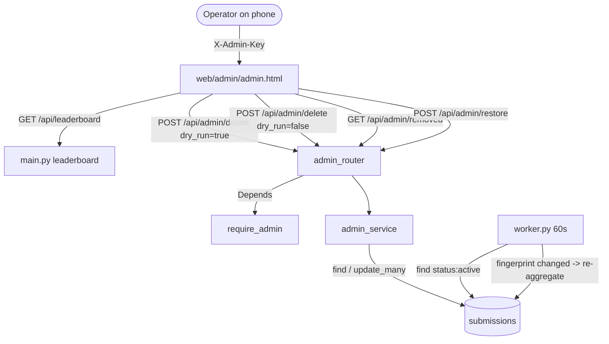

# Technical Design: Password-Protected Admin Configuration Deletion

**Version:** 1.0
**Date:** 2026-06-22
**Author:** Claude (KI-Agent)
**Related Documents:** [ADR-0035](../adr/ADR-0035-admin-config-deletion.md), [DEV_SPEC-0035](../specs/DEV_SPEC-0035-admin-config-deletion.md)

---

### 1. Introduction

This document provides a detailed technical design for the admin configuration-deletion
feature. It translates the requirements defined in DEV_SPEC-0035 into a concrete
implementation plan, specifying architecture, data model, API surface, frontend, and
security/performance considerations. The design reuses existing project patterns
(`duel_router.py` for the router, `web/editor/editor.html` for the standalone page,
`cells_to_grid` for seed rendering) and changes no existing public endpoint or the
tournament worker.

---

### 2. System Architecture and Components

#### 2.1. Component Overview

*   **Frontend:**
    *   `web/admin/admin.html` — standalone HTML/JS page (mirrors `web/editor/`). Prompts
        for the admin password once, stores it in `localStorage`, and sends it as the
        `X-Admin-Key` header on every call. Three delete-mode panels (A/B/C) each running
        a **preview (dry-run) → confirm** flow, plus a **Trash** tab listing removed
        submissions with per-row restore. Renders 8×8 seed thumbnails on a `<canvas>`.
*   **Backend:**
    *   `backend/app/admin_auth.py` — a FastAPI dependency `require_admin` that
        constant-time-compares the `X-Admin-Key` header against `ADMIN_PASSWORD`.
    *   `backend/app/admin_service.py` — pure-ish async selection + mutation logic:
        `select_mode_a/b/c` (return affected docs), `soft_delete_ids`, `list_removed`,
        `restore_id`. Selection is shared by dry-run and execution.
    *   `backend/app/admin_router.py` — REST surface under `/api/admin`, depending on
        `require_admin`, delegating to `admin_service`.
    *   `backend/app/main.py` — `app.include_router(admin_router)` (one line).
*   **Database:**
    *   `submissions` collection — reused. Two new optional fields written only on removed
        rows: `removed_at` (datetime) and `removed_reason` (str). No migration needed;
        absent on all existing/active rows.
    *   `players`, `match_results`, `worker_state` — **unchanged**; the worker self-heals
        via the active-roster fingerprint (ADR-0032).

#### 2.2. Component Interaction Diagram



---

### 3. Data Model Specification

**`submissions` (existing — additive fields).** Current persisted shape is `DBSubmission`
(`metadata`, `config`, `status`, `elo_rating`, `matches_played`, `created_at`) plus the
worker-written aggregates (`win_rate`, `wins`, `draws`, `losses`,
`avg_stable_generation`). Two fields are added, set **only** when a row is soft-deleted:

| Field | Type | Notes |
| :-- | :-- | :--- |
| `status` | str | Existing. `"active"` → `"removed"` on delete; back to `"active"` on restore. |
| `removed_at` | datetime (UTC) | Set on delete; unset (`$unset`) on restore. |
| `removed_reason` | str | Tag identifying the action: `"mode_a_dedup"`, `"mode_b_nickname"`, `"mode_c_rank"`. Unset on restore. |

No new collection, no index change required (queries filter on `status`, already used by
the worker and leaderboard). The `_id` (Mongo ObjectId, stringified) is the
`submission_id` used by mode C and restore.

**Identity helpers.** Nickname matching reuses `normalize_nickname()` from `auth_utils.py`.
Because submissions store only the raw `metadata.nickname`, normalization is computed in
Python over candidate docs (there is no stored normalized field on submissions).

---

### 4. Backend Specification

#### 4.1. API Endpoints

All endpoints require header `X-Admin-Key: <ADMIN_PASSWORD>`; missing/invalid → `401
{"error":"unauthorized"}` (via `require_admin`). Prefix `/api/admin`.

**`POST /api/admin/delete`** — unified delete (dry-run or execute).

Request body:
```jsonc
{
  "mode": "A" | "B" | "C",
  "dry_run": true,
  "nickname": "VibeMaster",   // required for mode B
  "rank": 5                    // required for mode C (1-based leaderboard rank)
}
```
- Mode A ignores `nickname`/`rank`.
- Mode B requires `nickname` → `400` if missing.
- Mode C requires `rank` (≥1) → `400` if missing/out of range.

Response (same shape for dry-run and execute):
```jsonc
{
  "mode": "A",
  "dry_run": true,
  "removed_count": 23,
  "affected": [
    { "submission_id": "...", "nickname": "VibeMaster",
      "win_rate": 12.5, "matches_played": 40,
      "seed": [0,1,0, ...64 ints...] }
  ],
  // mode A only: what survives per nickname
  "kept": [ { "submission_id": "...", "nickname": "VibeMaster", "win_rate": 31.0, "seed": [...] } ]
}
```
When `dry_run=false`, the server performs the soft delete and `affected` reflects exactly
the rows that were transitioned (rows already `removed` are never re-touched).

**`GET /api/admin/removed`** — trash listing.
```jsonc
{ "removed": [
    { "submission_id": "...", "nickname": "...", "win_rate": 0.0,
      "removed_at": "2026-06-22T10:00:00", "removed_reason": "mode_a_dedup",
      "seed": [...] }
] }   // sorted by removed_at desc
```

**`POST /api/admin/restore`** — `{ "submission_id": "..." }` → flips `removed`→`active`,
`$unset removed_at/removed_reason`. `404 {"error":"not_found"}` if no removed row with
that id. Returns `{ "status": "restored", "submission_id": "..." }`.

#### 4.2. Service Layer (`admin_service.py`)

- `_to_view(doc)` — maps a submission doc to the response row
  (`submission_id`=str(_id), nickname, `win_rate` as percent rounded to 1, matches_played,
  `seed`=`cells_to_grid(doc["config"]["cells"])`).
- `select_mode_a(db)` → `(kept, affected)`. Fetch all non-`removed` submissions; group by
  `normalize_nickname(metadata.nickname)`; within each group sort by `win_rate` desc,
  `avg_stable_generation` asc, `created_at` desc; first = kept, rest = affected. Groups of
  size 1 contribute only a `kept` entry, no `affected`.
- `select_mode_b(db, nickname)` → `affected` = all non-`removed` submissions whose
  normalized nickname equals `normalize_nickname(nickname)`.
- `select_mode_c(db, rank)` → resolve via the **same query+sort as `/api/leaderboard`**
  (`status:"active"`, `matches_played>0`, sort `win_rate` desc, `avg_stable_generation`
  asc), pick the `rank`-th (1-based); `400` if out of range. `affected` = `[that doc]`.
- `soft_delete_ids(db, ids, reason)` → `update_many({_id in ids, status:"active"},
  {$set:{status:"removed", removed_at:now, removed_reason:reason}})`; returns modified
  count. The `status:"active"` guard makes it idempotent.
- `list_removed(db)` / `restore_id(db, submission_id)` as in §4.1.

The router calls `select_*` for the preview; when `dry_run=false` it calls `select_*`
again and immediately `soft_delete_ids` on the resulting ids inside the same request, so
the executed set is computed from current data (selection logic is the single source of
truth — NFR-3).

#### 4.3. Auth (`admin_auth.py`)

```python
# KI-Agent unterstützt
ADMIN_PASSWORD = os.getenv("ADMIN_PASSWORD")
async def require_admin(x_admin_key: str = Header(default="")):
    if not ADMIN_PASSWORD or not secrets.compare_digest(x_admin_key, ADMIN_PASSWORD):
        raise HTTPException(status_code=401, detail={"error": "unauthorized"})
```
A missing/empty `ADMIN_PASSWORD` env var fails closed (every request → 401).

---

### 5. Frontend Specification

#### 5.1. Page structure (`web/admin/admin.html`)

A single self-contained page (no build step), tabbed:
- **Login gate:** if `localStorage["biotop_admin_key"]` is absent, show a password input;
  on submit, store it and reveal the tabs. A "Logout" button clears the key.
- **Tab A — Deduplicate:** a single "Preview" button → table of affected rows (seed
  thumbnail, nickname, win-rate) grouped/annotated with the kept row, a headline count
  ("23 will be removed, 15 kept"), then a "Confirm delete" button.
- **Tab B — By nickname:** text input + "Preview" → affected table + count → "Confirm".
- **Tab C — By rank:** fetches `/api/leaderboard`, renders the ranked list; selecting a
  row shows its preview → "Confirm" (sends `{mode:"C", rank:N, dry_run:false}`).
- **Tab Trash:** loads `/api/admin/removed`, renders rows with `removed_at`/reason and a
  per-row "Restore" button.

#### 5.2. Client behaviour

All fetches attach `X-Admin-Key`. A `401` clears the stored key and returns to the login
gate (handles a changed password). Seed thumbnails reuse the 64-int grid via a small
`<canvas>` painter (same index convention as `cells_to_grid`). Every Confirm is a
two-click action (preview first), satisfying US5; no native `confirm()` reliance.

#### 5.3. Sequence Diagram: Mode A delete

```mermaid
sequenceDiagram
    participant U as Operator
    participant P as admin.html
    participant R as admin_router
    participant S as admin_service
    participant DB as submissions
    U->>P: open Tab A, click Preview
    P->>R: POST /api/admin/delete {mode:A, dry_run:true}
    R->>S: select_mode_a(db)
    S->>DB: find status != removed
    DB-->>S: docs
    S-->>R: kept[], affected[]
    R-->>P: removed_count, affected, kept
    P-->>U: render preview (seeds, win-rates, counts)
    U->>P: click Confirm
    P->>R: POST /api/admin/delete {mode:A, dry_run:false}
    R->>S: select_mode_a + soft_delete_ids(reason=mode_a_dedup)
    S->>DB: update_many status:active -> removed
    DB-->>S: modified_count
    R-->>P: removed_count, affected
    P-->>U: success; (worker re-aggregates <=60s)
```

---

### 6. Security Considerations

- **Authentication:** constant-time `secrets.compare_digest` (no timing oracle); fail-closed
  when `ADMIN_PASSWORD` unset. Secret ≥16 random chars, only in `.env`, documented in
  `.env.example` with a placeholder; never committed and never logged.
- **Transport:** all admin traffic must be over HTTPS (booth deployment); the static key in
  the `X-Admin-Key` header is otherwise exposed. This is a deployment precondition.
- **Authorization scope:** the key grants full delete/restore; no per-action roles (single
  operator). `localStorage` persistence means a shared device retains access until Logout —
  documented operator caveat.
- **Input validation:** `mode` enum-checked; mode B requires non-empty nickname; mode C
  `rank` bounds-checked; restore validates the id exists in `removed` state. No raw query
  injection (Mongo driver parameterization; ids parsed to `ObjectId` defensively).
- **Data exposure:** admin responses contain only already-public-ish fields (nickname,
  seed, win-rate); recovery codes / hashes are never read or returned (they live in
  `players`, untouched). No `500` leakage of internals.
- **Out of scope (ADR-0035):** rate-limiting, brute-force lockout, expiring sessions,
  audit of failed logins — accepted residual risk for this increment.

### 7. Performance Considerations

- **Scale:** `submissions` is at most a few thousand rows during the fair. Mode A loads all
  non-removed docs once and groups in memory — O(N log N), trivially fast at this scale; no
  index beyond the existing `status` filter needed.
- **Writes:** a single `update_many` per delete (and per restore one `update_one`) — no
  per-row round trips.
- **Worker coupling:** zero added work; the existing fingerprint guard recomputes only when
  the active set actually changed, and the cache (`match_results`) is left intact, so a
  restore reuses cached match outcomes with no recomputation cost.
- **Stale window:** surviving rows show slightly outdated `win_rate` for ≤60 s after a
  mutation (one worker cycle) — acceptable per NFR and ADR.
- **Frontend:** seed thumbnails are tiny 8×8 canvases; previews render a bounded list
  (mode A worst case = all duplicates, still only thousands of rows — paginate only if it
  ever becomes a problem; not required now).
